# Proyecto Platzigram Django

[Clase 1 Introducción al curso](#Clase-1-Introducción-al-curso)

[Clase 2 Historia de web development](#Clase-2-Historia-de-web-development)

[Clase 3 Preparación del entorno de trabajo en Windows y Linux](#Clase-3-Preparación-del-entorno-de-trabajo-en-Windows-y-Linux)

[Clase 4 Creación del proyecto Platzigram / Tu primer Hola, mundo! en Django](#Clase-4-Creación-del-proyecto-Platzigram-/-Tu-primer-Hola-mundo-en-Django)

[Clase 5 El objeto Request](#Clase-5-El-objeto-Request)

[Clase 6 Solución al reto - Pasando argumentos en la URL](#Clase-6-Solución-al-reto-Pasando-argumentos-en-la-URL)

[Clase 7 Creación de la primera app](#Clase-7-Creación-de-la-primera-app)

[Clase 8 Introducción al template system](#Clase-8-Introducción-al-template-system)

[Clase 9 Patrones de diseño y Django](#Clase-9-Patrones-de-diseño-y-Django)

[Clase 10 La M en el MTV(model, Template, View)](#Clase-10-La-M-en-el-MTV(model-Template-View))

[Clase 11 El ORM de Django](#Clase-11-El-ORM-de-Django)

[Clase 12 Glosario](#Clase-12-Glosario)

[Clase 13 Extendiendo el modelo de usuario](#Clase-13-Extendiendo-el-modelo-de-usuario)

[Clase 14 Implementación del modelo de usuarios de Platzigram](#Clase-14-Implementación-del-modelo-de-usuarios-de-Platzigram)

[Clase 15 Explorando el dashboard de administración](#Clase-15-Explorando-el-dashboard-de-administración)

[Clase 16 Dashboard de Administración](#Clase-16-Dashboard-de-Administración)

[Clase 17 Creación del modelo de posts](#Clase-17-Creación-del-modelo-de-posts)

[Clase 18 Templates y archivos estáticos](#Clase-18-Templates-y-archivos-estáticos)

[Clase 19 Login](#Clase-19-Login)

[Clase 20 Logout](#Clase-20-Logout)

[Clase 21 Signup](#Clase-21-Signup)

[Clase 22 Middlewares](#Clase-22-Middlewares)

[Clase 23 Formularios en Django](#Clase-23-Formularios-en-Django)

[Clase 24 Mostrando el form en el template](#Clase-24-Mostrando-el-form-en-el-template)

[Clase 25 Model forms](#Clase-25-Model-forms)

[Clase 26 Validación de formularios](#Clase-26-Validación-de-formularios)

[Clase 27 Class-based views](#Clase-27-Class-based-views)

[Clase 28 Protegiendo la vista de perfil, Detail View y List View](#Clase-28-Protegiendo-la-vista-de-perfil-Detail-View-y-List-View)

[Clase 29 CreateView, FormView y UpdateView](#Clase-29-CreateView-FormView-y-UpdateView)

[Clase 30 Generic auth views](#Clase-30-Generic-auth-views)

[Clase 31 Arquirectura / Conceptos / Componentes](#Clase-31-Arquirectura/Conceptos/Componentes)

[Clase 32 ¿Cómo conectar Django a una base de datos?](#Clase-32-¿-Cómo-conectar-Django-a-una-base-de-datos-?)

[Clase 33 Configurar el servidor](#Clase-33-Configurar-el-servidor)

[Clase 34 Preparación del VPS (en AWS)](#Clase-34-Preparación-del-VPS-(en-AWS))


## Clase 1 Introducción al curso

Los temas que se van a ver en el curso van desde url, vistas y sistemas de templates,  hasta formularios, middleware y vistas basadas en clases.

El proyecto desarrollado será Platzigram y al final se va a realizar deploy en un servidor linux usando una base de datos de Postgresql.

En este proyectose implementara un sistema custom de usuarios, manejando la carga de media por usuario, perfil de usuario, paginacion y crear un middleware para asegurar que todos los perfiles de usuario esten completos durante el uso de la plataforma y manejo de sesiones.

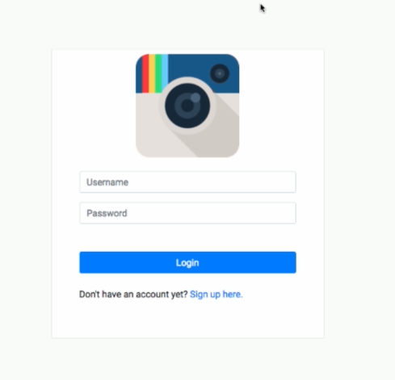

## Clase 2 Historia de web development

Al inicio de la web todos los sitios eran construidos en HTML y solo se veia texto plano conocidos como Text-based. Conforme las necesidades hay ido cambiando la web tambien lo ha hecho.

Eventualmente se requiere hacer conexion con bases de datos y es ahi donde nade CGI Scripts **(Common Gateway Interface)**, el objetivo es que a traves de Request se puedaq ejecutar un Script dentro del servidor. Estos Scripts eran normalmente escritos en perl, python o bash scripting.

Despues de esto se implementa PHP, este lenguaje tiene la capacidad de poder incluir la logica dentro del template pero en algunas ocasiones no se resolvia el problema de estar repitiendo codigo, conexion a base de datos o printar codigo. A partir de esto nacen los **Frameworks**, los cuales resuelven tareas comunes en el desarrollo web como la resolucion a una peticion HTTP, creacion de una respuesta, conexion a base de datos, consulta a tablas, interaccion con HTML con interfaces mas complejas y cada Framework tiene alguna funcionalidad especifica. **por ejemplo** Ruby on rails que agrega los generadores, Django agrega el admin o sistema de usuarios.

Django nace en 2004 para crear y mantener sitios muy grandes, URLs bien diseñadas, tener objetos Http Request y Response para cada peticion, cubrir la necesidad de crear sitios web en poco tiempo y generar un ORM, es decir que te permite conectarte a la base de datos a traves del framework. Django se toma la seguridad de las aplicaciones con mucha seriedad. Django es un framework muy escalable. Django es muy versatil, ha sido usado para todo tipo de proyectos, desde redes sociales hasta proyectos cientificos.

**Caracteristicas**

- Rapido desarrollo 

- Viene listo para todo, es decir que trae consigo muchas herramientas como la autenticacion de usuarios, la administracion de contenido, mapas de sitio, etc.

- Seguro

- Escalable

- Versatil

- Django es open source.

- Django tiene el concepto **(DRY(Don't Repeat Yourself))**, donde dice que si estas copiando y pegando algo en tu codigo, seguramente estas haciendo algo mal

## Clase 3 Preparación del entorno de trabajo en Windows y Linux

**Instalación de Python en Windows**

___

1. Dirigirse a https://python.org

2. Ir a la sección de descargas

3. Descargar cualquier versión superior a 3.6.*

**Instalación de Python en Linux**
___

1. Correr:
```
sudo add-apt-repository -y ppa:jonathonf/python-3
sudo apt-get update -y
sudo apt-get install -y python3
sudo apt-get install -y python3-dev
sudo apt-get install -y python3-distutils
sudo apt-get install python3-pip
sudo apt-get install python3-venv
sudo apt install python3-virtualenv

```

## Verificación de la descarga

1. Correr `python3 --version`

2. Correr `pip3 --version`

## Entorno virtual

1. Correr `python3 -m venv env` donde `env` sea el nombre deseado

2. Correr `source env/bin/activate` para activar el entorno

3. Correr `deactivate` para desactivar el entorno

## Instalación de django

1. Activar entorno virtual

2. Correr `pip install django -U`

## Clase 4 Creación del proyecto Platzigram / Tu primer Hola, mundo! en Django

En la terminal con el ambiente virtual prendido ejecutar

`pip freeze` --> para validar las extensiones instaladas.

En mi caso al ejecutar el comando aparece lo siguiente 

```
asgiref==3.2.10
Django==3.1.2
pytz==2020.1
sqlparse==0.4.1
```

Ahora en la consola ejecutar 

`django-admin` --> Es una interfaz de Django que permite correr otros subcomandos

En la terminal ejecutar ahora 

`django-admin startproject platzigram .` --> para la creación del proyecto.

el punto al final es para indicar que el folder **platzigram** se cree dentro del mismo directorio

Dentro de la carpeta platzigram hay varios archivos creados, el primero de ellos es **__init__.py**, el cual el objetivo de ese archivo es declarar platzigram como un modulo de Python.

El siguiente archivo se llama **settings**, el cual define todas las configuraciones del proyecto.

El siguiente archivo es **urls**, el cual es el archivo principal, donde esta el punto de entrada para todas peticiones que lleguen al proyecto de Django, la manera en que funciona es que va a tratar de buscar la url requerida y va a tratar de encontrarla con su vista correspondiente.

El siguiente archivo es **wsgi** el cual es el archivo usado durante el deploymen para produccion y es la interfaz wsgi con el proyecto Django cuando el servidor esta corriendo en produccion.

El siguiente archivo es **manage**. este es un archivo que nunca se va a tocar pero se convierte en el archivo con el cual se interactua durante todo el desarrollo

en el archivo **settings** encontramos la siguiente estructura de codigo

`BASE_DIR = Path(__file__).resolve().parent.parent` -> Esta es la linea mas importante porque es la que declara el lugar donde esta corriendo el proyecto

`SECRET_KEY = '%o(+74&#qc6#$@1ozm-6d(zim!t6+ai34e+d=5@v9n=zz7kwl&'` -> Este es usado para el hash de las contraseñas y der las sesiones que se almacenan en la base de datos 

`DEBUG = True` -> Marca que el proyecto esta en desarrollo en debugging, cuando el proyecto sea liberado a produccion es importante que la variable pase a `False`

`ALLOWED_HOSTS = []` -> Esta variable se utiliza hasta cuando se hace deploy pero basicamente lo que dice es que host esta permitido usar en el proyecto.

```
INSTALLED_APPS = [
    'django.contrib.admin',
    'django.contrib.auth',
    'django.contrib.contenttypes',
    'django.contrib.sessions',
    'django.contrib.messages',
    'django.contrib.staticfiles',
]

MIDDLEWARE = [
    'django.middleware.security.SecurityMiddleware',
    'django.contrib.sessions.middleware.SessionMiddleware',
    'django.middleware.common.CommonMiddleware',
    'django.middleware.csrf.CsrfViewMiddleware',
    'django.contrib.auth.middleware.AuthenticationMiddleware',
    'django.contrib.messages.middleware.MessageMiddleware',
    'django.middleware.clickjacking.XFrameOptionsMiddleware',
]
``` 
Son las aplicaciones instaladas ligadas al proyecto que estamos creando agrega la aplicacion de administrador, autenticacion, contenttypes es el encargado de hacer conexion con la base de datos, sesiones, mensajes, manejos estaticos y lo mismo con el siguiente que es MIDDLEWARE.

`ROOT_URLCONF = 'platzigram.urls'` -> Definimos cual es nuestro archivo principal o modulo de entradas de urls

Despues viene la configuracion de TEMPLATES

```
TEMPLATES = [
    {
        'BACKEND': 'django.template.backends.django.DjangoTemplates',
        'DIRS': [],
        'APP_DIRS': True,
        'OPTIONS': {
            'context_processors': [
                'django.template.context_processors.debug',
                'django.template.context_processors.request',
                'django.contrib.auth.context_processors.auth',
                'django.contrib.messages.context_processors.messages',
            ],
        },
    },
]
```

`WSGI_APPLICATION = 'platzigram.wsgi.application'` -> Cual es el archivo de entrada que por default es el que creo el comando startproject

A continuacion viene la configuracion de la base de datos que por default viene condfigurado con sqlite3 pero es muy facil poner cualquier tipo de base de datos como Postgresql, oracle o Mysql.

sqlite3 es solo para realizar pruebas no debe usarse en produccion

```
DATABASES = {
    'default': {
        'ENGINE': 'django.db.backends.sqlite3',
        'NAME': BASE_DIR / 'db.sqlite3',
    }
}
```

Tambien agrega validadores de contraseñas donde si esta usando el sistema de autenticacion todas las contraseñas pasen por validaciones

```
AUTH_PASSWORD_VALIDATORS = [
    {
        'NAME': 'django.contrib.auth.password_validation.UserAttributeSimilarityValidator',
    },
    {
        'NAME': 'django.contrib.auth.password_validation.MinimumLengthValidator',
    },
    {
        'NAME': 'django.contrib.auth.password_validation.CommonPasswordValidator',
    },
    {
        'NAME': 'django.contrib.auth.password_validation.NumericPasswordValidator',
    },
]
```

`LANGUAGE_CODE = 'en-us'`-> Aca se define cual es el lenguaje en el que se esta interactuando con la aplicacion, por default viene en ingles 

`TIME_ZONE = 'UTC'` -> Es la zona horaria en la que esta corriendo la aplicacion

y las siguientes son variables utilizadas para traduccion 

`USE_I18N = True`

`USE_L10N = True`

`USE_TZ = True`

`STATIC_URL = '/static/'`-> Define que cada que se vaya a /static/ en lugar de buscar la url usando el archivo urls.py, va a buscar resolver el archivo estatico que se esta pidiendo.

Por ultimo esta el archivo **manage.py** que no se va a leer pero si interactuar con el

para esto se en la terminal debemos ejecutar 

`python3 manage.py`

y vemos que el despliega una lista similar al de django donde estan los comandos de [auth], [contenttypes], [django], [sessions] y [staticfiles]

```
Type 'manage.py help <subcommand>' for help on a specific subcommand.

Available subcommands:

[auth]
    changepassword
    createsuperuser

[contenttypes]
    remove_stale_contenttypes

[django]
    check
    compilemessages
    createcachetable
    dbshell
    diffsettings
    dumpdata
    flush
    inspectdb
    loaddata
    makemessages
    makemigrations
    migrate
    sendtestemail
    shell
    showmigrations
    sqlflush
    sqlmigrate
    sqlsequencereset
    squashmigrations
    startapp
    startproject
    test
    testserver

[sessions]
    clearsessions

[staticfiles]
    collectstatic
    findstatic
    runserver
```
El que mas interesa en este momento particularmente es runserver y se inicia en la terminal con la siguiente sentencia

`python3 manage.py runserver`

Despues de correr este comando nos despliega esta informacion 

```
Watching for file changes with StatReloader
Performing system checks...

System check identified no issues (0 silenced).

You have 18 unapplied migration(s). Your project may not work properly until you apply the migrations for app(s): admin, auth, contenttypes, sessions.
Run 'python manage.py migrate' to apply them.
October 09, 2020 - 15:41:57
Django version 3.1.2, using settings 'platzigram.settings'
Starting development server at http://127.0.0.1:8000/
Quit the server with CONTROL-C.
```

Donde Starting developmetindica que esta la ruta en el navegador que esta funcionando con django

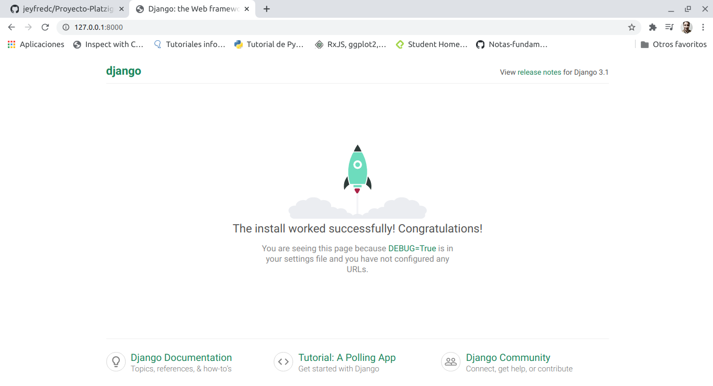

Para construir el primer hola mundo de la aplicacion nos dirigimos a **urls.py** , es posible comentar todo para ir revisando la documentacion y que siginifica cada cosa y por el momento no se requiere la vista  admin por tanto se deja comentada, `path('admin/', admin.site.urls),` , el `path()` como funciona es que se define la url a la que se esta esperando responder algo y es el primer argunmento de la funcion que en este caso seria `'hello-world'` lo cual significa que cuando vayamos a http://127.0.0.1:8000/hello-world algo tiene que pasar, y ese algo es el segun argunmento de la funcion path el cual es la vista que se va a generar para eso se puede definir una funcion o una clase, en este caso se va a crear la funcion `def hello_world(request):` siempre todas las vistas reciben un request que es el objeto del request y lo que regresa es una respuesta.

Para escribir una respuesta http debemos importar una herramienta de django llamada httpResponse `from django.http import HttpResponse`.

Despues de esto se regresa una instancia de esa clase con el contenido que nosotros queramos establecer en este caso `'Hello, world!'`

**urls.py**

```
"""platzigram URL Configuration

The `urlpatterns` list routes URLs to views. For more information please see:
    https://docs.djangoproject.com/en/3.1/topics/http/urls/
Examples:
Function views
    1. Add an import:  from my_app import views
    2. Add a URL to urlpatterns:  path('', views.home, name='home')
Class-based views
    1. Add an import:  from other_app.views import Home
    2. Add a URL to urlpatterns:  path('', Home.as_view(), name='home')
Including another URLconf
    1. Import the include() function: from django.urls import include, path
    2. Add a URL to urlpatterns:  path('blog/', include('blog.urls'))
"""
""" from django.contrib import admin
from django.urls import path

urlpatterns = [
    path('admin/', admin.site.urls),
]
 """
from django.urls import path
from django.http import HttpResponse


def hello_world(request):
    return HttpResponse('Hello, world!')


urlpatterns = [

    path('hello-world', hello_world)

    
]
```

Ahora en el navegado pordemos ir a la direccion http://127.0.0.1:8000/hello-world y desplegar el primer hola mundo 

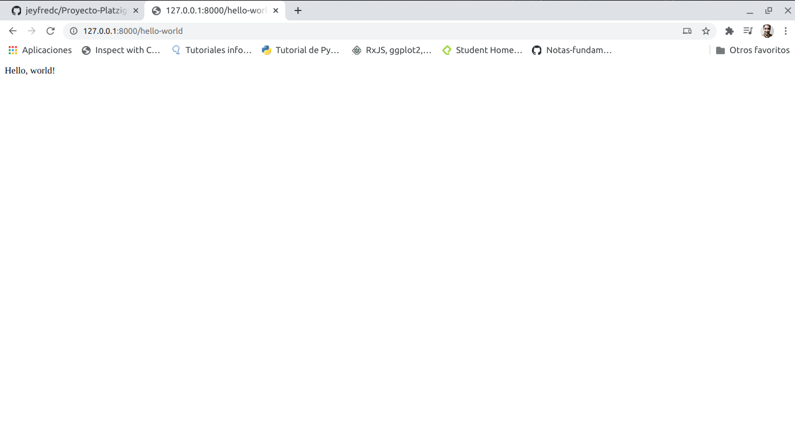

## Clase 5 El objeto Request

En esta clase crearemos mas vistas, jugaremos con los diferentes patrones de urls que django nos permite tener, revisaremos cómo django procesa las peticiones.

Lo primero que hay que hacer es revisar la documentacion de [django](https://docs.djangoproject.com/en/3.1/topics/http/urls/), para revisar como funciona el **dispatcher** de urls. la documentacion se encuentra en ingles pero hay un paso a paso que indica como procesa sjango una solicitud

**Cómo procesa Django una solicitud**

Cuando un usuario solicita una página de su sitio con tecnología Django, este es el algoritmo que sigue el sistema para determinar qué código Python ejecutar:

1. Django determina el módulo raíz URLconf que se utilizará. Por lo general, este es el valor de la **ROOT_URLCONF** configuración, pero si el **HttpRequest** objeto entrante tiene un **urlconf** atributo (establecido por middleware), su valor se utilizará en lugar de la **ROOT_URLCONF** configuración que se encuentra en settings.

2. Django carga ese módulo de Python y busca la variable **urlpatterns**. Esta debería ser una lista de Python **django.urls.path()** y / o **django.urls.re_path()** instancias.

3. Django recorre cada patrón de URL, en orden, y se detiene en el primero que coincide con la URL solicitada.

4. Una vez que uno de los patrones de URL coincide, Django importa y llama a la vista dada, que es una función de Python simple (o una vista basada en clases ). La vista recibe los siguientes argumentos:

- Una instancia de **HttpRequest**.

- Si el patrón de URL coincidente no devolvió ningún grupo con nombre, las coincidencias de la expresión regular se proporcionan como argumentos posicionales.

- Los argumentos de la palabra clave se componen de cualquier parte nombrada que coincida con la expresión de la ruta, anulada por cualquier argumento especificado en el **kwargs** argumento opcional para **django.urls.path()** o **django.urls.re_path().**

5. Si ningún patrón de URL coincide, o si se genera una excepción durante cualquier punto de este proceso, Django invoca una vista de manejo de errores adecuada. Consulte Manejo de errores a continuación.

Ahora lo que se va a hacer es crear un archivo para manejar las vistas dentro de la carpeta platzigram que se va a llamar **views.py** y alli se va a agregar la vista que habiamos creado en la clase anterior y la quitamos de urls.py

```
""" Platzigram views """

from django.http import HttpResponse


def hello_world(request):
    """ Return a greeting """
    return HttpResponse('Hello, world!')
```

y ahora importarla en **urls.py** para que siga funcionando la vista

```
from django.urls import path

from platzigram import views


urlpatterns = [

    path('hello-world/', views.hello_world)


]
```

por el momento nada ha cambiado y la vista que habiamos visto antes en http://127.0.0.1:8000/hello-world sigue cargando como lo hizo anteriormente


Ahora en el archivo **views** utilizamos un modulo que se va a requerir para utilizar la hora del servidor que se llama datetime que realmente es una utilidad de Python `from datetime import datetime`, cambiamos el `Hello, world!` y le pasamos otro argumento con la ahora actual para verla en el navegador

```
""" Platzigram views """

# Django
from django.http import HttpResponse

# utilities
from datetime import datetime

def hello_world(request):
    """ Return a greeting """
    now = datetime.now()
    return HttpResponse('Oh, hi! current time is {now}'.format(now=str(now)))
```

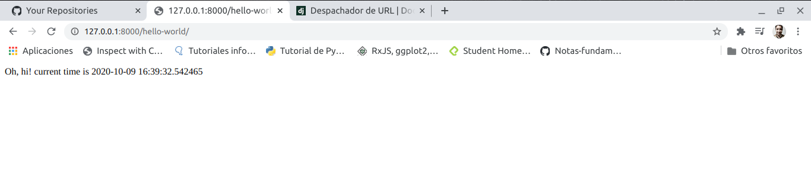

para mejorar la vista del formato de la hora se puede agregar a la variable now lo siguiente `now = datetime.now().strftime('%b %dth, %Y - %H:%M hrs')` donde `%b` indica el mes `%dth,` es dia `%Y` es el año `%H:%M hrs` indica la hora y minutos y al pasar el formato ya no es necesario convertirlo a un string por tanto la respuesta queda asi `return HttpResponse('Oh, hi! current time is {now}'.format(now=now))` o la otra forma para escribirlo seria la siguiente

```
""" Platzigram views """

# Django
from django.http import HttpResponse

# utilities
from datetime import datetime

def hello_world(request):
    """ Return a greeting """
    return HttpResponse('Oh, hi! current time is {now}'.format(
        now= datetime.now().strftime('%b %dth, %Y - %H:%M hrs')
        ))
```

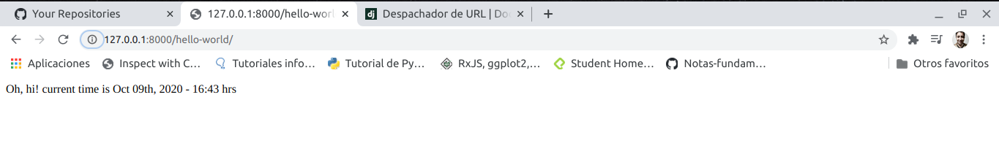

Hasta el momento no se ha hecho nada con el objeto request por tanto se va a crear otra vista despues de hello_world para ver que sucede con el objeto

```
def hi(request):
    """ Hi """
    return HttpResponse('Hi!')
```

y ahora se debe ligar a una url en el archivo **urls.py**

```
from django.urls import path

from platzigram import views


urlpatterns = [

    path('hello-world/', views.hello_world),
    path('hi/', views.hi)

]
```

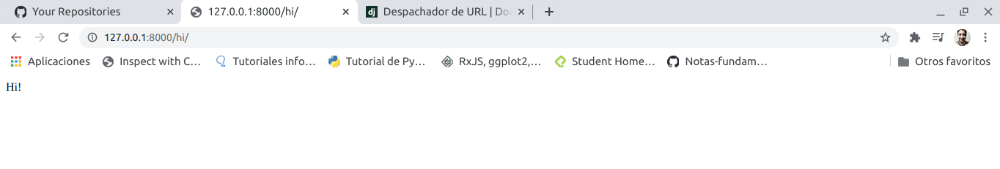

Para ver que esta pasando con request simplemente podemos hacer la impresion de este objeto con `print(request)`

```
def hi(request):
    """ Hi """
    print(request)
    return HttpResponse('Hi!')
```
Donde esta imprimiendo el objeto es en la terminal que indica que es un objeto de WSGIRequest que es un metodo GET y la url

`<WSGIRequest: GET '/hi/'>`

los atributos del objeto **HttpRequest** los encuentras [aqui](https://docs.djangoproject.com/en/3.1/ref/request-response/#django.http.HttpRequest)

la desventaja de la funcion `print()` es que se tiene que usar una y otra vez donde se quiera ver que esta pasando con el objeto. Existe una utilidad de Python que se llama **pdb** el cual es un debugger de Python que se llama asi `import pdb; pdb.set_trace()` el **;** es para no utilizar otra linea, esto se reemplaza en la funcion `print(request)`

para usarlo debemos recarga la direccion http://127.0.0.1:8000/hi/, esta se va a quedar cargando y luego en la terminal podemos hacer uso de pdb

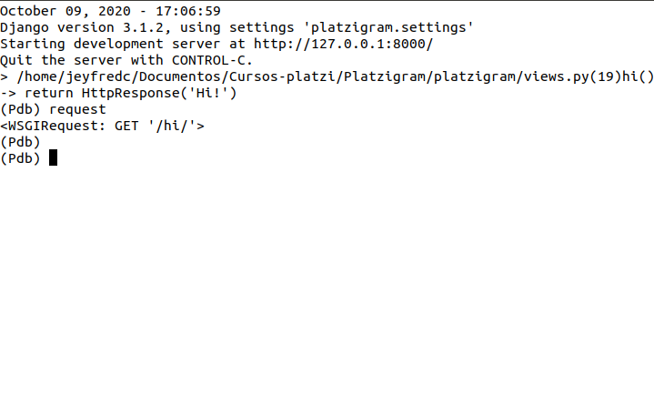

y asi es como podemos tener acceso a todos los metodos de request

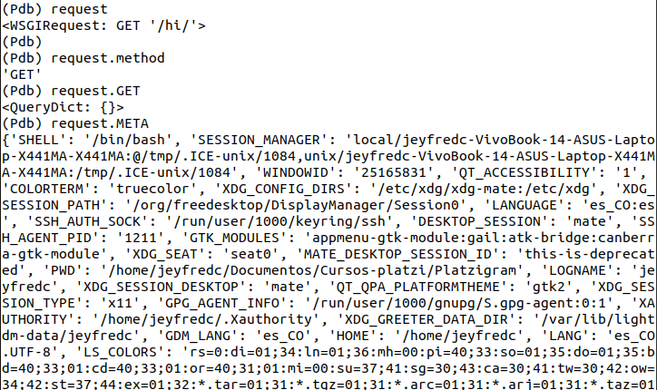

para salir de este debug podemos presionar la tecla **c + Enter** en la terminal y para finalizar o detener el servidor con **ctrl + c**

ahora en la funcion vamos a pasar una lista de numeros de la siguiente forma

```
def hi(request):
    """ Hi """
    numbers = request.GET['numbers']
    return HttpResponse(str(numbers))
 ```

 y en el navegador pasamos lo siguiente http://127.0.0.1:8000/hi/?numbers=10,4,50,32 , lo cual va a traer esa lista de numeros en el navegador

**Reto de la clase:** Crea una vista y su respectiva URL en la que recibas números y hagas operaciones con ellos. En la siguiente clase te voy a enseñar a resolverlo.

Regresa la lista ordenada de números en formato json.

## Clase 6 Solución al reto - Pasando argumentos en la URL

Continuando con las clases a continuacion se va a solucionar el reto de la clase pasada y ver otras formas de pasar argumentos a traves de las urls

para esto agregamos un debug ha la funcion `hi`

```
def hi(request):
    """ Hi """
    numbers = request.GET['numbers']
    import pdb; pdb.set_trace()
    return HttpResponse(str(numbers))
```

despues de esto utilizamos la terminal para regresar a `numbers` lo cual en un principio no trae una lista de numeros

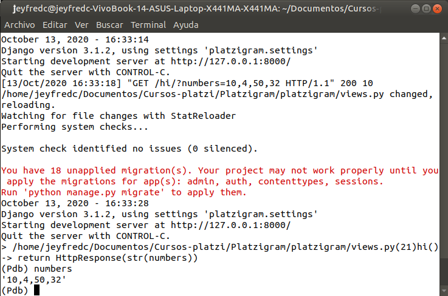

pero se puede agregar un metodo para poder separar los numeros dado un caracter, el cual se llama split y lo que recibe es el caracter que lo separa que en este caso es una coma , y si hacemos split obtenemos una lista de numeros pero estos numeros realmente siguen como enteros 

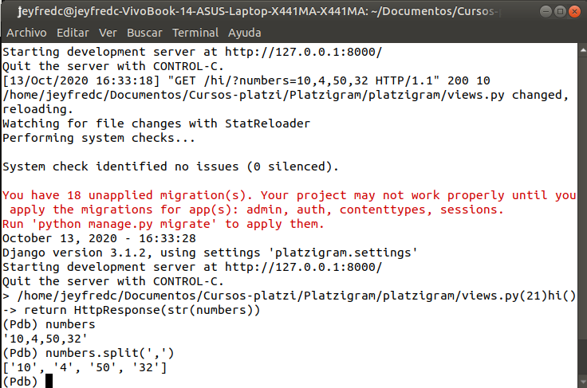

Usando un for se puede recorrer cada uno de los caracteres y convertirlos en enteros mediante un list comprehension (Pdb) `[int(i) for i in numbers.split(',')]` esto va a regresar una lista de numeros 

`[10, 4, 50, 32]`

modificando nuestro codigo de la funcion hi quedaria de la siguiente forma

```
def hi(request):
    """ Hi """
    numbers = [int(i) for i in request.GET['numbers'].split(',')]
    sorted_ints = sorted(numbers)
    return HttpResponse(str(numbers), content_type='application/json')
```    

Esto nos regresara en el navegador la lista que ya conocemos 

`[10, 4, 50, 32]`

revisando la documentacion sobre [HttpResponse Objects](https://docs.djangoproject.com/en/3.1/ref/request-response/#httpresponse-objects)

podemos encontrar el uso de content_type

**HttpResponse objetos** 

**clase HttpResponse**

A diferencia de los **HttpRequest** objects, que son creados automáticamente por Django, los **HttpResponse** objects son tu responsabilidad. Cada vista que escriba es responsable de crear instancias, completar y devolver un **HttpResponse**.

La **HttpResponse** class vive en el **django.http** module.

**Uso**

**Pasando cadenas**

El uso típico es pasar el contenido de la página, como una cadena, una cadena de bytes o memoryview, al HttpResponseconstructor:

```
>>> from django.http import HttpResponse
>>> response = HttpResponse("Here's the text of the Web page.")
>>> response = HttpResponse("Text only, please.", content_type="text/plain")
>>> response = HttpResponse(b'Bytestrings are also accepted.')
>>> response = HttpResponse(memoryview(b'Memoryview as well.'))
```
___

Modificando nuevamente nuestra funcion para regresarla como un objeto json podemos declarar en un diccionario e importar la libreria json para hacer uso de esta, tambien existe otra forma de implementarla a traves de [JsonResponse objects](https://docs.djangoproject.com/en/3.1/ref/request-response/#httpresponse-objects)

```
""" Platzigram views """

# Django
from django.http import HttpResponse

# utilities
from datetime import datetime
import json

def hello_world(request):
    """ Return a greeting """
    return HttpResponse('Oh, hi! current time is {now}'.format(
        now= datetime.now().strftime('%b %dth, %Y - %H:%M hrs')
        ))


def hi(request):
    """ Hi """
    numbers = [int(i) for i in request.GET['numbers'].split(',')]
    sorted_ints = sorted(numbers)
    data = {
        'status': 'ok',
        'numbers': sorted_ints,
        'message': 'Integers sorted successfuly.'
    }
    return HttpResponse(json.dumps(data), content_type='application/json')
```

esto en nuestro navegador nos va a regresar lo siguiente

`{"status": "ok", "numbers": [4, 10, 32, 50], "message": "Integers sorted successfuly."}`

y si queremos agregar indentacion para que se vea mas presentable podemos utilizarlo como parametros en dumps

`return HttpResponse(json.dumps(data, indent=4), content_type='application/json')`

para que el navegador lo suba de la siguiente forma 

```
{
    "status": "ok",
    "numbers": [
        4,
        10,
        32,
        50
    ],
    "message": "Integers sorted successfuly."
}
```

Hasta aqui estaria resuelto el resto de la clase anterior, ahora lo que sigue es resolver otra manera para pasar argumentos. 

En los sitios web podemos ver cosas como `http://127.0.0.1:8000/users/jeyfred` o un blog post algo como esto `http://127.0.0.1:8000/post/2020`

para que django pueda realizar este tipo de cosas utiliza [Path converters](https://docs.djangoproject.com/en/3.1/topics/http/urls/).

y en la documentacion se indica que puede ser una lista de paths `django.urls.path()` o una lista de repaths ` django.urls.re_path()`.

Un ejemplo seria una validacion de edad indicando que Platzigram no puede ser usado por menores de 15 años, para eso dentro del archivo de **urls.py** creamos la ruta 


from django.urls import path

from platzigram import views

```
urlpatterns = [

    path('hello-world/', views.hello_world),
    path('sorted/', views.sort_integers),
    path('hi/<str:name>/<int:age>/', views.say_hi)
]
```

**Nota:** hay un pequeño cambio en la funcion **hi**, cambia por sort_integers por tanto en la url se vera diferente.

y ahora dentro de las vistas en **views.py** implementamos la funcion `say_hi`, la documentacion indica que si en el path se pasa las variables name y age en este caso de ejemplo `path('hi/<str:name>/<int:age>/', views.say_hi`, la funcion esta obligada a pasar estos parametros `def say_hi(request, name, age):`

```
""" Platzigram views """

# Django
from django.http import HttpResponse

# utilities
from datetime import datetime
import json

def hello_world(request):
    """ Return a greeting """
    return HttpResponse('Oh, hi! current time is {now}'.format(
        now= datetime.now().strftime('%b %dth, %Y - %H:%M hrs')
        ))


def sort_integers(request):
    """ Returna JSON response with sorted integers. """
    numbers = [int(i) for i in request.GET['numbers'].split(',')]
    sorted_ints = sorted(numbers)
    data = {
        'status': 'ok',
        'numbers': sorted_ints,
        'message': 'Integers sorted successfuly.'
    }
    return HttpResponse(json.dumps(data, indent=4), content_type='application/json')


def say_hi(request, name, age):
    """ Return a greeting """
    if age < 12:
        message = 'Sorry {}, you are not allowed here'.format(name)
    else:
        message = 'Hello, {}! Welcome to Platzigram'.format(name) 
    return HttpResponse(message)
```

Si vamos al navegador y pasamos http://127.0.0.1:8000/hi/jeyfred/11/ 


y ahora si pasamos en el navegador otro argumento http://127.0.0.1:8000/hi/jeyfred/26/

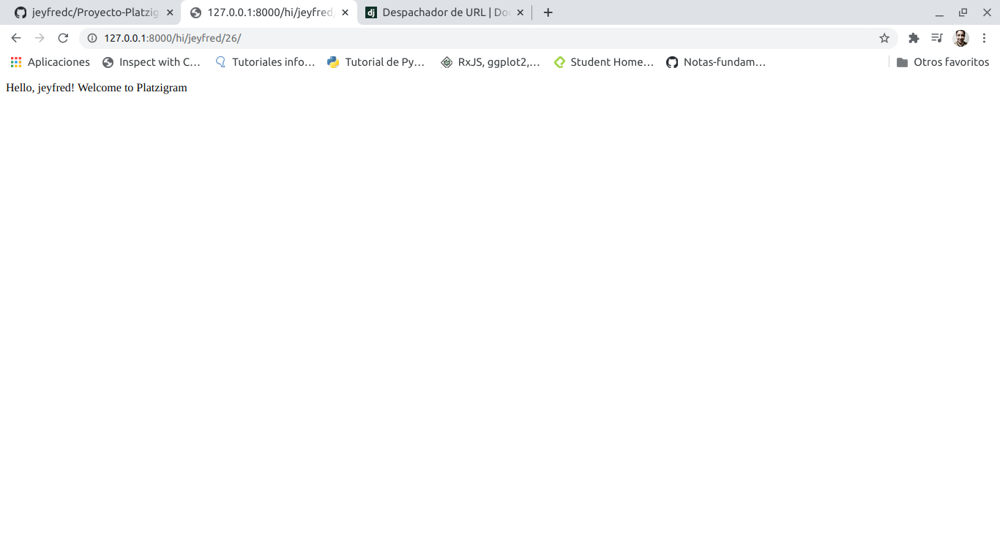

## Clase 7 Creación de la primera app

Vamos a explorar el concepto de Apps en Django y crearemos nuestra primera app de Platzigram, que es la aplicacion de **posts** y tambien los archivos de apps, admin, views, models y  tests.

La manera de crear una aplicacion dentro Django es utilizar el archivo **Manage.py** para inciarlo debemos ejecutar en la terminal lo siguiente

`python3 manage.py startapp posts`

Es importante destacar que las aplicaciones vengan en plural por convencion. 

Una app dentro de Django es un modulo de python que provee un conjunto de funcionalidades relacionadas entre sí.

Las apps son una combinación de models, vistas, urls, archivos estaticos.

Muchas apps en django estan hechas para ser reutilizadas.

esta es la manera como se ven los nuevos archivos despues de haber ejecutado startapp dentro de la terminal donde vemos una carpeta que se llama **migrations** que es la encarga de guardar los cambios en la base de datos.

El archivo **admin.py**, el cual se encarga de administrar los modelos.

El archivo **apps.py**, el cual declara toda la configuracion de la app hacia el publico en caso de que la app sea reutilizable.

El archivo **models.py**, el cual sirve para definir los modelos de nuestros datos.

El archivo **tests.py**, el cual se usa para pruebas.

y un archivo **views.py** que sirve para hacer render de las vistas 

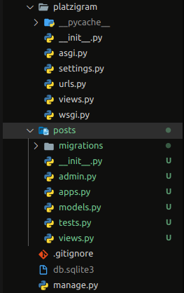

Para instalar la aplicacion es necesario realizar la configuracion en el archivo **apps.py**, podemos hacer uso de la documentacion de [applications](https://docs.djangoproject.com/en/3.1/ref/applications/) y configurar el nombre


```
""" Posts application module. """

from django.apps import AppConfig


class PostsConfig(AppConfig):
    """ Posts application settings. """
    
    name = 'posts'
    verbose_name = 'Posts'
```    
**Nota:** el contenido de **admin.py**, se puede eliminar, es decir que el archivo quede vacio

Ahora para realizar la instalacion de la aplicacion debemos dirigirnos al archivo **settings.py** y agregar la aplicacion, agregamos comentarios para diferenciar las aplicaciones que nos proveedor Django y las propias creadas

```
INSTALLED_APPS = [
    # Django apps
    'django.contrib.admin',
    'django.contrib.auth',
    'django.contrib.contenttypes',
    'django.contrib.sessions',
    'django.contrib.messages',
    'django.contrib.staticfiles',

    # Local apps
    'posts',
]
```

para verificar que todo esta funcionando se corre en servidor

`python3 manage.py runserver`

Verificar que todo este corriendo en el servidor de manera correcta y a continuacion vamos a crear una vista para esto dentro de **urls.py** creamos otro `path`.

Para diferenciar las vistas locales cambiamos la estructura de views por local_views y tambien dentro de cada uno de los paths locales y tambien se importan las vistas de posts y las llamamos posts_views

```
from django.urls import path

from platzigram import views as local_views
from posts import views as posts_views


urlpatterns = [

    path('hello-world/', local_views.hello_world),
    path('sorted/', local_views.sort_integers),
    path('hi/<str:name>/<int:age>/', local_views.say_hi),
    path('posts/', posts_views.list_posts),
]
```
y acontinuacion creamos la vista en **posts/views.py**, a modo de prueba primero le pasamos una lista de numeros reprensentada en cadena

```
"""Post views.  """

# Django
from django.http import HttpResponse


def list_posts(request):
    """ List existing posts. """
    posts = [1, 2, 4]
    return HttpResponse(str(posts))
```

verificamos en la terminal que el servidor este corriendo correctamente y recargamos en el navegador http://127.0.0.1:8000/posts/

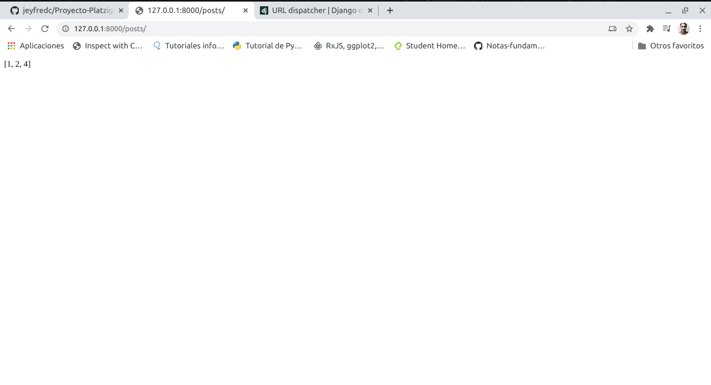

y ahora en **posts/views.py** se va a declarar de manera global un diccionario que contenga un name, user, timestamp y picture y en la funcion se va a pasar como html en el navegador. **Nota:** Esto es a manera de ejemplo.

para poder leer todo el diccionario desempaquetamos con `.format(**post)` y para unir todo utilizamos `.join(content)`

```
"""Post views.  """

# Django
from django.http import HttpResponse
from datetime import datetime

posts=[
    {
        'name': 'Mont Blanck',
        'user': 'Jeyfred Calderon',
        'timestamp' : datetime.now().strftime('%b %dth, %Y - %H:%M hrs'),
        'picture': 'https://picsum.photos/200/200?image=1036',
    },
    {
        'name': 'Via Láctea',
        'user': 'c. vander',
        'timestamp' : datetime.now().strftime('%b %dth, %Y - %H:%M hrs'),
        'picture': 'https://picsum.photos/200/200?image=903',
    },
    {
        'name': 'Nuevo auditorio',
        'user': 'Thespianartist',
        'timestamp' : datetime.now().strftime('%b %dth, %Y - %H:%M hrs'),
        'picture': 'https://picsum.photos/200/200?image=1076',
    }
]


def list_posts(request):
    """ List existing posts. """
    content = []
    for post in posts:
        content.append(""" 
            <p><strong>{name}</strong></p>
            <p><small>{user} - <i>{timestamp}</i></small></p>
            <figure></figure>
         """.format(**post))
    return HttpResponse('<br>'.join(content))

```

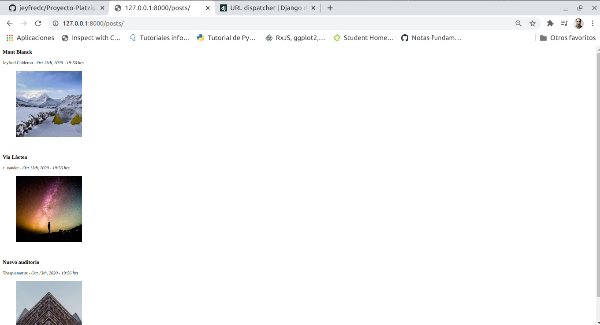

## Clase 8 Introducción al template system

Template system de Django es una manera de presentar los datos usando HTML, está inspirado en Jinja2 y su sintaxis, por lo cual comparte muchas similitudes. Permite incluir alguna lógica de programación.

Para comenzar a usar los templates hay que crear un folder dentro de posts y nombrarla **templates**, en este folder crear un archivo que se llame **feed.html** y en este archivo escribimos `Hola, Mundo!`

Ahora dentro de las vistas de posts **posts/views.py** reemplazamos `from django.http import HttpResponse` por `from django.shortcuts import render`, render es una funcion que toma un request, el nombre del template 

**posts/views.py**

```
"""Post views.  """

# Django
from django.shortcuts import render


def list_posts(request):
    """ List existing posts. """
    return render(request, 'feed.html')
```

Verificamos que todo este bien con el servidor en la terminal y recargamos http://127.0.0.1:8000/posts/

para que salga `Hola, Mundo!`

La forma en que trabaja render es que necesita pasar a request para agregar contexto al render, el segundo argumento es el nombre del template que se esta buscando. esto viene predefinido en el archivo de **settings.py**, Donde dice que lo va a encontrar dentro de los directorios de las aplicaciones 

```
TEMPLATES = [
    {
        'BACKEND': 'django.template.backends.django.DjangoTemplates',
        'DIRS': [],
        'APP_DIRS': True, #Busca dentro de los directorios de las aplicaciones 
        'OPTIONS': {
            'context_processors': [
                'django.template.context_processors.debug',
                'django.template.context_processors.request',
                'django.contrib.auth.context_processors.auth',
                'django.contrib.messages.context_processors.messages',
            ],
        },
    },
]
```

la funcion render tambien puede recibir otro argumento como por ejemplo un diccionario que tenga un nombre

```
"""Post views.  """

# Django
from django.shortcuts import render
from datetime import datetime


posts=[
    {
        'title': 'Mont Blanck',
        'user': {
            'name': 'Jeyfred Calderon',
            'picture': 'https://lh3.googleusercontent.com/ogw/ADGmqu9Rq5ukqaEtLja_pDNAyZJq7qMy3YTdwSEEdhXF=s32-c-mo',
        },
        'timestamp' : datetime.now().strftime('%b %dth, %Y - %H:%M hrs'),
        'photo': 'https://picsum.photos/800/600?image=1036',
    },
    {
        'title': 'Via Láctea',
        'user': {
            'name': 'Christian Van der Henst',
            'picture': 'https://picsum.photos/60/60?image=1005',
        },
        'timestamp' : datetime.now().strftime('%b %dth, %Y - %H:%M hrs'),
        'photo': 'https://picsum.photos/800/800?image=903',
    },
    {
        'title': 'Nuevo auditorio',
        'user': {
            'name': 'Uriel (Thespianartist)',
            'picture': 'https://picsum.photos/60/60?image=883',
        },
        'timestamp' : datetime.now().strftime('%b %dth, %Y - %H:%M hrs'),
        'photo': 'https://picsum.photos/500/700?image=1076',
    },
]


def list_posts(request):
    """ List existing posts. """
    return render(request, 'feed.html', {'posts': posts})
```

y cambiar el parametro que recibe **feed.html** por `{{ posts }}`

al recargar el navegador trae lo siguiente pero no es muy util de momento porque no tiene logica de programacion

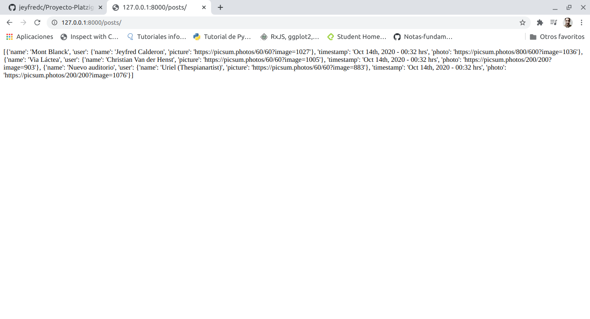

Ahora si utilizamos el archivo **feed.html** reemplazamos `{{ posts }}` por lo siguiente

```

    <p>{{ post.title }}</p>

```

al recargar el navegador se deben imprimir los titulos

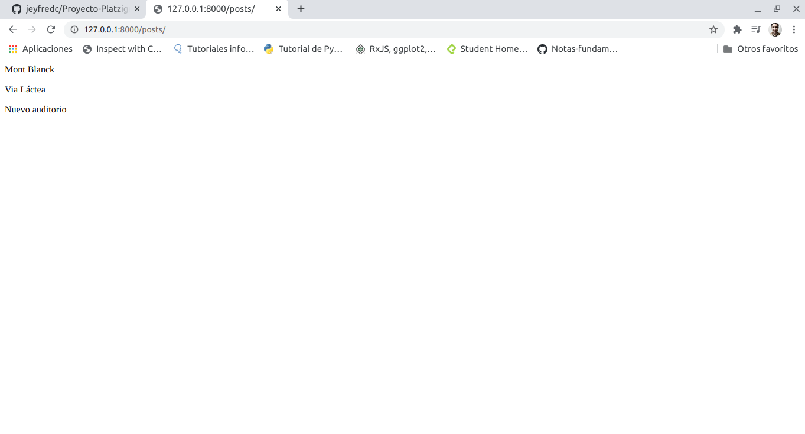

____

A continuacion vamos a utilizar Bootstrap mediante el **CDN** que se encuentra en la pagina de [Booststrap](https://getbootstrap.com/) 

y en el archivo **feed.html** cambiamos la estructura por html5 utilizando Bootstrap

```
<!DOCTYPE html>
<html lang="en">
<head>
    <meta charset="UTF-8">
    <meta name="viewport" content="width=device-width, initial-scale=1.0">
    <title>Platzigram</title>
    <link rel="stylesheet" href="https://stackpath.bootstrapcdn.com/bootstrap/4.5.3/css/bootstrap.min.css" integrity="sha384-TX8t27EcRE3e/ihU7zmQxVncDAy5uIKz4rEkgIXeMed4M0jlfIDPvg6uqKI2xXr2" crossorigin="anonymous">
  	  {# Cargamos la librería #}
        
 
        {# CSS Bootstrap #}
        
</head>
<body>
    <br><br>
    <div class="container">
        <div class="row">
            
            <div class="col-lg-4 offset-lg-4">
                <div class="media">
                    
                    <div class="media-body">
                        <h5 class="mt-0">{{ post.user.name }}</h5>
                        {{ post.timestamp }}
                    </div>
                </div>
                
                <h6 class="ml-1 mt-1">{{ post.title }}</h6>
            </div>
            
        </div>
    </div>
</body>
</html>
```

Por ultimo debemos instalar Bootstrap en este caso la version 4, para eso abrir el archivo **settings.py** y en `INSTALLED_APPS` agregarlo de esta forma

```
INSTALLED_APPS = [
    # Django apps
    'django.contrib.admin',
    'django.contrib.auth',
    'django.contrib.contenttypes',
    'django.contrib.sessions',
    'django.contrib.messages',
    'django.contrib.staticfiles',
    'bootstrap4',

    # Local apps
    'posts',
]
```

en caso que no funcione en la terminal ejecutar `pip install django-bootstrap4`

Correr el servidor y recargar el navegador http://127.0.0.1:8000/posts/ 

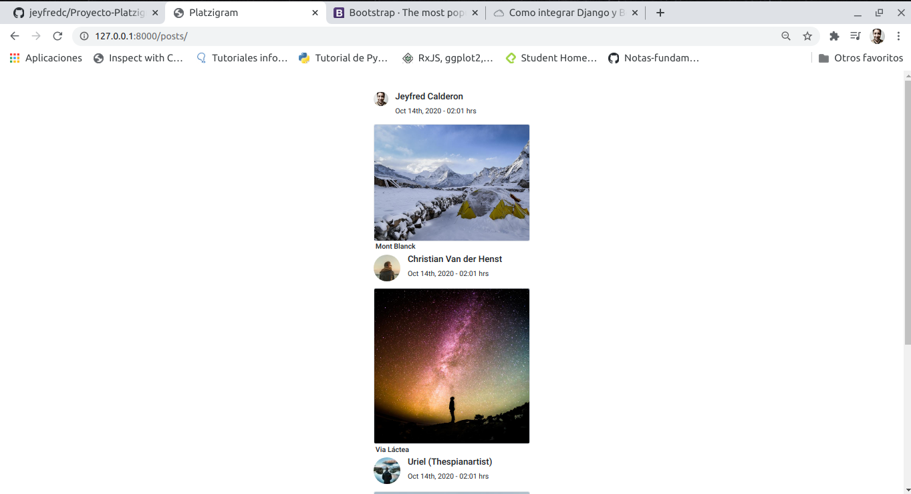

## Clase 9 Patrones de diseño y Django

Un patrón de diseño, en términos generales, es una solución reutilizable a un problema común.
El patrón más común para el desarrollo web es MVC (Model, View, Controller) el cual utiliza principalmente PHP y es la manera de separar los datos de la presentacion y de la logica, el Controller es el que maneja la logica de request, sabe que hacer en ese momento y que template debe mostrar. El Controller va a cambiar los datos a traves del modelo y este es el que se encarga de definir la estructura de los datos, el acceso a ellos e incluso la validacion. Finalmente la vista es la que se encarga de ver como presenta los datos al usuario. 

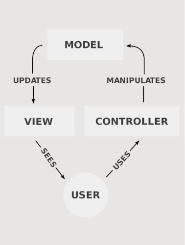

Django implementa un patrón similar llamado MTV (Model, Template, View). Donde el modelo es el que define la estructura de los datos, el Template es la logica de la presentacion de los datos y la vista es la encargada de traer los datos y pasarlos por el template.

## Clase 10 La M en el MTV(model, Template, View)


Para entender mejor esta clase descargar [DB Browser for Sqlite](https://sqlitebrowser.org/dl/)

En el archivo **settings.py** encontramos la condiguracion de la base de datos que trae por default Django el cual es sqlite3 que es un archivo que ya esta presente en el folder de **Platzigram**

```
DATABASES = {
    'default': {
        'ENGINE': 'django.db.backends.sqlite3',
        'NAME': BASE_DIR / 'db.sqlite3',
    }
}
```

El Modelo en Django usa diferentes opciones para conectarse a múltiples bases de datos relacionales, entre las que se encuentran: SQLite, PostgreSQL, Oracle y MySQL.

Para revisarlo como se configura con otra base de datos debemos revisar en la parte de [DATABASES ENGINE](https://docs.djangoproject.com/en/3.1/ref/settings/#databases) especifica el sistema de base de datos con el que vamos a estar trabajando. 

Pero si queremos trabajar con Postgresql o Mysql toca configurar el `HOST` que es la ubicacion de la base de datos donde esta corriendo.

___

Cuando corremos el servidor con `python3 manage.py runserver`

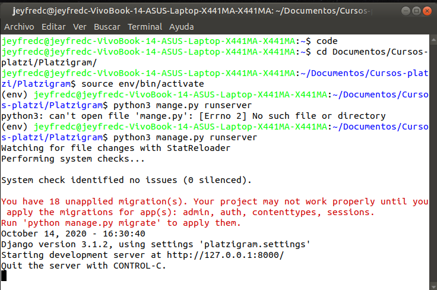

la terminal indica que hay 18 migraciones que no se han aplicado y que el proyecto puede no funcionar correctamente porque las apps que trae por default no han encontrado esa migracion

Ahora si tenemos el servidor encendido apagarlo con `Ctrl + C`

para ejecutar los cambios de las migraciones en la base de datos que viene por defecto, escribir en la terminal 

`python3 manage.py migrate`

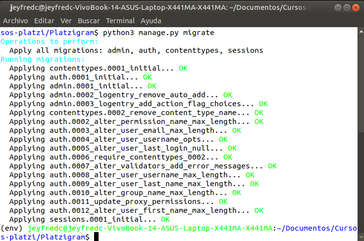

y vemos que todo queda OK

Ahora podemos hacer uso de **DB Browser for Sqlite** para abrir el archivo que tenemos en el proyecto

Dar click en Open Database, buscamos el fichero db.sqlite3 del proyecto Platzigram y damos click en abrir

este archivo creo todas las tablas que aparecen en la imagen 

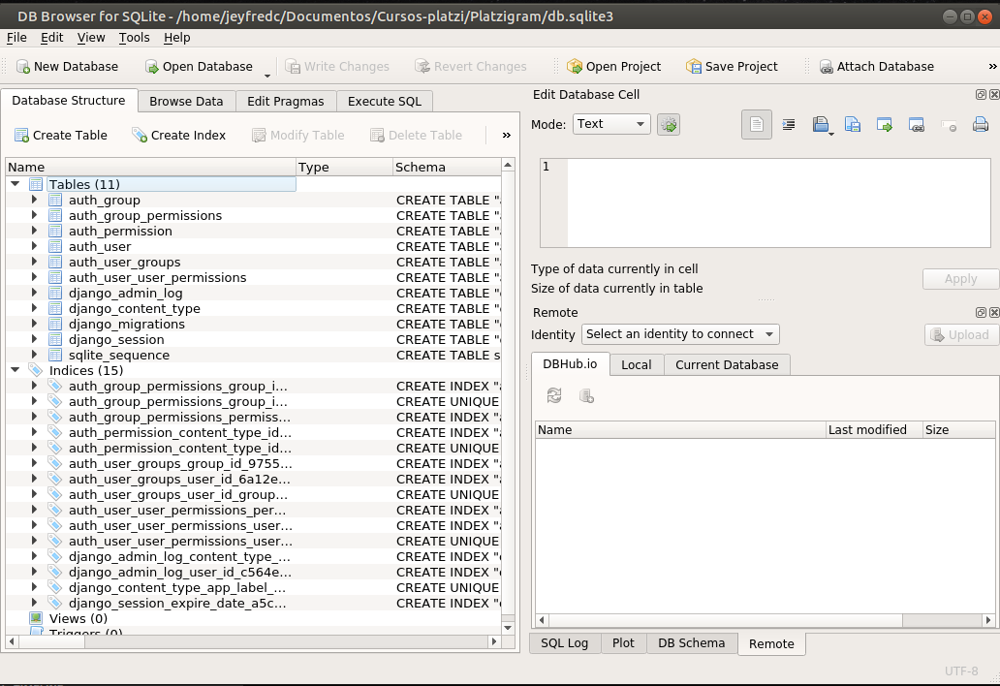

Si se quiere crear una tabla en caso de no usar un Framework como Django lo que habria que hacer es escribir todas las sentencias SQL como las de la imagen para crear esa tabla, y esas sentencias SQL cambian de Engine a Engine, no son las mismas que se usan para Postgresql como las que se usan para Mysql.

Para la creación de tablas, Django usa la técnica del ORM (Object Relational Mapper), una abstracción del manejo de datos usando Programacion Orientada a Objetos, esto es en el caso de Django para trabajar con multiples sistemas como Postgresql, Mysql o oracle a traves de clases de Python.

En definitiva el ORM es un conjunto de clases que permiten interactuar con bases de datos y definir la estructura de tablas.

Como ejempĺo se va a crear un modelo de usuario pero este ya viene con sqlite3.

para crearlo abrir el archivo **posts/models.py**

Para crear un modelo de base de datos como el de la imagen se debe crear una clase, para verificar que los campos que a continuacion se muestran sirven con la base de datos se debe consultar la documentacion que es la [referencia a la base de datos](https://docs.djangoproject.com/en/3.1/ref/models/fields/)

```
""" posts models. """

#Django
from django.db import models


class User(models.Model):
    """ User model. """

    email = models.EmailField()
    password = models.CharField()

    first_name = models.CharField()
    last_name = models.CharField()

    bio = models.TextField()

    birthdate = models.DateField()

    created =  models.DateTimeField()
    modified = models.DateTimeField()
```

Si a continuacion de guardar esto se corre el servidor, nos va a informar que esta faltando

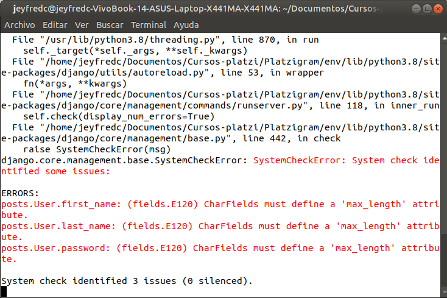

Donde indica que se necesecita tener una maxima longitud para los campos first_name, last_name y password

Terminando de configurar la base de datos se agrega lo siguiente

```
""" posts models. """

#Django
from django.db import models


class User(models.Model):
    """ User model. """

    email = models.EmailField(unique=True)
    password = models.CharField(max_length=100)

    first_name = models.CharField(max_length=100)
    last_name = models.CharField(max_length=100)

    bio = models.TextField(blank=True)

    birthdate = models.DateField(blank=True, null=True)

    created =  models.DateTimeField(auto_now_add=True)
    modified = models.DateTimeField(auto_now=True)
```

- **(max_length=100)** son campos que contienen una maxima longitud

- **(unique=True)** es un campo para que el email como en el ejemplo sea unico

- **(blank=True, null=True)** En el ejemplo depronto la fecha de cumpleaños puede no ser necesaria por tanto se pone en blanco pero por ser un campo numerico se debe configurar como nulo 

- **(auto_now_add=True)** Este sirve para cargar una fecha de creacion de dato en la tabla

- **(auto_now=True)** Este sirve para cargar una fecha de actualizacion de dato en la tabla

Si nuevamente se revisa el servidor despues de haber agregado estos campos ya no debe indicar ningun tipo de error.

Para que tanto DB Browser for sqlite y Django detecten el cambio o modificacion que se hizo en **posts/models.py** 

debemos apagar el servidor nuevamente y ahora usar la sentencia

`python3 manage.py makemigrations`

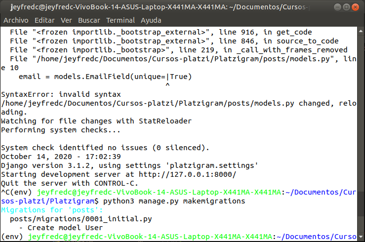

E indica que se creo un modelo de usuario y realizo unos cambios que se pueden ver en la carpeta **posts/migrations/0001_initial.py**

el archivo es otra clase de Python que indica que fue lo que se creo 

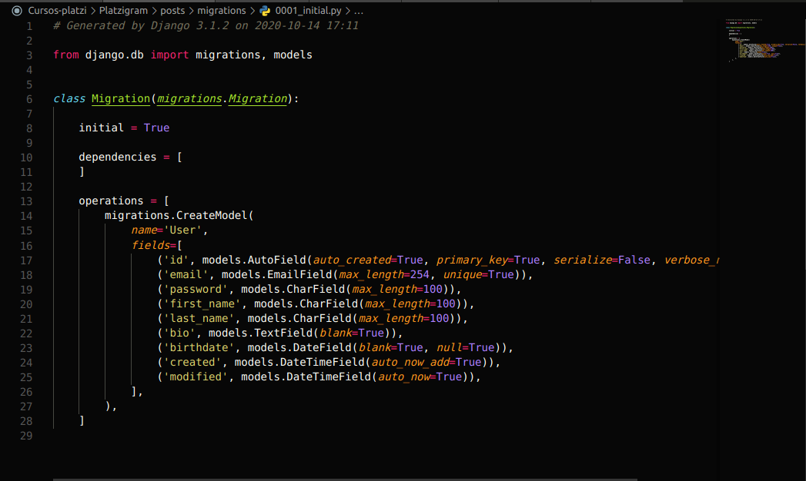

Si se ejecuta el servidor nuevamente va indicar que esta pendiente 1 migracion 

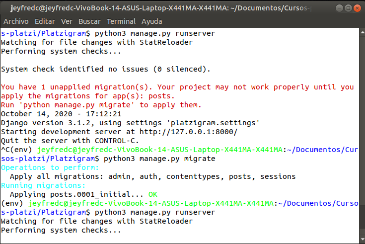

Por tanto nuevamente se debe ejecutar

`python3 manage.py migrate`

`python3 manage.py runserver`

para ver que los cambios estan aplicados se puede abrir DB Browser for sqlite y abrir nuevamente el proyecto, donde debe aparecer una tabla llamada **posts_user**

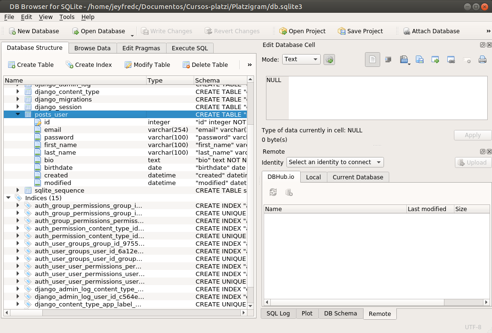

## Clase 11 El ORM de Django

A continuacion vamos a ver como insertar datos, hacer consultas y hacer filtros en la base de datos.

Antes de continuar se va a agregar un campo mas a la tabla que va a ser una validacion

**Nota:** Django agrega un id a la tabla por defecto es por esto que no es necesario configurarlo en models

Abrir **posts/models.py** y debajo de last_name agregar lo siguiente `is_admin = models.BooleanField(default=False)` este campo es para cualquier usuario no tenga permiso como administrador.

Al agregar este campo hay que indicarle a Django que la base de datos a cambiado.

Nuevamente se debe apagar el servidor si esta encendido y ejecutar

`python3 manage.py makemigrations`

luego 

`python3 manage.py migrate`

y por ultimo si encender el servidor

`python3 manage.py runserver`

tambien se puede verificar que el campo de haya actualizado en DB Browser for sqlite y ademas al agregar este nuevo campo la terminal nos indica que creo un nuevo archivo en **posts/migrations/0002_user_is_admin.py**

___

Para grabar datos en el ORM se debe abrir el shell de python3 pero por si solo no funciona al ejecutarlo. Por tanto en la terminal se debe ejecutar la siguiente sentencia

`python3 manage.py shell`

utilizando `from posts.models import User` podemos hacer la instancia de un objeto en la base de datos. Por ejempĺo crear un usuario asi

```
pepito = User.objects.create(
    email='pepitocarepepito@gmail.com',
    password='pepito1234',
    first_name='pepito',
    last_name='carepepito'
)
```

De esta forma es como se crearia un usuario en la tabla User

se puede consultar la propiedad de la clase a traves de sus valores como por ejemplo

`pepito.email` = email

`pepito.id` = id por defecto

`pepito.pk` = llave primaria por defecto

`pepito.firs_tname` = name


y la otra para confirmar que ya se encuentra en la base de datos es abriendo DB Browser for Sqlite

Seleccionando **Browse Data** y ubicando **Table:** en **post_user**


si por ejemplo el email quedo con el correo mal configurado para modificarlo se abre nuevamente shell y se ejecuta lo siguiente

`pepito.email = 'pepito@gmail.com'`

`pepito.save()`

Al actualizar DB Browser ya debe aparecer el correo corregido 

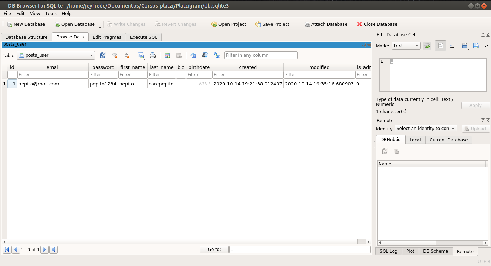

Otra manera de agregar datos a la tabla es instanciar como una clase 

`gonzalo = User()`

`gonzalo.email = 'gonzalo@gmail.com'`

`gonzalo.first_name = 'Gonzalo'`

`gonzalo.last_name = 'Gonzalez'`

`gonzalo.password = 'gongon123'`

`gonzalo.is_admin = True`

`gonzalo.save()`

al finalizar la sentencia con `save()` se guardan los datos en la tabla 

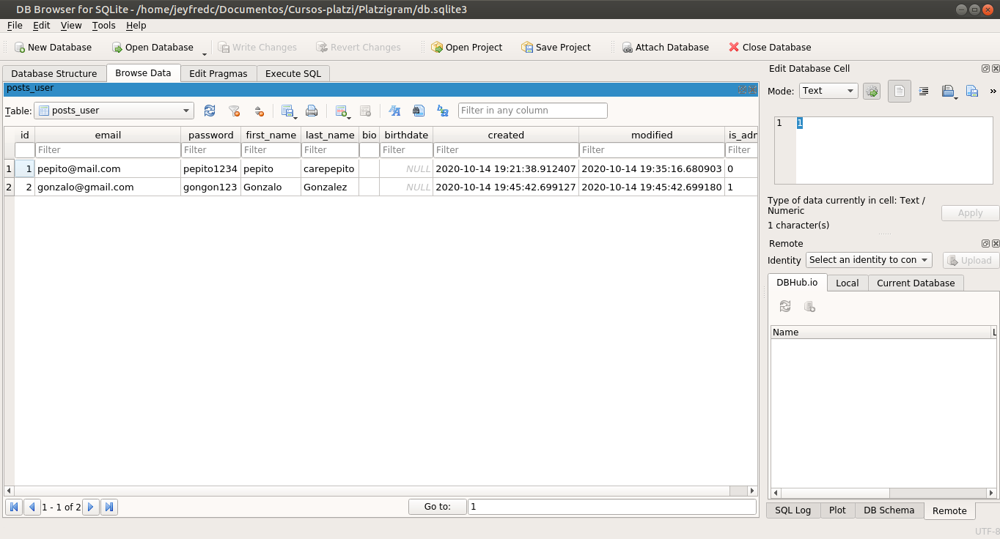

En caso de querer borrar un usuario de la tabla ejecutar en shell

`gonzalo.delete()`

saldra la siguiente respuesta que es la confirmacion que se elimino el usuario en la base de datos y nuevamente se puede consultar en Db Browser

`(1, {'posts.User': 1})`


Para hacer mas facil la creacion de datos a continuacion se dejan 4 usuarios mas para crear, esto se puede realizar en algun archivo y luego pegar en el shell

```
from datetime import date 

users = [
    {
        'email': 'reyes_k423@gmail.com',
        'first_name': 'Camilo',
        'last_name': 'Reyes',
        'password' : '1234567',
        'is_admin': True
    },
    {
        'email': 'mariadb@gmail.com',
        'first_name': 'Maria',
        'last_name': 'Dionisia Benabidez',
        'password' : '5556655'
    },
    {
        'email': 'pablo.barato@hotmail.com',
        'first_name': 'Pablo',
        'last_name': 'Barato',
        'password' : '12345',
        'birthdate' : date(1990, 12, 19),
        'bio' : "Lorem Ipsum is simply dummy text of the printing and typesetting industry. Lorem Ipsum has been the industry's standard dummy text ever since the 1500s"
    },
    {
        'email': 'Ana_de_platzi@gmail.com',
        'first_name': 'Ana',
        'last_name': 'de_platzi',
        'password' : 'computer',
        'is_admin': True,
        'birthdate' : date(1981, 4, 10)
    }
]

from posts.models import User

for user in users:
    obj = User(**user)
    obj.save()
    print(obj.pk)
```


___

Para hacer querys o consultas se puede hacer uso de la [documentacion](https://docs.djangoproject.com/en/3.1/topics/db/queries/)

para traer algun usuario de los creados por ejemplo pablo barato se abre shell y con `get` es posible traer un usuario: 

A continuacion se ejecuta

`from posts.models import User`

`user = User.objects.get(email='pablo.barato@hotmail.com')`

hasta aqui no pasa nada pero si se escribe 

`user`

regresa el id de usuario con el que fue creado pablo el cual seria el numero 5 y lo trae de la siguiente forma

`<User: User object (5)>`

si se pide el tipo de usuario 

`type(user)`

regresa indicando que es una instancia de la clase User

`<class 'posts.models.User'>`

tambien se pueden traer todos los datos

`user.first_name`

`user.last_name`

`user.bio`

`user.password`

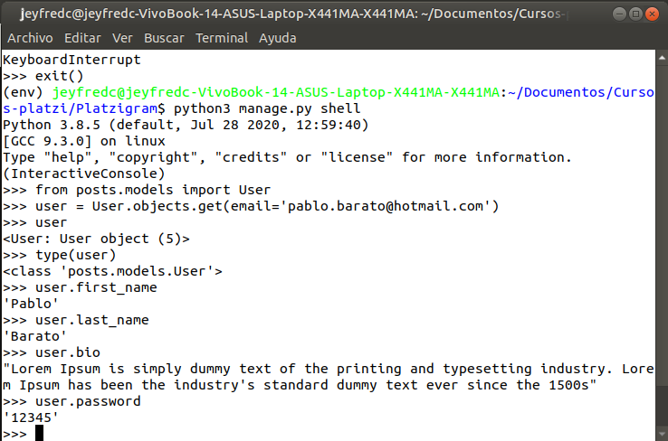

___

Todos los usuarios creados hasta el momento fueron configurados con correos gmail a excepcion de pablo que es hotmail para filtrar estos datos se puede hacer uso de `filter` y se ejecuta lo siguiente en shell

**Nota:** la notacion de email**__**, doble guion bajo es para anunciar que se va a realizar un query especial

`gmail_users = User.objects.filter(email__endswith='@gmail.com')`

luego ejecutar 

`gmail_users`

pero esto va a traer los id de los usuarios, en este caso me aparecen 3 porque el correo de pepito no quedo como pepito@gmail.com si no como pepito@mail.com

`<QuerySet [<User: User object (3)>, <User: User object (4)>, <User: User object (6)>]>`

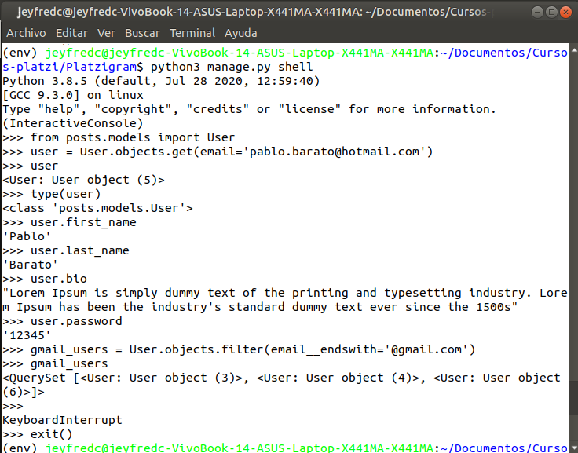

___

para poder traer objetos diferentes al id se puede crear un metodo en el archivo **posts/models.py** despues de la clase y agregar

```
    def __str__(self):
        """ retun self.email """
        return self.email
``` 

Guardar, salir de shell y ejecutar nuevamente shell recordando que lo primero que se hacer es ejecturar

`from posts.models import User`

`gmail_users = User.objects.filter(email__endswith='@gmail.com')`

`gmail_users`

esto va a traer la representacion de los correos como un string

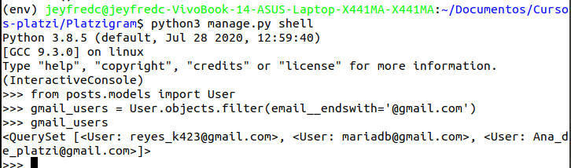

si se requiere traer a todos los usuarios se puede ejecutar

`users = User.objects.all()`

`users`

y esto es lo que traera en shell

`<QuerySet [<User: pepito@mail.com>, <User: reyes_k423@gmail.com>, <User: mariadb@gmail.com>, <User: pablo.barato@hotmail.com>, <User: Ana_de_platzi@gmail.com>]>`

**Nota:** Recordar que **get** es para traer un solo dato y **filter** para traer varios

Tambien se puede filtrar mediante un for si los correos que estan como gmail tiene permisos de administrador o no de la siguiente forma

ejecutar en shell

```
for u in gmail_users:
    print(u.email, ':', u.is_admin)
```

y esto trae 

```
reyes_k423@gmail.com : True
mariadb@gmail.com : False
Ana_de_platzi@gmail.com : True
```
___

Ahora para actualizar que todos los usuarios que tienen correo gmail tienen permisos de administracion se ejecuta en shell lo siguiente

`gmail_users = User.objects.filter(email__endswith='gmail.com').update(is_admin=True)`

**.update** lo que hace es actualizar los datos de todos los correos terminados en **gmail.com**, para verificar se puede consultar en DB Browser, los valores deben estar con el campo con el numero 1

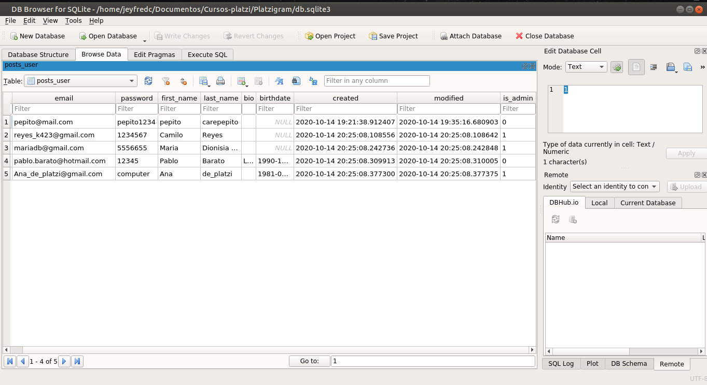

si se quiere que toda la lista de usuarios creados queden con permiso se puede ejecutar lo siguiente

`mail_users = User.objects.filter(email__endswith='mail.com')`

esto trae a todos los que terminen en **mail.com** que serian los 5 usuarios creados hasta el momento

`<QuerySet [<User: pepito@mail.com>, <User: reyes_k423@gmail.com>, <User: mariadb@gmail.com>, <User: pablo.barato@hotmail.com>, <User: Ana_de_platzi@gmail.com>]>`

y luego ejecutar 

`mail_users = User.objects.filter(email__endswith='mail.com').update(is_admin=True)`

consultado en DB Browser, todos los usuarios ahora deberian estar activos

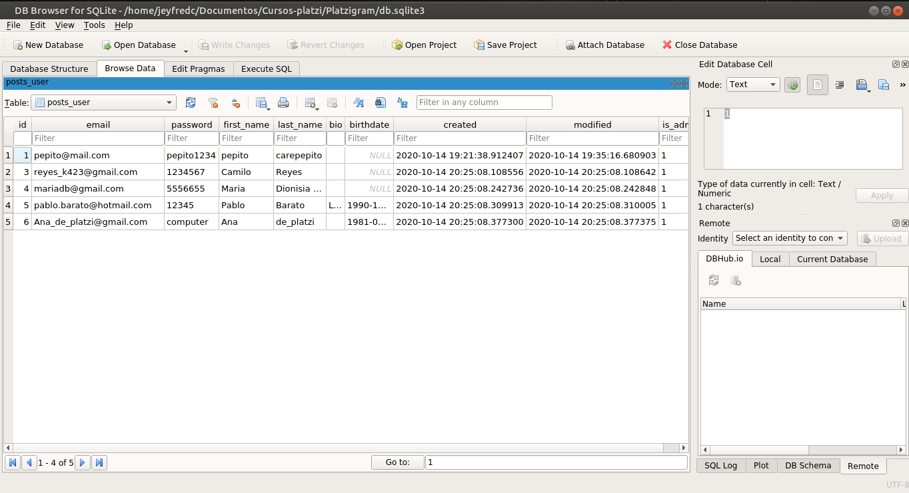

**Reto de la clase:**

Inserta mas usuarios a la base de datos que hemos construido en nuestro entorno de pruebas y realiza consultas en el ORM para traer a los admins.

Crea un nuevo campo PAÍS en el modelo, inserta usuarios y haz filtros.

## Clase 12 Glosario

- **ORM**: Object-relational mapping. Es el encargado de permitir el acceso y control de una base de datos relacional a través de una abstracción a clases y objetos.

- **Templates**: Archivos HTML que permiten la inclusión y ejecución de lógica especial para la presentación de datos.

- **Modelo**: Parte de un proyecto de Django que se encarga de estructurar las tablas y propiedades de la base de datos a través de clases de Python.

- **Vista**: Parte de un proyecto de Django que se encarga de la lógica de negocio y es la conexión entre el template y el modelo.

- **App**: Conjunto de código que se encarga de resolver una parte muy específica del proyecto, contiene sus modelos, vistas, urls, etc.

- **Patrón de diseño**: Solución común a un problema particular.

## Clase 13 Extendiendo el modelo de usuario

El modelo de usuarios que acabamos de construir funciona bien y es válido, sin embargo tiene algunas cosas que podrían representar fallas de seguridad en la aplicación. Por esto vamos a explorar el modelo de usuarios que nos provee Django.

El problema de tener este modelo es que la contraseña esta en texto plano, no existen metodos para verificarla, almacenarla de manera segura, ni tampoco una manera para validar su fortaleza.

Django trae un modelo de usuarios por default la cual se va aextender para utilizar de manera segura

en las bases de datos se ven de esta forma


pero es importante saber que la existencia de esto es gracias a `'django.contrib.auth'` el cual se encuentra en el archivo de **settings.py** en la parte de `INSTALLED APPS` e incluye el modelo de usuario.

Para hacer uso del modelo de usuario se debe ingresar desde shell

para incluirlo se hace de la siguiente forma

`from django.contrib.auth.models import User`

Luego se crea un nuevo usuario, pero este debe recibir como parametro el username y el password

`u = User.objects.create_user(username='gonzalo', password='gonzalez')`

despues de crearlo se puede ver que gonzalo es un usuario

`u`

que tambien tiene un id

`u.pk`

que tiene username

`u.username`

y tambien el valor del password que ya viene encriptado

`u.password`

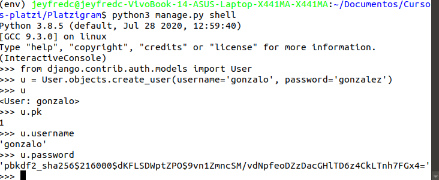

en DB Browser tambien se puede ver en la tabla **auth_user**

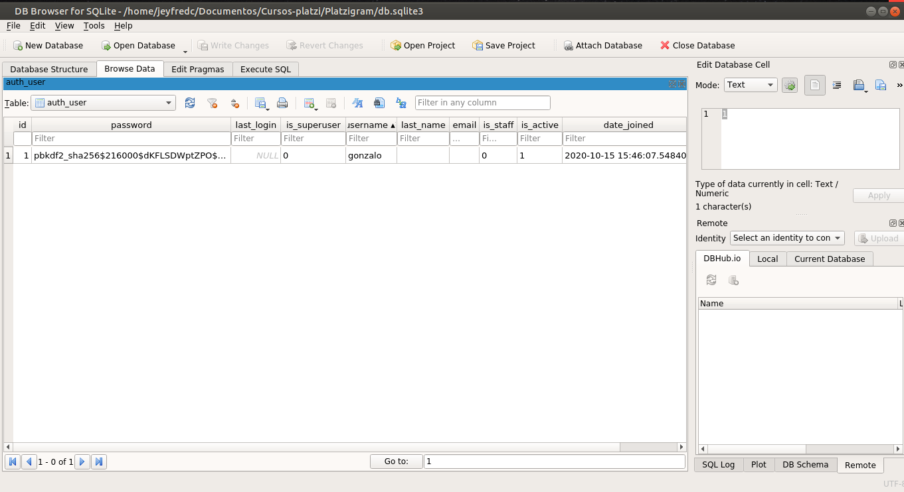

Ahora hay que crear un super usuario en shell

se crea de la siguiente forma:

`python3 manage.py createsuperuser`

a continuacion va a pedir un username, despues un email, el password, confirmacion de password

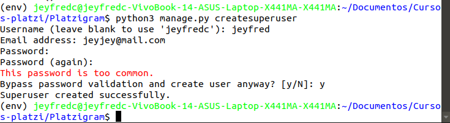

despues de esto se puede validar en DB Browser.

___

Ahora se va a validar en admin, para eso abrir **urls.py** importar `from django.contrib import admin` y luego agregar el path de admin `path('admin/', admin.site.urls),`

```
""" Platzigram URLs module. """

#Django
from django.contrib import admin
from django.urls import path

from platzigram import views as local_views
from posts import views as posts_views


urlpatterns = [

    path('admin/', admin.site.urls),

    path('hello-world/', local_views.hello_world),
    path('sorted/', local_views.sort_integers),
    path('hi/<str:name>/<int:age>/', local_views.say_hi),
    path('posts/', posts_views.list_posts),
]
```

luego en la consola correr el servidor. verificar que todo este bien y ir al path de admin en http://127.0.0.1:8000/admin/

inmediatamente despues de colocar la ruta se va a abrir el login de admin

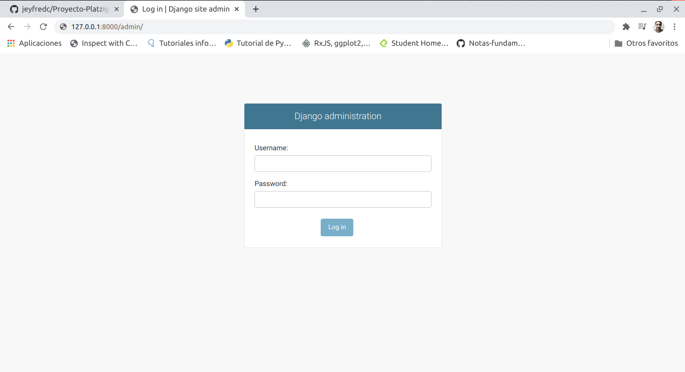

Alli se digita el nombre del super usuario creado con la contraseña asignada 

luego de esto, hay un acceso a grupos y a usuarios al dar click en usuarios esta todo el acceso a los que se han creado hasta el momento

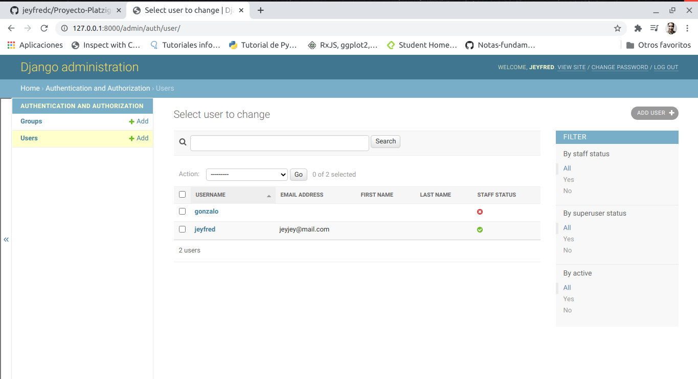

la documentacion de todo esto se puede ver en el repositorio de GitHub de [Django](https://github.com/django/django) y para ver lo que se esta creando ir a la ruta [models](https://github.com/django/django/blob/master/django/contrib/auth/models.py)

___

A continuacion borrar todo el contenido que se encuentr en el archivo **posts/models.py**, sin borrar el archivo **models.py**, no se requiere, ya que se esta haciendo uso de las aplicaciones que provee Django.

Borrar los archivos que se encuentren en **posts/migrations**, sin borrar el archivo **__init__.py**

Borrar tambien el archivo de bases de datos que es **db.sqlite3** 

**Nota:** Todo lo que se borro eran modelos de ejemplo

## Clase 14 Implementación del modelo de usuarios de Platzigram

Las opciones que Django propone para implementar Usuarios personalizados son:

- Usando el Modelo [proxy](https://docs.djangoproject.com/en/3.1/ref/models/fields/)

- Extendiendo la clase abstracta de [Usuario existente](https://docs.djangoproject.com/en/dev/topics/auth/customizing/#extending-the-existing-user-model)

- La opción OneToOneField restringe la posibilidad de tener perfiles duplicados.

Django no guarda archivos de imagen en la base de datos sino la referencia de su ubicación.

para empezar hay que crear una nueva aplicacion llamada users en consola

`python3 manage.py startapp users`

Ahora existe un nuevo folder llamado **users** con los mismos archivos que tenia **posts**

abrir **users/apps.py** para empezar a configurar el proyecto recordando que se debe establecer `verbose_name = 'Users'` el cual debe ir en plural

```
""" User app configuration. """

from django.apps import AppConfig


class UsersConfig(AppConfig):
    """User app config.  """

    name = 'users'
    verbose_name = 'Users'
```

abrir **users/models.py**

segun la documentacion lo que dice es que debe extender el modelo User `from django.contrib.auth.models import User`

el nombre mas indicado para crear el perfil de platzigram seria **Profile** `class Profile(models.Models)`

se hace uso de [OneToOneField](https://docs.djangoproject.com/en/3.1/ref/models/fields/#onetoonefield) 

```
""" Users models. """

#Django
from django.contrib.auth.models import User
from datetime import datetime
from django.db import models


class Profile(models.Models):
    """Profile Model  
    
    Proxy model that extends the base data with other information.
    """

    user = models.OneToOneField(User, on_delete=models.CASCADE)

    website = models.URLField(max_length=200, blank=True)
    biography = models.TextField(blank=True)
    phone_number = models.CharField(max_length=20, blank=True)

    picture = models.ImageField(upload_to='users/pictures', blank=True, null=True)

    created = models.DateField(auto_now_add=True)
    modified = models.DateField(auto_now=True)


def __str__(self):
    """ return username """

    return self.user.username
```

Ahora hay que hacer la instalacion de la aplicacion users en el archivo **settigs.py** en `INSTALLED APPS` y poner debajo de `posts` a `users`

```
INSTALLED_APPS = [
    # Django apps
    'django.contrib.admin',
    'django.contrib.auth',
    'django.contrib.contenttypes',
    'django.contrib.sessions',
    'django.contrib.messages',
    'django.contrib.staticfiles',
    'bootstrap4',

    # Local apps
    'posts',
    'users',
]
```

Como se realiza un cambio en la base de datos hay que hacer la migracion en consola con 

`python3 manage.py makemigrations`

despues ejecutar 

`python3 manage.py migrate`

A continuacion marca este error que indica que o esta instalado Pillow 

```
SystemCheckError: System check identified some issues:

ERRORS:
users.Profile.picture: (fields.E210) Cannot use ImageField because Pillow is not installed.
	HINT: Get Pillow at https://pypi.org/project/Pillow/ or run command "python -m pip install Pillow".
```
(Pillow es una variante (o fork) de la popular librería PIL (Python Image Library) que permite procesar con facilidad imágenes con Python 2. x/3. ... Con Pillow podemos consultar información básica de una imagen como su tamaño, el formato que tiene (jpg, png, gif, etc.), el tipo de imagen (bits/pixel, BN/color, etc.)), la aplicacion obliga a instalar pillow porque en el modelo de bases de datos al crear el objeto `picture` obliga a tener una referencia de imagen el cual trabaja con esta libreria.

para instalar simplemente se ejecuta

`pip install pillow`

Nuevamente ejecutar 

`python3 manage.py makemigrations`

`python3 manage.py migrate`

Nuevamente hay que crear el superusuario porque antes se borro la base de datos

`python3 manage.py createsuperuser`

a continuacion va a pedir un username, despues un email, el password, confirmacion de password


despues de esto se puede validar en DB Browser.

y por ultimo encender el servidor

`python3 manage.py runserver`

verificar si esta ingresando con http://127.0.0.1:8000/admin/

y que la base de datos **users_profile** se encuentre creada

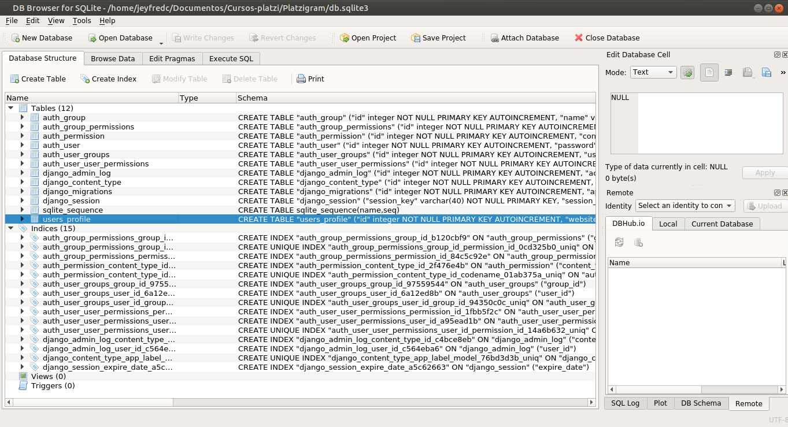

## Clase 15 Explorando el dashboard de administración

Registraremos el perfil que acabamos de customizar, junto con el modelo extendido de Usuario, en el admin de Django para poder manejarlo desde la aplicación.

Esto puede hacerse de dos formas: con admin.site.register(Profile) o creando una nueva clase que herede de Admin.ModelAdmin.

Hasta el momento es posible ingresar a admin pero como tal no hay un perfil de usuario creado 

Abrir el archivo **users/admin.py**

lo primero que hay que hacer es importar Profile `from users.models import Profile` y luego registrar el modelo con `admin.site.register(Profile)`

```
""" User admin classes. """
#Django
from django.contrib import admin

#Models
from users.models import Profile

# Register your models here.
admin.site.register(Profile)
```

Ahora si cargamos el navegador ya aparece Profiles en el admin

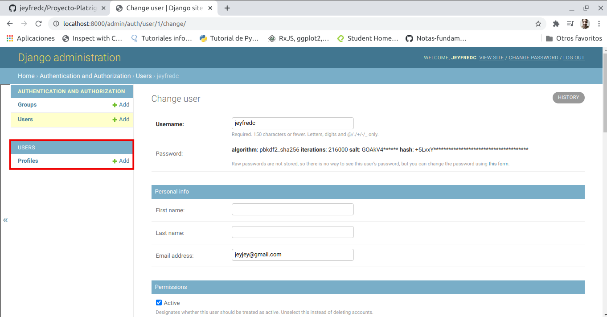

Si ahora se selecciona el boton Add se puede crear el perfil de usuario con website, biografia, numero e imagen l dar click en save queda creado el primer perfil

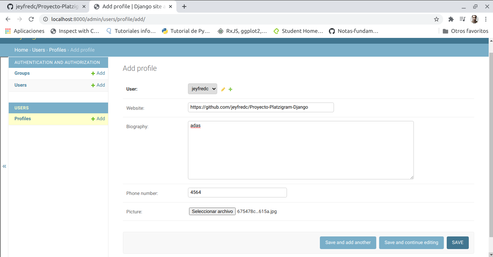

Ahora se va a modificar el registro y crear una clase en el archivo **users/admin.py** que se va a llamar `ProileAdmin`, por convencion siempre se agrega la palabra Admin al final de la clase, para registrarlo en una sola linea se puede hacer a traves de un decorador `@admin.register(Profile)` y 
la clase puede estar vacia

```
""" User admin classes. """
#Django
from django.contrib import admin

#Models
from users.models import Profile


@admin.register(Profile)
class ProfileAdmin(admin.ModelAdmin):
    """ Profile admin. """

    pass
```

con la modificacion realizada, la pagina de momento va a seguir funcionando igual

Al dar  click en Profile los datos del perfil no estan cargando

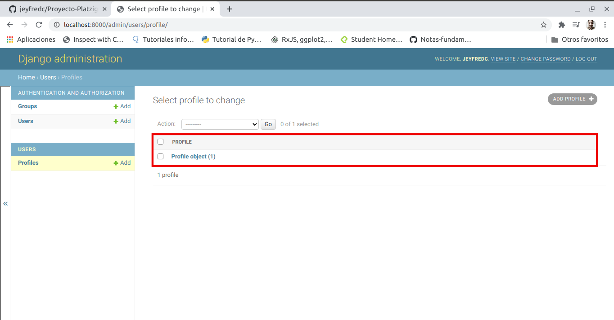

para ordenarlo en la clase `ProfileAdmin` hay que agregar un `list_display` para darle el orden que se requiera

```
""" User admin classes. """
#Django
from django.contrib import admin

#Models
from users.models import Profile


@admin.register(Profile)
class ProfileAdmin(admin.ModelAdmin):
    """ Profile admin. """

    list_display = ('user', 'phone_number', 'website', 'picture')
```    

despues de guardar los cambios con la lista, el perfil se mostrara de la siguiente forma y con el orden que se esta aplicando

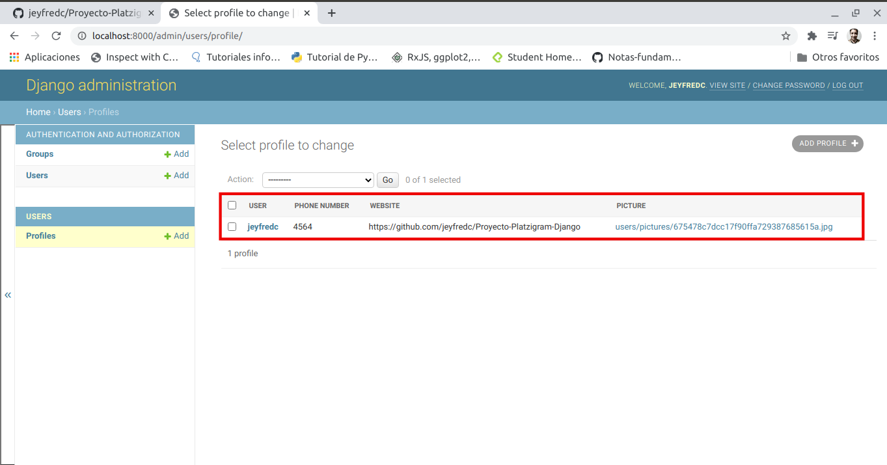

Por el momento solo al dar click al usuario va hacia el detalle del mismo para hacer algun tipo de modificacion

existen otras propiedades para que el numero, el website lo linkee directamente al perfil para hacer alguna modificacion agregando `list_display_links` y seleccionando los objetos que van a adquirir esas propiedades 

```
@admin.register(Profile)
class ProfileAdmin(admin.ModelAdmin):
    """ Profile admin. """

    list_display = ('pk','user', 'phone_number', 'website', 'picture')
    list_display_links = ('pk', 'user', 'phone_number')
```

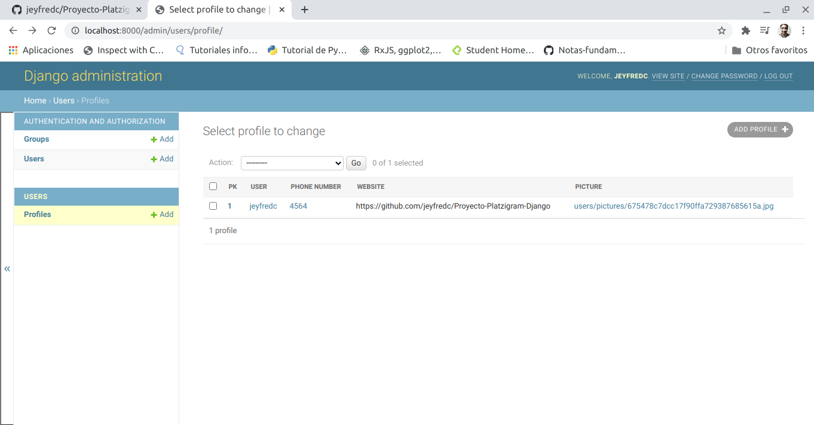

y tambien existe otra propiedad que permite que se hagan modificaciones directamente desde el perfil

```
@admin.register(Profile)
class ProfileAdmin(admin.ModelAdmin):
    """ Profile admin. """

    list_display = ('pk','user', 'phone_number', 'website', 'picture')
    list_display_links = ('pk', 'user', 'phone_number')
        list_editable =('phone_number', 'website', 'picture')
```

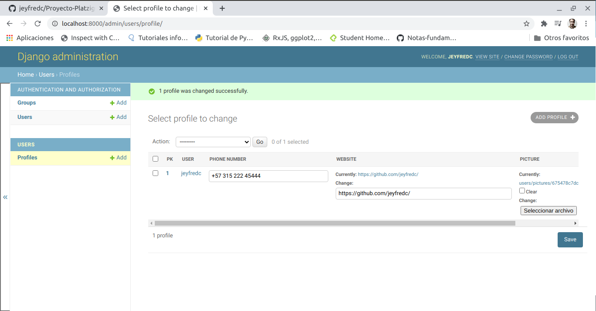

Ahora se puede hacer mas pruebas para crear mas usuarios dando click en **User + Add**

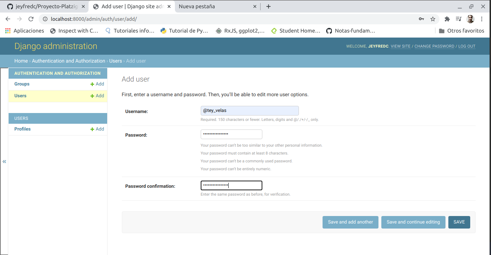

se asigna nombre, apellido y luego se guarda

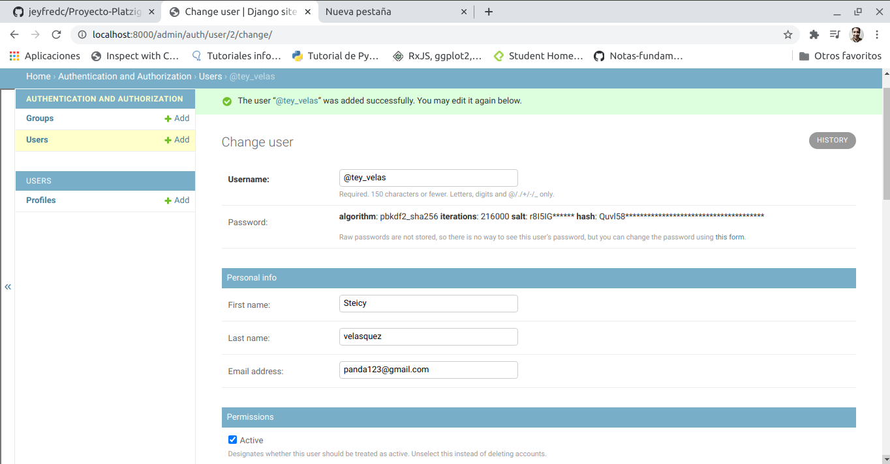

por ultimo seleccionar **Profile + Add** para añadir el perfil 

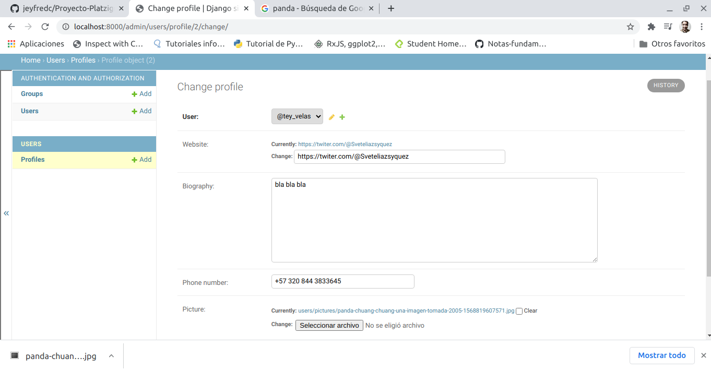

y luego verificar que esten creado los dos perfiles

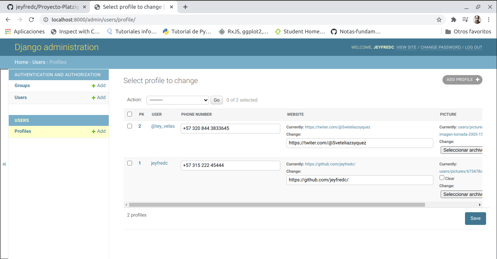

Si se quiere agregar una barra de busqueda para hacer mas sencilla la lista cuando existan muchos usuarios existe la propiedad `search_fields`

```
@admin.register(Profile)
class ProfileAdmin(admin.ModelAdmin):
    """ Profile admin. """

    list_display = ('pk','user', 'phone_number', 'website', 'picture')
    list_display_links = ('pk', 'user')
    list_editable = ('phone_number', 'website', 'picture')
    search_fields = ('user__email', 'user__name','user__first_name', 'user__last_name', 'phone_number')
```

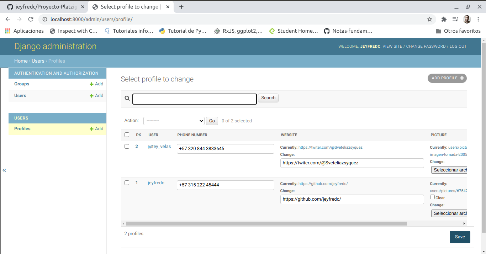

tambien se pueden añadir filtros para utilizar mas adelante con la propiedad `list_filter`, estos salen al costado derecho de **Profile**

```
@admin.register(Profile)
class ProfileAdmin(admin.ModelAdmin):
    """ Profile admin. """

    list_display = ('pk','user', 'phone_number', 'website', 'picture')
    list_display_links = ('pk', 'user')
    list_editable = ('phone_number', 'website', 'picture')
    search_fields = ('user__email', 'user__name', 'user__first_name', 'user__last_name', 'phone_number')
    list_filter = ('user__is_active', 'user__is_staff', 'created', 'modified')
```

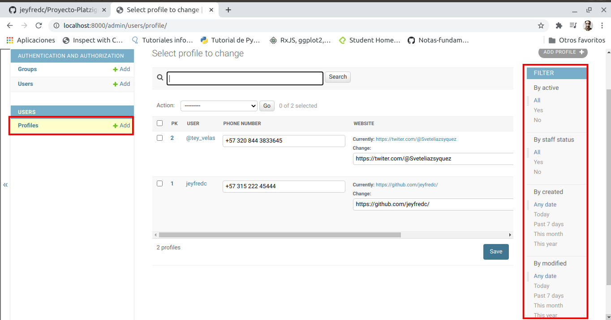

## Clase 16 Dashboard de Administración

Editaremos el detalle para que sea igual de complejo que el detalle de Usuario y le agregaremos los datos del perfil para no tener que estar cambiando de urls. Usaremos fieldsets y admin.StackedInline.

En la documentación de Django, https://docs.djangoproject.com/en/3.1/ref/contrib/admin/ podemos ver cómo funcionan los fieldsets.

Cuando se ingresa a cualquier perfil del administrador se ve la presentacion de la siguiente forma


para cambiar la presentacion del perfil en **users/admin.py** debajo de los `list_filter` se crea el fieldsets el cual sirve para controlar el diseño de la pagina y esta contiene sus configuraciones a traves de tuplas

```
    fieldsets = (
        ('Profile', {
            'fields': (
            ('user', 'picture'),
            ),
        }),
    )
```

Al guardar cambia la forma de la presentacion, por ejemplo solo muestra informacion del usuario  y la imagen

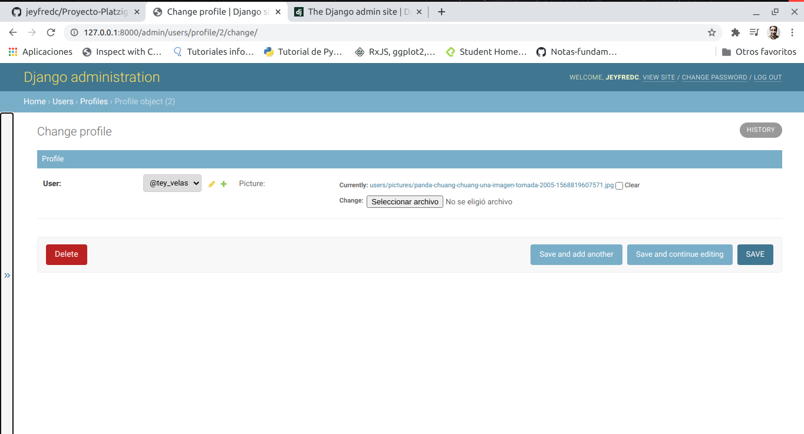

Al agregar mas informacion a la tupla se puede ver que se agrega un campo mas a otra fila donde arroja la informacion del numero y pagina 


```
    fieldsets = (
        ('Profile', {
            'fields': (
            ('user', 'picture'),
            ('phone_number', 'website'),
            ),
        }),
    )
```
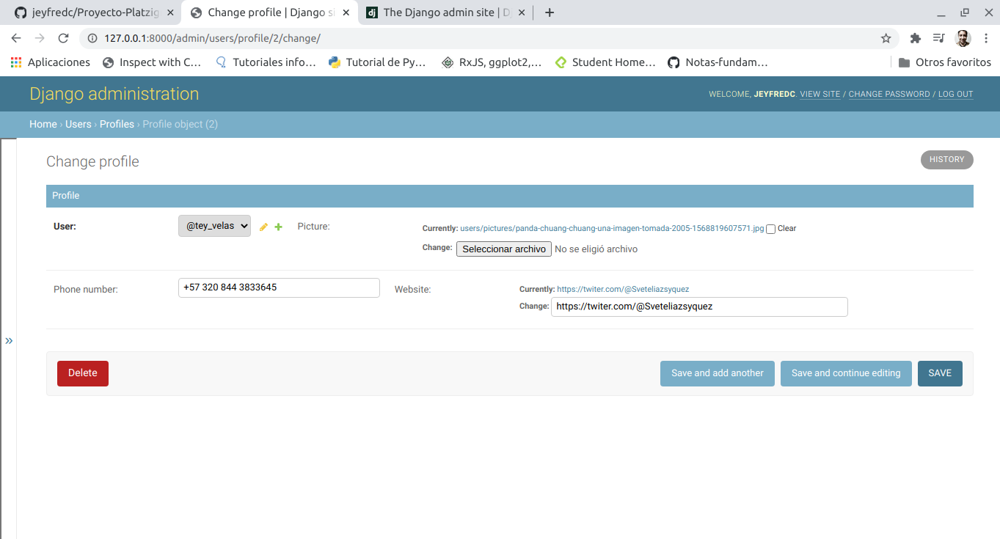

Ahora se va a poner otra informacion a traves de otra tupla con lo siguiente

```
    fieldsets = (
        ('Profile', {
            'fields': (('user', 'picture'),),
        }),
        ('Extra info', {
            'fields' : (
                ('website', 'phone_number'),
                ('biography')
            )
        }),
    )
```

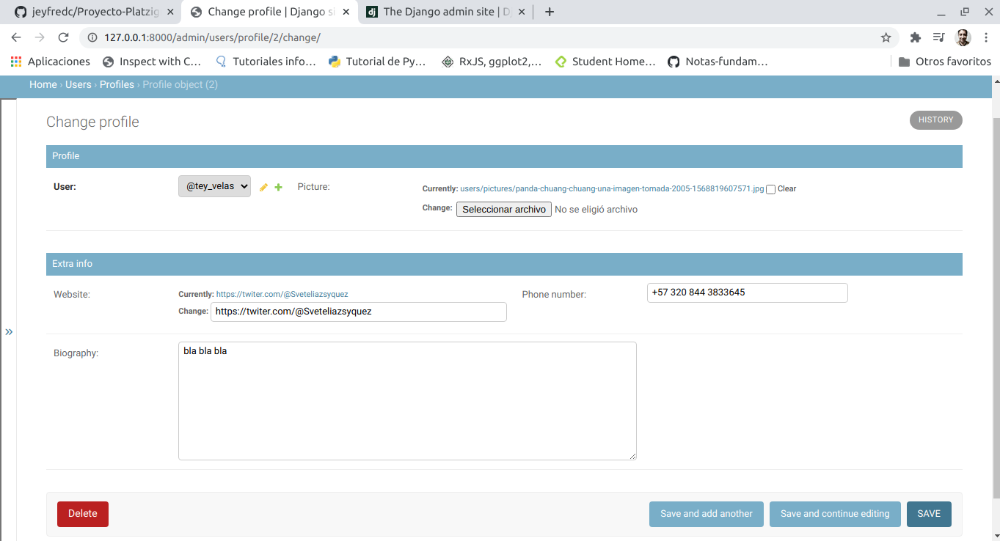

A continuacion se va a introducir un campo de metadata pero este no funciona como los otros campos porque no es editable

```
    fieldsets = (
        ('Profile', {
            'fields': (('user', 'picture'),),
        }),
        ('Extra info', {
            'fields' : (
                ('website', 'phone_number'),
                ('biography')
            )
        }),
        ('Metadata', {
            'fields' : (
                ('created', 'modified'),
            )
        }),
    )
```    

Para que esto funcione hay que llamar otra variable llamara `readonlyfields` y quiere decir que todo lo que este dentro de la variable, al acceder al detalle no se va a poder modificar

```
    fieldsets = (
        ('Profile', {
            'fields': (('user', 'picture'),),
        }),
        ('Extra info', {
            'fields' : (
                ('website', 'phone_number'),
                ('biography')
            )
        }),
        ('Metadata', {
            'fields' : (
                ('created', 'modified'),
            )
        }),
    )

    readonly_fields = ('created', 'modified', 'user')
```

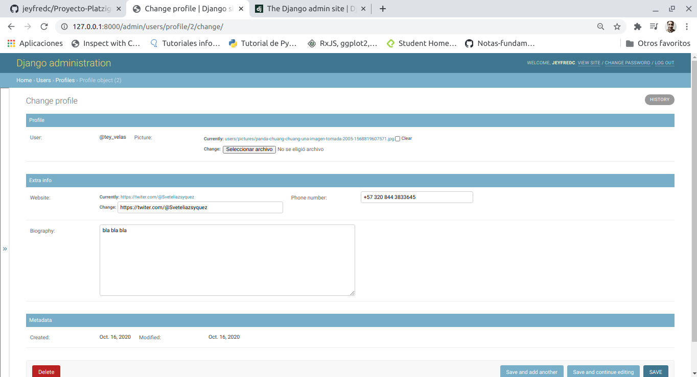

Al añadir un usuario hay que dar click en add User y luego pasar a Profiles para crear el perfil del usuario, existe una forma que extiende el modelo de usuario para tener al usuario y al perfil y crearlos en el mismo lugar, la informacion se encuentra en la [documentacion](https://docs.djangoproject.com/en/3.1/topics/auth/customizing/#extending-the-existing-user-model) actualmente la pagina se ve asi 

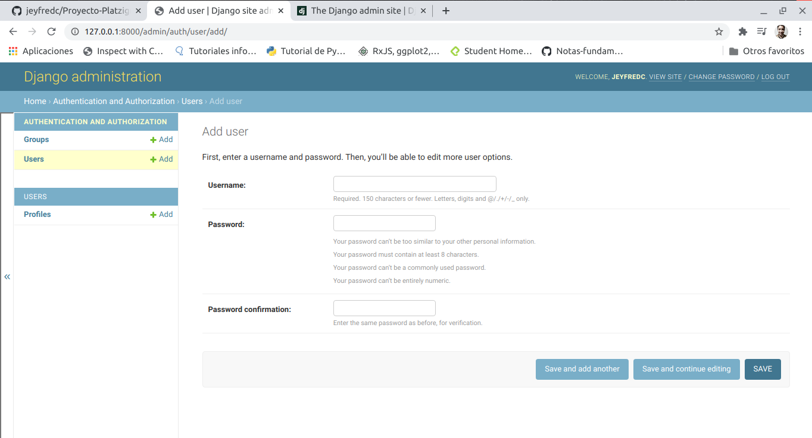

para realizar el cambio y tener todo en la misma pagina se debe crear una cllase llamada `ProfileInline` y hereda de `admin.StackedInline` y lo unico que recibe como parametro es el modelo, indica que no se puede eliminar y recibe el modelo en plural

`model = Profile`
`can_delete = False`
`verbose_name_plural = 'profiles'`

despues hay que crear la clase `UserAdmin` que hereda de `BaseUserAdmin` para eso hay que importar el modelo `from django.contrib.auth.admin import UserAdmin as BaseUserAdmin` luego se debe registrar `inlines` en una tupla y por ultimo desregistrar al usuario y luego agregar al usuario administador

```
""" User admin classes. """
#Django
from django.contrib.auth.admin import UserAdmin as BaseUserAdmin
from django.contrib import admin
#Models
from django.contrib.auth.models import User
from users.models import Profile


@admin.register(Profile)
class ProfileAdmin(admin.ModelAdmin):
    """ Profile admin. """

    list_display = ('pk','user', 'phone_number', 'website', 'picture')
    list_display_links = ('pk', 'user')
    list_editable = ('phone_number', 'website', 'picture')
    search_fields = ('user__email', 'user__name', 'user__first_name', 'user__last_name', 'phone_number')
    list_filter = ('user__is_active', 'user__is_staff', 'created', 'modified')

    fieldsets = (
        ('Profile', {
            'fields': (('user', 'picture'),),
        }),
        ('Extra info', {
            'fields' : (
                ('website', 'phone_number'),
                ('biography')
            )
        }),
        ('Metadata', {
            'fields' : (
                ('created', 'modified'),
            )
        }),
    )

    readonly_fields = ('created', 'modified', 'user')

class ProfileInline(admin.StackedInline):
    """ Profile in-line admin for users. """

    model = Profile
    can_delete = False
    verbose_name_plural = 'profiles'


# Define a new User admin
class UserAdmin(BaseUserAdmin):
    """ Add profile admin to base user admin. """

    inlines = (ProfileInline,)

# Re-register UserAdmin
admin.site.unregister(User)
admin.site.register(User, UserAdmin)
``` 

y ahora al recargar la pagina no solo se puede crear al usuario si no que de una vez se puede crear tanto usuario como perfil

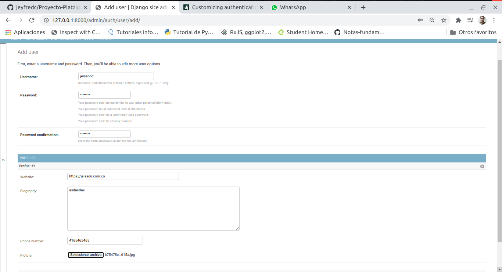

y luego despues de hacer el registro crear el nombre apellido e email

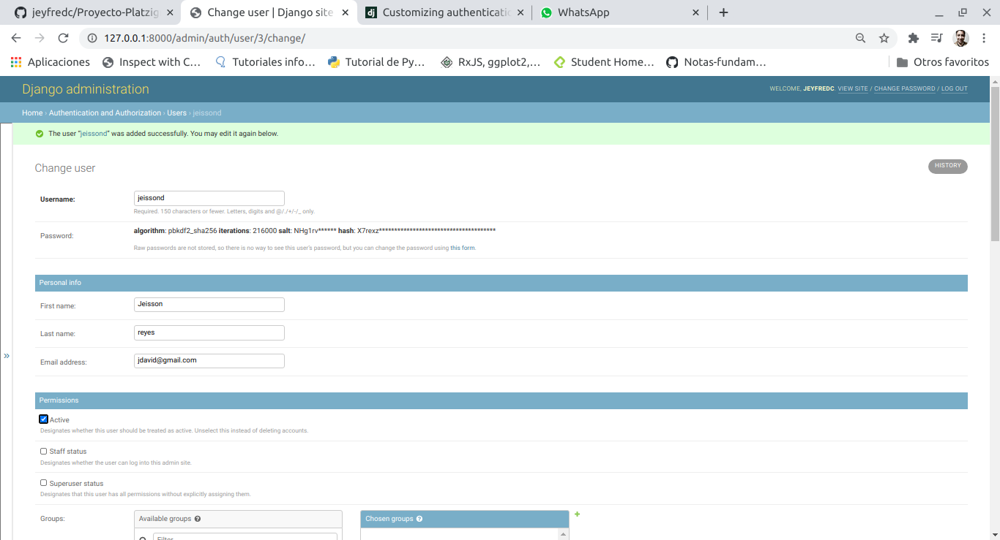

y por ultimo se pueden editar otros campos para que no solo aparezca el username, email, first name, last name  y staff status

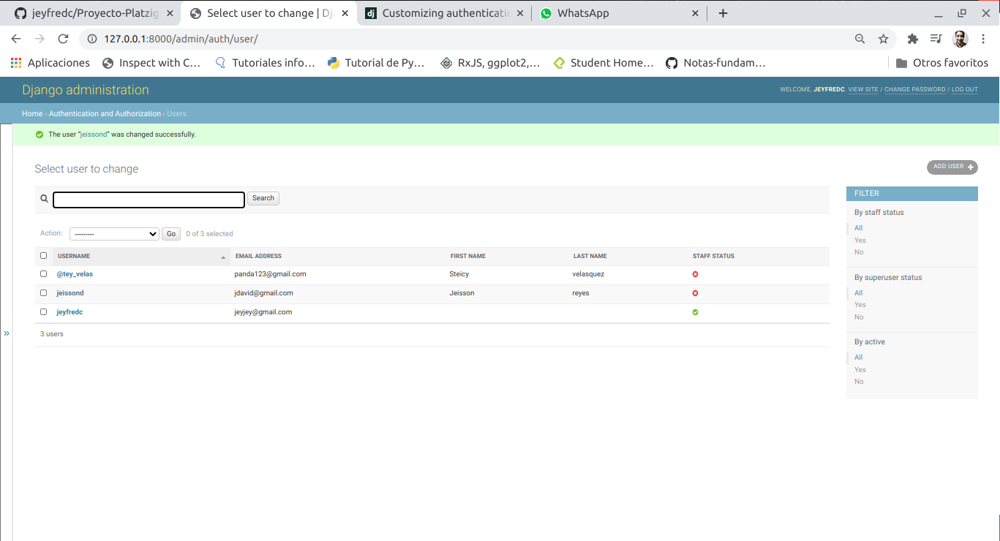

y ademas darle un orden sobreescribiendo el `UserAdmin` con `list_display`

```
# Define a new User admin
class UserAdmin(BaseUserAdmin):
    """ Add profile admin to base user admin. """

    inlines = (ProfileInline,)
    list_display = (
        'username',
        'email',
        'first_name', 
        'last_name',
        'is_active',
        'is_staff'
    )

# Re-register UserAdmin
admin.site.unregister(User)
admin.site.register(User, UserAdmin)
```


## Clase 17 Creación del modelo de posts

Para reflejar los cambios en la base de datos, siempre que se crea o se edita un modelo debemos cancelar el server, ejecutar makemigrations, migrate y luego de nuevo volver a correr el servidor con runserver.

Ahora en **posts/models.py** se agrega lo siguiente, importando base de datos y el modelo del usuario

```
# Django
from django.db import models
from django.contrib.auth.models import User


class Post(models.Model):
    """ Post model. """

    user= models.ForeignKey(User, on_delete=models.CASCADE)
    profile = models.ForeignKey('users.Profile', on_delete=models.CASCADE)

    title = models.CharField(max_length=255)
    photo = models.ImageField(upload_to='posts/photos')

    created = models.DateTimeField(auto_now_add=True)
    modified = models.DateTimeField(auto_now=True)


    def __str__(self):
        """ Return title and username. """
        return '{} by @{}'.format(self.title, self.user.username)
```      

Ahora verificar que la base de datos se haya creado la cual se llamas **posts_post**

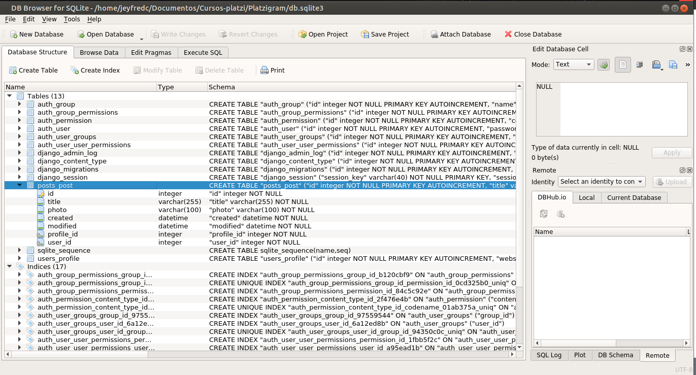

Con respecto a las imágenes, Django por defecto no está hecho para servir la media, pero editando las urls logramos que se puedan mostrar. Para servir archivos de media, usamos `MEDIA_ROOT` y `MEDIA_URLS`, el cual se encuentra en la [documentacion](https://docs.djangoproject.com/en/3.1/ref/settings/#media-root).

Ahora en el modulo de **urls.py** se debe importar static `from django.conf.urls.static import static` y esto lo que hace es que al final de los `urlpatterns` suma a static y da la url a traves de `settings.MEDIA_URL` y luego la ubicacion de la carpeta `document_root=settings.MEDIA_ROOT`, ademas de esto tambien se debe configurar los settings por lo que hay que importarlo en el archivo con `from django.conf import settings`

```
""" Platzigram URLs module. """

#Django
from django.contrib import admin
from django.conf import settings
from django.conf.urls.static import static
from django.urls import path

from platzigram import views as local_views
from posts import views as posts_views


urlpatterns = [

    path('admin/', admin.site.urls),

    path('hello-world/', local_views.hello_world),
    path('sorted/', local_views.sort_integers),
    path('hi/<str:name>/<int:age>/', local_views.say_hi),
    path('posts/', posts_views.list_posts),
] + static(settings.MEDIA_URL, document_root=settings.MEDIA_ROOT)
```

y ahora hay que realizar la configuracion de los settings en el archivo **settings.py**

debajo de `STATIC_URL`

```
STATIC_URL = '/static/'

MEDIA_ROOT = (BASE_DIR/ 'media')

MEDIA_URL = '/media/'
```

Esto lo que va a hacer es que cuando se corra nuevamente el servidor y se guarde una imagen automaticamente va a crear una carpeta llamada media en Platzigram que es la raiz del proyecto y va a permitir abrir las imagenes cuando en el navegador se seleccione

esta es la ruta que esta configurada antes de incluir el path media

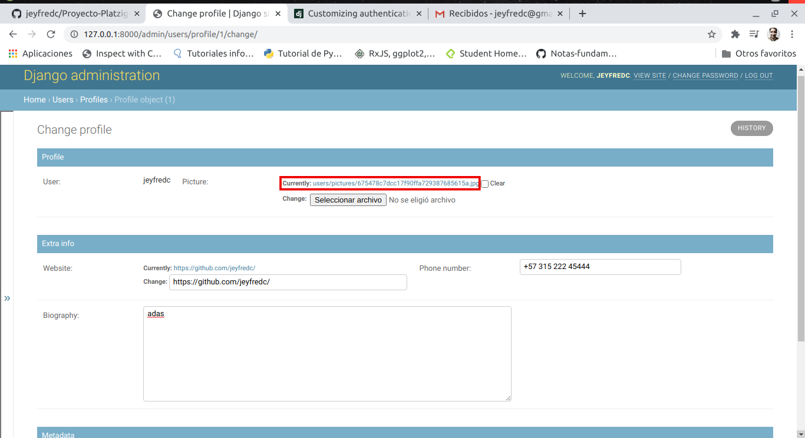

ahora al seleccionar nuevamente una imagen se va a almacenar en **/media/users/pictures/nombredelaimagen**

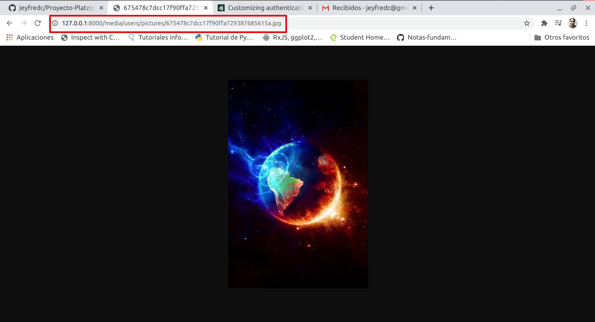

**Reto de la clase:**

Crea el modelo de posts y regístralo en el admin.

## Clase 18 Templates y archivos estáticos

Los templates quedarán definidos en un nuevo folder que llamaremos /templates/.

despues de crear el folder hay que hacer la configuracion en **settings.py** donde estan los directorios de `TEMPLATES` que es `'DIRS'` y alli indicar que templates va a ser el directorio de estos

```
TEMPLATES = [
    {
        'BACKEND': 'django.template.backends.django.DjangoTemplates',
        'DIRS': [BASE_DIR/ 'templates'],
        'APP_DIRS': True,
        'OPTIONS': {
            'context_processors': [
                'django.template.context_processors.debug',
                'django.template.context_processors.request',
                'django.contrib.auth.context_processors.auth',
                'django.contrib.messages.context_processors.messages',
            ],
        },
    },
]
```

dentro del folder **templates** crear un folder que llame **users** y otro que llame **posts**

en el archivo de las vistas **posts/views.py** reemplazar `return render(request, 'feed.html', {'posts': posts})` por `return render(request, 'posts/feed.html', {'posts': posts})`

y ahora el archivo feed que se encuentra en **posts/templates/feed.html** se mueve a **Platzigram/templates/posts** y se elimina el folder templates de **posts**

y a continuacion en **Platzigram/templates** se crea una vista o modelo base que va a compartir con **posts** y **users** la cual se va a llamar **base.html**

```
<!DOCTYPE html>
<html lang="en">
<head>
    <meta charset="UTF-8">
    


    
    <link rel="stylesheet" href="">
    <link rel="stylesheet" href="https://use.fontawesome.com/releases/v5.1.0/css/all.css" crossorigin="anonymous" />
    <link rel="stylesheet" href="" />

</head>
<body>

    

    <div class="container mt-5">
        
        
    </div>

</body>
</html>
```

Ahora tambien se crea otro archivo que va a ser compartido que es **nav.html**

```

<nav class="navbar navbar-expand-lg fixed-top" id="main-navbar">
    <div class="container">

        <a class="navbar-brand pr-5" style="border-right: 1px solid #efefef;" href="">
            
        </a>

        <div class="collapse navbar-collapse">
            <ul class="navbar-nav mr-auto">

                <li class="nav-item">
                    <a href="">
                        
                    </a>
                </li>

                <li class="nav-item nav-icon">
                    <a href="">
                        <i class="fas fa-plus"></i>
                    </a>
                </li>

                <li class="nav-item nav-icon">
                    <a href="">
                        <i class="fas fa-sign-out-alt"></i>
                    </a>
                </li>

            </ul>
        </div>
    </div>
</nav>
```

dentro de **templates/users** crear otro archivo base que es para los usuarios el cual tambien se llamara **base.html**

```
<!DOCTYPE html>
<html lang="en">
<head>
    <meta charset="UTF-8">
    

    
    <link rel="stylesheet" href="">
    <link rel="stylesheet" href="https://use.fontawesome.com/releases/v5.1.0/css/all.css" crossorigin="anonymous" />
    <link rel="stylesheet" href="" />

</head>
<body class="h-100">

    <div class="container h-100">
        <div class="row h-100 justify-content-center align-items-center">
            <div class="col-sm-12 col-md-5 col-lg-5 pt-2 pl-5 pr-5 pb-5" id="auth-container">

                

                

            </div>
        </div>
    </div>

</body>
</html>
```

Despues de realizar esto verificar que el servidor este corriendo correctamente

ahora lo que se quiere hacer es que **templates/posts/feed.html** herede de **templates/base.html**, **feed.html** queda de la siguiente forma

para que feed pueda heredar se van a eliminar algunas cosas del archivo y mediante la sintaxis `` y luego `` para agregar el titulo o cabecera, todo bloque se debe cerrar con `` despues dentro de `` va todo el contenido que ira en la pagina

```



<title>Platzigram feed</title>



    <div class="row">
        
        <div class="col-lg-4 offset-lg-4">
            <div class="media">
                
                <div class="media-body">
                    <h5 class="mt-0">{{ post.user.name }}</h5>
                    {{ post.timestamp }}
                </div>
            </div>
            
            <h6 class="ml-1 mt-1">{{ post.title }}</h6>
        </div>
        
    </div>

```

Al recargar la pagina http://127.0.0.1:8000/posts/ no se va a ver como antes 

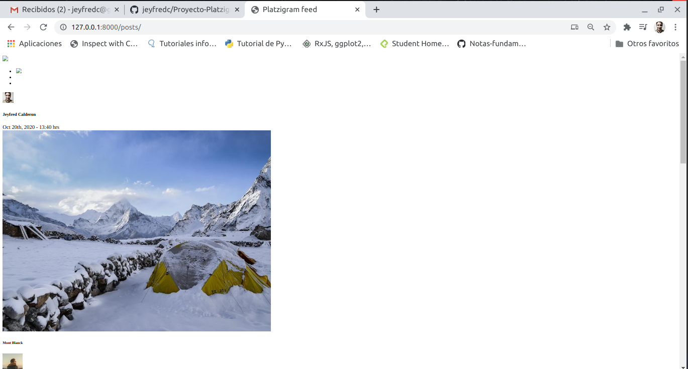

porque hace falta cargar los archivos estaticos que estan en **templates/base.html**

```
    <link rel="stylesheet" href="" />
    <link rel="stylesheet" href="https://use.fontawesome.com/releases/v.5.1.0/css/all.css" crossorigin="anonymous" /> 
    <link rel="stylesheet" href="" /> 
```

El concepto de archivos estáticos en Django, son archivos que se usan a través de la aplicación para pintar los datos. Pueden ser archivos de imagen, audio y video, o archivos css y scripts js.

En el folder Platzigram que es la raiz del proyecto crear un folder que se llame **static** y dentro de static crear otro folder que se llame **css** y otro aparte que se llame **img**

copiar los archivos del [repositorio](https://github.com/jeyfredc/Proyecto-Platzigram-Django/tree/master/static) alli en cada una de sus carpetas

Para servir archivos estáticos, nos apoyamos en STATIC_ROOT y STATIC_URLS. el cual encontramos en la [documentacion](https://docs.djangoproject.com/en/3.1/ref/settings/#std:setting-STATICFILES_DIRS)

Abrir **settings.py** y dejar los archivos estaticos de la siguiente forma

```
STATIC_URL = '/static/'

STATICFILES_DIRS = [BASE_DIR/ 'static']

STATICFILES_FINDERS = [
    'django.contrib.staticfiles.finders.FileSystemFinder',
    'django.contrib.staticfiles.finders.AppDirectoriesFinder',
]

MEDIA_ROOT = (BASE_DIR/ 'media')

MEDIA_URL = '/media/'
```

Terminando de configurar el folder static verificar que el servidor este corriendo de manera correcta, apagarlo y nuevamente prenderlo para aplicar cambios y despues recargar la pagina http://127.0.0.1:8000/posts/, se debe ver la presentacion de la siguiente forma, faltando algunas cosas por corregir.

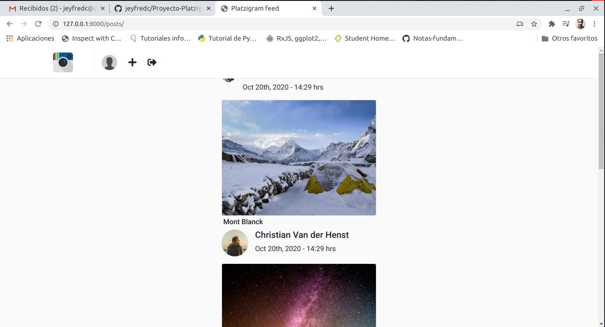

## Clase 19 Login

El objetivo de esta es poder establecer la autorizacion para poder ingresar a feed a traves de login para esto hay que hacer uso del [sistema de autenticacion de Django](https://docs.djangoproject.com/en/3.1/topics/auth/default/#authentication-in-web-requests)

A continuacion hay que empezar por crear la vista en **urls.py** para esto hay que importar las vistas de usuario que seria `from users import views as users_views` y debajo del path de posts crear el path de users login `path('users/login/', users_views.logn_view)`.

Hasta el momento no se han nombrado las urls pero se pueden nombrar con una coma despues de la vista con `name=''`

```
""" Platzigram URLs module. """

#Django
from django.contrib import admin
from django.conf import settings
from django.conf.urls.static import static
from django.urls import path

from platzigram import views as local_views
from posts import views as posts_views
from users import views as users_views


urlpatterns = [

    path('admin/', admin.site.urls),

    path('hello-world/', local_views.hello_world, name='hello_world'),

    path('sorted/', local_views.sort_integers, name='sort'),

    path('hi/<str:name>/<int:age>/', local_views.say_hi, name='hi'),

    path('posts/', posts_views.list_posts, name='feed'),

    path('users/login/', users_views.login_view, name='login'),

] + static(settings.MEDIA_URL, document_root=settings.MEDIA_ROOT)
```

Ahora lo que hay que hacer es crear la vista que se acabe de indicar en la urls y empezar modificando **users/views.py**

```
""" Users views. """

# Django
from django.contrib.auth import authenticate, login
from django.shortcuts import render


def login_view(request):
    """ Login views """
    return render(request, 'user/login.html')

```

y crear la vista de login en los templates de users la ruta es **Platzigram/templates/users/login.html**

el action lleva un tag especial que es ``, es recomendable manejarlo de esta forma para que reconozca el name establecisto en urls.py `path('users/login/', users_views.login_view, name='login'),` si por ejempplo el path cambia de users/login a account/login, no va a ver necesidad de buscar rutas, si no que se va a cargar con el nombre establecido en el path

```



<title>Platzigram sign in</title>




    <form method="POST" action="">

        <input type="text" placeholder="Username" name="username">
        <input type="password" placeholder=" Password" name="password">

        <button type="submit">Sign in!</button>

    </form>


```

De momento la vista tiene que cargar de esta forma 

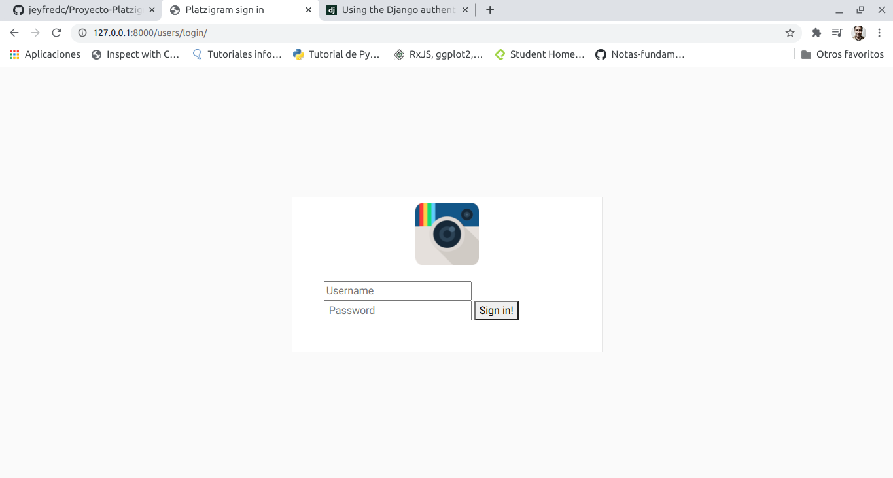

con esta vista al intentar autenticar sale un error **Forbidden (403) CSRF verification failed. Request aborted.** CSRF(Cross Site Request Forgery) este es un metodo que proporciona Django que protege de ataques CSRF. para ver mas sobre CSRF se puede consultar en esta [pagina](https://www.welivesecurity.com/la-es/2015/04/21/vulnerabilidad-cross-site-request-forgery-csrf/)

para proteger la aplicacion se debe añadir el tag al login ``

```



<title>Platzigram sign in</title>




    <form method="POST" action="">
        % csrf_token %}

        <input type="text" placeholder="Username" name="username">
        <input type="password" placeholder=" Password" name="password">

        <button type="submit">Sign in!</button>

    </form>


```

Ahora para terminar de hacer la autenticacion en **users/views.py** se puede añadir la configuracion para autenticar como lo muestra la [pagina](https://docs.djangoproject.com/en/3.1/topics/auth/default/#authentication-in-web-requests)

Se hace uso de un diccionario que despliega un error `{'error': 'Invalid username and password'}`, se hace un redireccion hacia post o el nombre que este configurado en urls en caso de que el usuario y contraseña esten validados `return redirect('feed')` para eso se importo el shorcuts redirect `from django.shortcuts import render, redirect`

```
""" Users views. """

# Django
from django.contrib.auth import authenticate, login
from django.shortcuts import render, redirect


def login_view(request):
    """ Login views """
    if request.method == 'POST':
        username = request.POST['username']
        password = request.POST['password']
        user = authenticate(request, username=username, password=password)
        if user:
            login(request, user)
            return redirect('feed')
        else:
            return render(request, 'users/login.html', {'error': 'Invalid username and password'})

    return render(request, 'users/login.html')
```

Despúes de realizar la autenticacion de manera correcta con cada usuario de http://127.0.0.1:8000/users/login/ debe redirigir a http://127.0.0.1:8000/post/. Sin embargo hasta el momento si existe una mala autenticacion solamente redirige a login pero no muestra el error, para hacerlo nuevamente hay que incluir en la vista de login **Platzigram/templates/users/login.html**

```



<title>Platzigram sign in</title>




    
        <p style="color: red;"> {{ error }} </p>
    

    <form method="POST" action="">
        

        <input type="text" placeholder="Username" name="username">
        <input type="password" placeholder=" Password" name="password">

        <button type="submit">Sign in!</button>

    </form>


```

realizando esta modificacion al autenticar mal se va a mostrar en el navegador el mensaje **'Invalid username and password'**

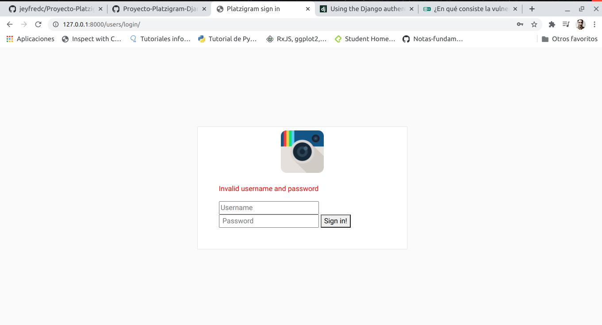

lo ultimo que falta hacer es que no se pueda entrar a feed si no esta posts, es decir no se permita ingresar directamente a los posts hasta que no se autentique realmente para eso existe un decorador [The login_required decorator](https://docs.djangoproject.com/en/3.1/topics/auth/default/#the-login-required-decorator), que lo que hace es agregar el decorador arriba de una funcion y en la documentacion se indica que si el valor ha sido logueado va a redirigir a **settings.LOGIN:URL**

y esto se debe implementar en la vista de **posts** es decir **Platzigram/posts/views.py**, se debe importar `from django.contrib.auth.decorators import login_required` y agregar el decorador de Python antes de la funcion `@login_required`

```
"""Post views.  """

# Django
from django.contrib.auth.decorators import login_required
from django.shortcuts import render

# Utilities
from datetime import datetime


posts=[
    {
        'title': 'Mont Blanck',
        'user': {
            'name': 'Jeyfred Calderon',
            'picture': 'https://lh3.googleusercontent.com/ogw/ADGmqu9Rq5ukqaEtLja_pDNAyZJq7qMy3YTdwSEEdhXF=s32-c-mo',
        },
        'timestamp' : datetime.now().strftime('%b %dth, %Y - %H:%M hrs'),
        'photo': 'https://picsum.photos/800/600?image=1036',
    },
    {
        'title': 'Via Láctea',
        'user': {
            'name': 'Christian Van der Henst',
            'picture': 'https://picsum.photos/60/60?image=1005',
        },
        'timestamp' : datetime.now().strftime('%b %dth, %Y - %H:%M hrs'),
        'photo': 'https://picsum.photos/800/800?image=903',
    },
    {
        'title': 'Nuevo auditorio',
        'user': {
            'name': 'Uriel (Thespianartist)',
            'picture': 'https://picsum.photos/60/60?image=883',
        },
        'timestamp' : datetime.now().strftime('%b %dth, %Y - %H:%M hrs'),
        'photo': 'https://picsum.photos/500/700?image=1076',
    },
]

@login_required
def list_posts(request):
    """ List existing posts. """
    return render(request, 'posts/feed.html', {'posts': posts})

```

y por ultimo configurar en el archivo **settings.py** a `LOGIN_URL='/useres/login/'`

```

# Internationalization
# https://docs.djangoproject.com/en/3.1/topics/i18n/

LANGUAGE_CODE = 'en-us'

TIME_ZONE = 'UTC'

USE_I18N = True

USE_L10N = True

USE_TZ = True


# Static files (CSS, JavaScript, Images)
# https://docs.djangoproject.com/en/3.1/howto/static-files/

STATIC_URL = '/static/'

STATICFILES_DIRS = [BASE_DIR/ 'static']

STATICFILES_FINDERS = [
    'django.contrib.staticfiles.finders.FileSystemFinder',
    'django.contrib.staticfiles.finders.AppDirectoriesFinder',
]

MEDIA_ROOT = (BASE_DIR/ 'media')

MEDIA_URL = '/media/'

LOGIN_URL = '/users/login/'
```

de esta forma no se tendra acceso directo a posts sin antes estar autenticado desde una pestaña de incognito y la va a redirigir a login, tener en cuenta que si quiere probar sin estar en incognito se debe borrar la cache del navegador para que no guarde al usuario

## Clase 20 Logout

Completaremos el flujo de autenticación del usuario que iniciamos en la clase anterior agregando la funcionalidad de Logout. Ademas incorporamos algo de estilos al formulario de Login.

Abrir el archivo **Platzigram/templates/users/login.html** para agregar estilos de bootstrap en el alert y cambiar los estilos del formulario para el login

```



<title>Platzigram sign in</title>




    
        <p class="alert alert-danger">{{ error }}</p>
    

    <form method="POST" action="">
        

        <div class="form-group">
            <input class="form-control" type="text" placeholder="Username" name="username">
        </div>

        <div class="form-group">
            <input class="form-control" type="password" placeholder=" Password" name="password"">
        </div>

        <button class="btn btn-primary btn-block mt-5" type="submit">Sign in!</button>

    </form>


```

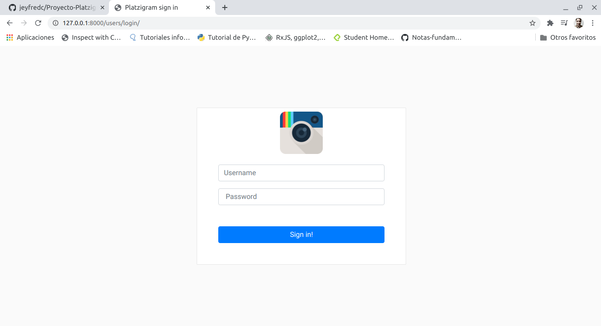

Para hacer el Logout se consulta la [documentacion](https://docs.djangoproject.com/en/3.1/topics/auth/default/#how-to-log-a-user-out)

se debe crear otra vista en las urls.py debajo del path login 

`path('users/logout/', users_views.logout_view, name='logout'),`

y despues pasar a crear la funcion en **Platzigram/users/views.py**

se debe importar logout `from django.contrib.auth import authenticate, login, logout`, tambien es recomendable utilizar login_required `from django.contrib.auth.decorators import login_required` y luego crear la funcion para hacer un redirect hacia el login cuando el usuario finalice la sesion con la funcion `def logout_view(request):`

```
""" Users views. """

# Django
from django.contrib.auth import authenticate, login, logout
from django.contrib.auth.decorators import login_required
from django.shortcuts import render, redirect


def login_view(request):
    """ Login view """
    if request.method == 'POST':
        username = request.POST['username']
        password = request.POST['password']
        user = authenticate(request, username=username, password=password)
        if user:
            login(request, user)
            return redirect('feed')
        else:
            return render(request, 'users/login.html', {'error': 'Invalid username and password'})
            
    return render(request, 'users/login.html')


@login_required
def logout_view(request):
    """ Logout a user """
    logout(request)
    # Redirect to a success page.
    return redirect('login')
```    

Para probarlo en el navegador ir directamente hacia logout http://127.0.0.1:8000/users/logout/ y para comprobar que no se puede ingresar a post colocar directamente http://127.0.0.1:8000/posts/, esto va a redireccionar hacia el login.

Lo unico que falta despues de ingresar con una sesion correctamente, es que el icono de salida funcione como logout


para que este icono funcione hay que abrir **Platzigram/templates/nav.html**

y en la parte del icono `sign-out` redirigir a la url

```
                <li class="nav-item nav-icon">
                    <a href="">
                        <i class="fas fa-sign-out-alt"></i>
                    </a>
                </li>
```                

despues de guardar este cambio nuevamente hacer click sobre el icono 


y de esta forma va a redirigir a login


## Clase 21 Signup

Crearemos el Registro de usuario a partir de la clase perfil, por lo que usaremos un formulario personalizado. Definiremos un nuevo Template para el formulario. Dejaremos que el browser se encargue de las validaciones generales. Sólo validaremos en python la coincidencia entre password y confirmación del password. Incluiremos una validación con try/catch para evitar que se dupliquen usuarios con mismo nombre.

Empezando hay que crear la url en **urls.py** para despues pasar a crear la funcion y la vista de creacion de usuarios

agregando el otro path

`path('users/signup/', users_views.signup_view, name='signup'),`

Crear la funcion en **Platzigram/users/views.py** para ir rendereando o cargando la pagina para ir viendo como esta quedando

```
def signup_view(request):
    """ Sign up view """
    return render(request, 'users/signup.html')
```

Crear la vista **signup.html** en **Platzigram/templates/users/signup.html**

```



<title>Platzigram sign up</title>




    <form action="" method="POST">
        

        <div class="form-group">
            <input type="text" class="form-control" placeholder="Username" name="username" required="true" />
        </div>

        <div class="form-group">
            <input type="password" class="form-control" placeholder="Password" name="password" required="true" />
        </div>

        <div class="form-group">
            <input type="password" class="form-control" placeholder="Password confirmation" name="password_confirmation" required="true" />
        </div>

        <div class="form-group">
            <input type="text" class="form-control" placeholder="First name" name="first_name" required="true" />
        </div>

        <div class="form-group">
            <input type="text" class="form-control" placeholder="Last name" name="last_name" required="true" />
        </div>

        <div class="form-group">
            <input type="email" class="form-control" placeholder="Email address" name="email" required="true" />
        </div>

        <button class="btn btn-primary btn-block mt-5" type="submit">Register!</button>

    </form>
    

```

Al cargar la pagina en http://127.0.0.1:8000/users/signup/ se vera lo siguiente 

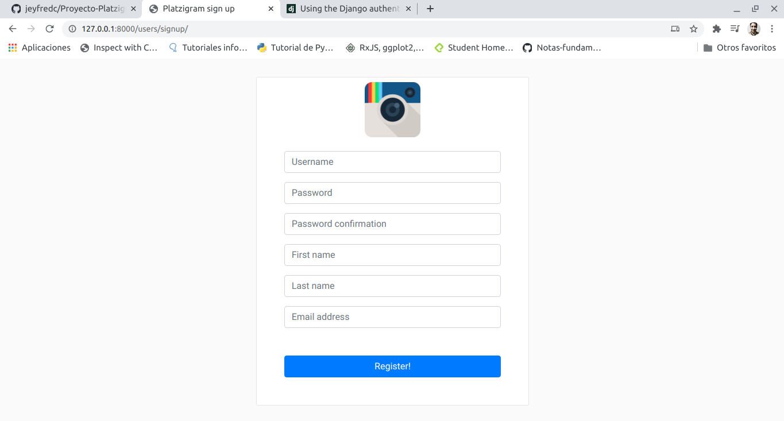

Para implementar la creacion de usuario despues de probar la vista, se consulta en la [documentacion](https://docs.djangoproject.com/en/3.1/topics/auth/default/#creating-users) y en **Platzigram/users/views.py** se empieza a añadir la logica en la funcion `signup_view`, lo primero que se debe hacer es importar `from django.contrib.auth.models import User` y empezar a añadir una logica parecida a la del login que indica que si hace post de username, password y password_confirmation entonces cree al usuario pero ademas se añade una validacion indicando que el password y el password_confirmation sean iguales para continuar con las validaciones.

Tambien hay que importar a Profile para incluirlo en el perfil de la aplicacion con todos los atributos basicos que se requieren aunque no es necesario implementarlos. primero se importa el modelo `from users.models import Profile` despues de grabar al usuario, se graba el perfil y por ultimo hay una redireccion al login y en caso de que no redirige a signup

```
""" Users views. """

# Django
from django.contrib.auth import authenticate, login, logout
from django.contrib.auth.decorators import login_required
from django.shortcuts import render, redirect

from django.contrib.auth.models import User
from users.models import Profile


def login_view(request):
    """ Login view """
    if request.method == 'POST':
        username = request.POST['username']
        password = request.POST['password']
        user = authenticate(request, username=username, password=password)
        if user:
            login(request, user)
            return redirect('feed')
        else:
            return render(request, 'users/login.html', {'error': 'Invalid username and password'})
            
    return render(request, 'users/login.html')


def signup_view(request):
    """ Sign up view """
    if request.method == 'POST':
        username = request.POST['username']
        password = request.POST['password']
        password_confirmation = request.POST['password_confirmation']

        if password != password_confirmation:
            return render(request, 'users/signup.html', {'error': 'Password confirmation does not match'})

        user = User.objects.create_user(username=username, password=password)
        user.first_name = request.POST['first_name']
        user.last_name = request.POST['last_name']
        user.email = request.POST['email']
        user.save()

        profile = Profile(user=user)
        profile.save()

        return redirect('login')


    return render(request, 'users/signup.html')


@login_required
def logout_view(request):
    """ Logout a user """
    logout(request)
    # Redirect to a success page.
    return redirect('login')
```    

Hasta el momento confirmar que la pagina siga funcionando de la misma forma y en caso de que si pasar a la vista **Platzigram/templates/users/signup.html** y hacer la validacion del error 

```



<title>Platzigram sign up</title>




    <form action="" method="POST">
        

        
        <p class="alert alert-danger"> {{ error }} </p>
        

        <div class="form-group">
            <input type="text" class="form-control" placeholder="Username" name="username" required="true" />
        </div>

        <div class="form-group">
            <input type="password" class="form-control" placeholder="Password" name="password" required="true" />
        </div>

        <div class="form-group">
            <input type="password" class="form-control" placeholder="Password confirmation" name="password_confirmation" required="true" />
        </div>

        <div class="form-group">
            <input type="text" class="form-control" placeholder="First name" name="first_name" required="true" />
        </div>

        <div class="form-group">
            <input type="text" class="form-control" placeholder="Last name" name="last_name" required="true" />
        </div>

        <div class="form-group">
            <input type="email" class="form-control" placeholder="Email address" name="email" required="true" />
        </div>

        <button class="btn btn-primary btn-block mt-5" type="submit">Register!</button>

    </form>
    

```

Para confirmar que se este implementado el mensaje de error colocar mal las contraseñas 

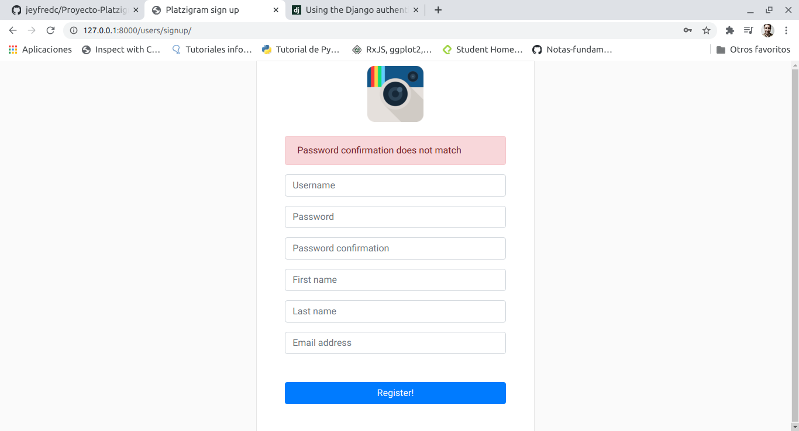

Ahora nuevamente confirmar de manera correcta las contraseñas, hacer el registro

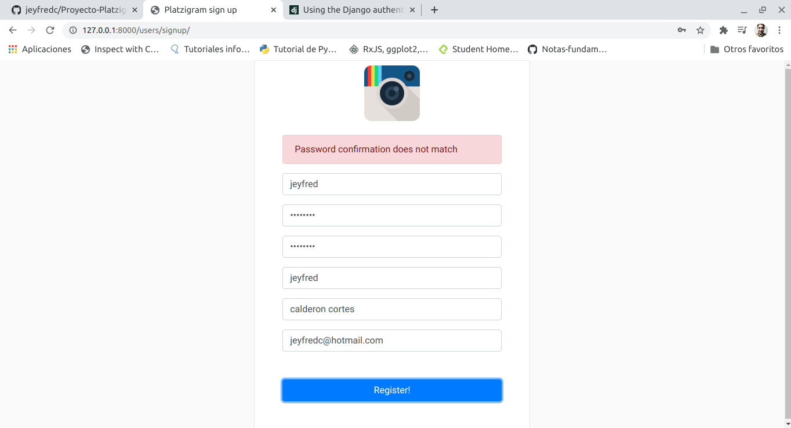

luego va hacer la redireccion a login y despues confirmar en login que se pueda ingresar a posts

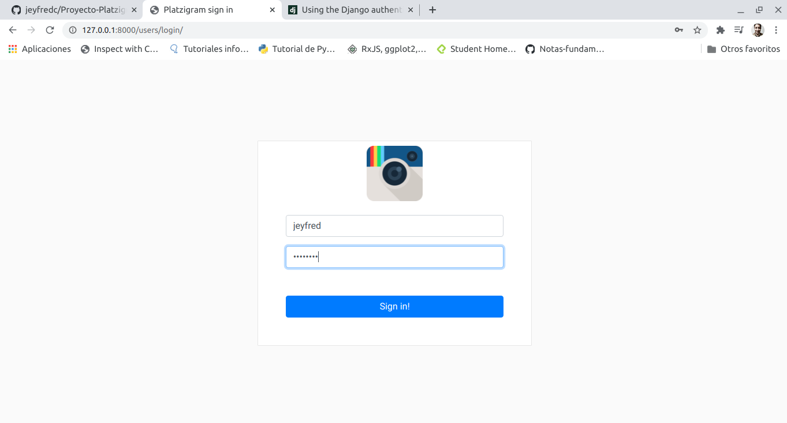

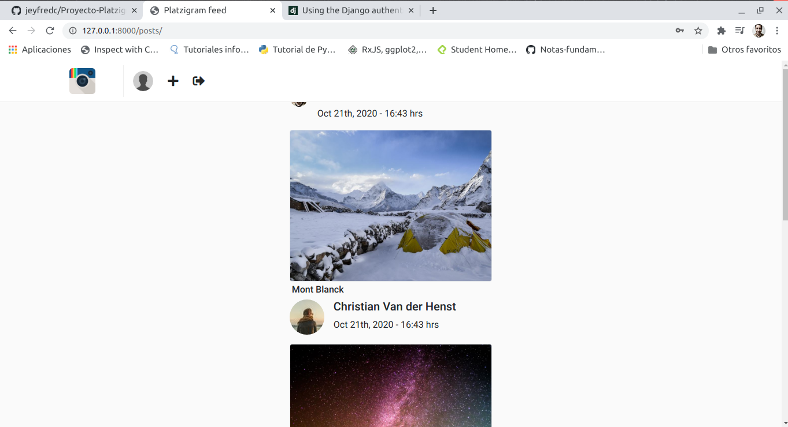

Otra forma de verificar que el usuario y el perfil esten creados es dirigiendo al admin en http://127.0.0.1:8000/admin/ 

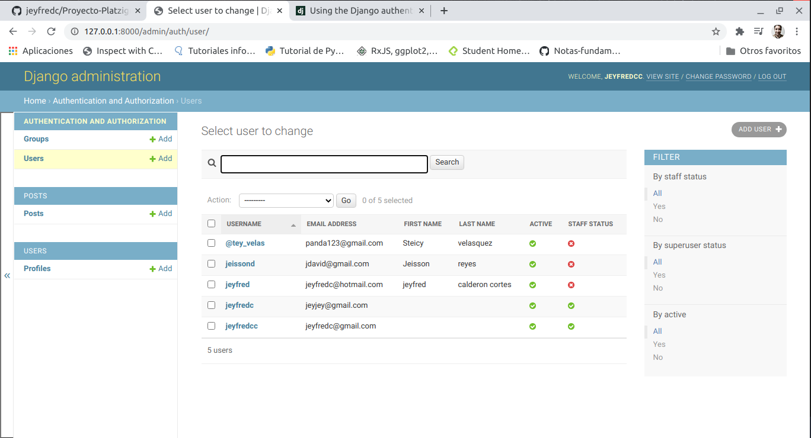

falta hacer una validacion y es la del username, creando uno igual en signup, al hacer esto sale un mensaje de error **UNIQUE**

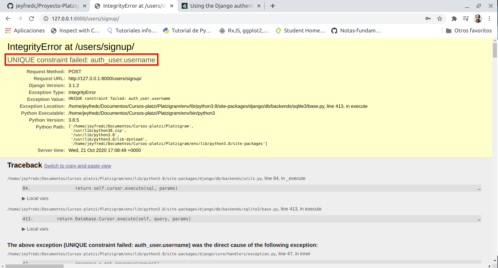

la consola tambien indica que tipo de error se esta arrojando y es el que se debe capturar para corregir 

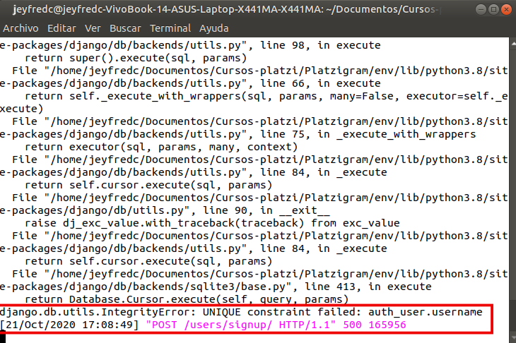

hay que agregar un try/except en **Platzigram/users/views.py**, importar el error con `from django.db.utils import IntegrityError` y luego caprturar el error incluyendo un mensaje de error 

```
def signup_view(request):
    """ Sign up view """
    if request.method == 'POST':
        username = request.POST['username']
        password = request.POST['password']
        password_confirmation = request.POST['password_confirmation']

        if password != password_confirmation:
            return render(request, 'users/signup.html', {'error': 'Password confirmation does not match'})
            
        try:
            user = User.objects.create_user(username=username, password=password)
        except IntegrityError:
            return render(request, 'users/signup.html', {'error': 'Username is already in user'})

        user.first_name = request.POST['first_name']
        user.last_name = request.POST['last_name']
        user.email = request.POST['email']
        user.save()

        profile = Profile(user=user)
        profile.save()

        return redirect('login')


    return render(request, 'users/signup.html')
```

Nuevamente intentar crear un usuario que ya exista en base de datos y de esta forma aparecera el nuevo mensaje de error configurado

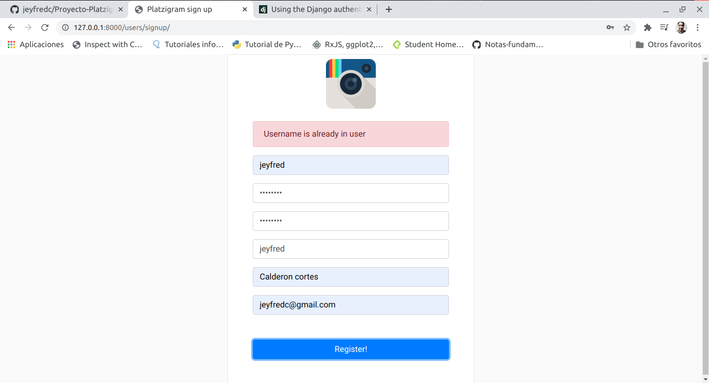

## Clase 22 Middlewares

Un middleware en Django es una serie de hooks y una API de bajo nivel que nos permiten modificar el objeto request antes de que llegue a la vista y response antes de que salga de la vista, la definicion de Middlewares se puede encontrar en la [documentacion](https://docs.djangoproject.com/en/3.1/topics/http/middleware/)

Django dispone de los siguientes middlewares por defecto en el archivo **settins.py**:

- **SecurityMiddleware:** Se encarga de comprobar todas las medidas de seguridad, las variables de settings relacionadas con Https, Auth, entre otros.

- **SessionMiddleware:** Se encarga de validar una sesión.

- **CommonMiddleware:** Se encarga de verificar componentes comunes como lo es el debug.

- **CsrfViewMiddleware:** Éste nos permite utilizar el tag  y es el que inserta el token de seguridad en cada formulario.

- **AuthenticationMiddleware:** Nos permite agregar request.user desde las vistas.

- **MessageMiddleware:** Pertenece al Framework de mensajes de Django, y permite pasar un mensaje sin necesidad de mantener un estado en la base de datos o en memoria.

- **XFrameOptionsMiddleware:** Middleware de seguridad.

Crearemos un middleware para redireccionar al usuario al perfil para que actualice su información cuando no haya definido aún biografía o avatar.

Crear la url en **urls.py** para despues pasar a crear la funcion y la vista de actualizacion de datos

```
    path('users/me/profile/', users_views.update_profile, name='update_profile'),
```

Crear la funcion en **Platzigram/users/views.py** para ir rendereando o cargando la pagina para ir viendo como esta quedando

```
def update_profile(request):
    """ Update a user's profile view. """
    return render(request, 'users/update_profile.html')
```

Crear la vista **update_profile.html** en **Platzigram/templates/users/update_profile.html**

```




<title>@{{ request.user.username}} | Update profile</title>





    <h1 class="mt-5">@{{ request.user.username}} </h1>


```

verificar y cargar la vista, primero hay que iniciar con algun usuario registrado en base y luego si redireccionar a http://127.0.0.1:8000/users/me/profile/

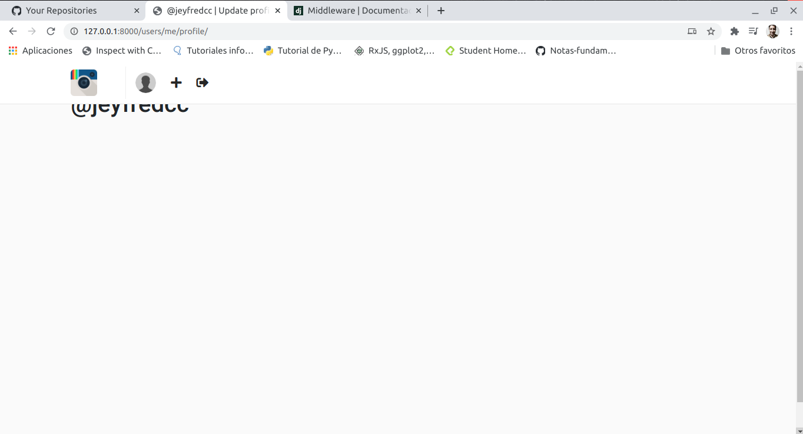

Ahora se va a crear el middleware directamente en platzigram y se va a llamar **middleware.py**

lo primero que se hace es inicializar una clase como lo indica la documentacion y se crean los metodos init y call, en el metodo call debe ir la logica del middleware donde existen varias condiciones.

La primera es que si el usuario es anonimo no puede ingresar a la aplicacion y que para eso el perfil debe estar autenticado.

La segunda es que si el perfil aun no tiene creada una imagen y biografia tampoco puede redirigir hacia ningun lado para ello tambien se importa redirect para redirigir la pagina hacia update_profile y se importa reverse para que cuando el usuario haga click sobre el icono de logout pueda salir de la aplicacion 

```
"""Platzigram middleware catalog. """

# Django


from django.urls import reverse


class ProfileCompletionMiddleware:
    """ Profile completion middleware.
    
    Ensure every user that is interacting with the plataform
    have their profile picture and biography.
    """

    def __init__(self, get_response):
        """ Middleware initialization. """
        self.get_response = get_response

    
    def __call__(self, request):
        """ Code to be executed for each request before the view is called. """
        if not request.user.is_anonymous:
            if not request.user.is_staff:
                profile = request.user.profile
                if not profile.picture or not profile.biography:
                    if request.path not in [reverse('update_profile'), reverse('logout')]:
                        return redirect('update_profile')
```

Posteriormente hay que realizar la instalacion del middleware en **settings.py**, para esto hay que buscar la variable **MIDDLEWARE = [** y alli agregar el que se acaba de configurar  que es     `'platzigram.middleware.ProfileCompletionMiddleware',`

```
MIDDLEWARE = [
    'django.middleware.security.SecurityMiddleware',
    'django.contrib.sessions.middleware.SessionMiddleware',
    'django.middleware.common.CommonMiddleware',
    'django.middleware.csrf.CsrfViewMiddleware',
    'django.contrib.auth.middleware.AuthenticationMiddleware',
    'django.contrib.messages.middleware.MessageMiddleware',
    'django.middleware.clickjacking.XFrameOptionsMiddleware',
    'platzigram.middleware.ProfileCompletionMiddleware',

]
```

Despues de realizar esto si se loguea con un usuario que no tenga imagen o biografia solamente se va a redirigir a http://127.0.0.1:8000/users/me/profile/ y solamente se podra hacer logout.

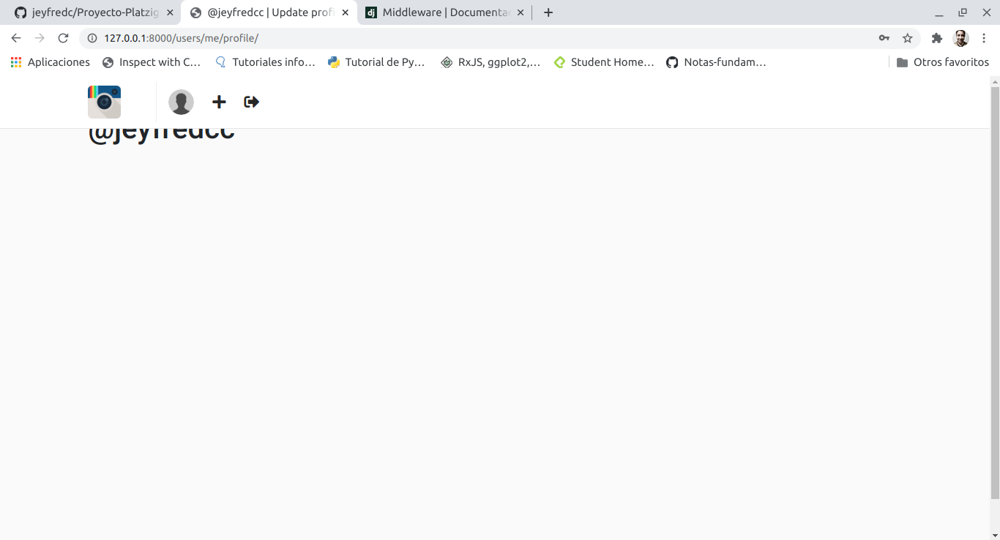

## Clase 23 Formularios en Django

Falta terminar de modificar el template para agregar los campos para actualizar la imagen de perfil y el formular para actualizar, website, biography y phone number.

Abrir el template **Platzigram/templates/users/update_profile.html** y realizar la modificacion 

```




<title>@{{ request.user.username}} | Update profile</title>


    <link rel="stylesheet" href="">
    <link rel="stylesheet" href="https://use.fontawesome.com/releases/v5.1.0/css/all.css" crossorigin="anonymous" />
    <link rel="stylesheet" href="" />






    <div class="row justify-content-md-center">
        <div class="col-6 p4" id="profile-box">

            <form >

                <div class="media">
                    

                    <div class="media-body">
                        <h5 class="ml-4">@{{ user.username}} | {{ user.get_full_name }}</h5>
                        <p class="ml-4"><input type="file" name="picture" required="true"></p>
                    </div>
                </div>
                <hr><br>

                <div class="form-group">
                    <label>Website</label>
                    <input class="form-control" type="url" name="website" placeholder="Website" value="{{ user.profile.website }}" />
                </div>

                <div class="form-group">
                    <label>Biography</label>
                    <textarea class="form-control" name="biography">{{ user.profile.biography }}</textarea>
                </div>

                <div class="form-group">
                    <label>Phone number</label>
                    <input type="text" class="form-control" name="phone_number" placeholder="Phone number" value="{{ user.profile.phone_number }}"/>
                </div>

                <button type="submit" class="btn btn-primary btn-block mt-5">Update info</button>

            </form>
        </div>
    </div>


```

La clase utilitaria para formularios de Django nos ayuda a resolver mucho del trabajo que se realiza de forma repetitiva. La forma de implementarla es muy similar a la implementación de la clase models.model.

Algunas de las clases disponibles en Django al implementar form, son:

- BooleanField

- CharField

- ChoiceField

- TypedChoiceField

- DateField

- DateTimeField

- DecimalField

- EmailField

- FileField

- ImageField"

A traves del admin en el navegador se pueden establecer valores para que se vayan cargando en el perfil del usuario.

por ejemplo aca esta otro perfil creado y en la otra ventana el acceso a todos los perfiles

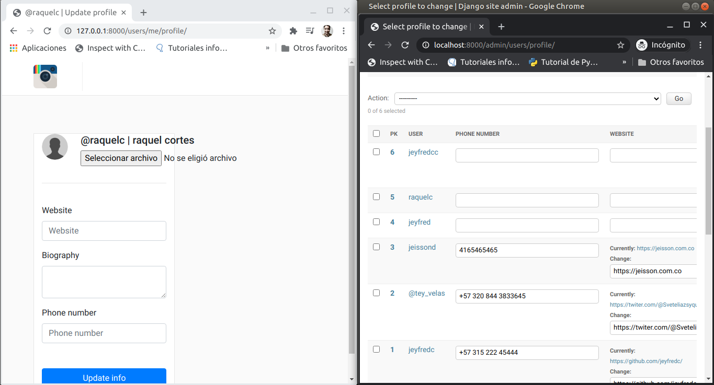

desde el admin se ingresa al perfil y se empiezan a realizar modificaciones del website, biografia y numero y se guarda desde el admin para que posteriormente aparezca en el perfil

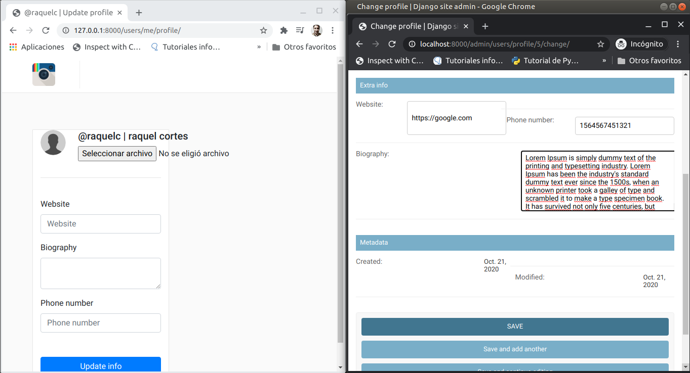

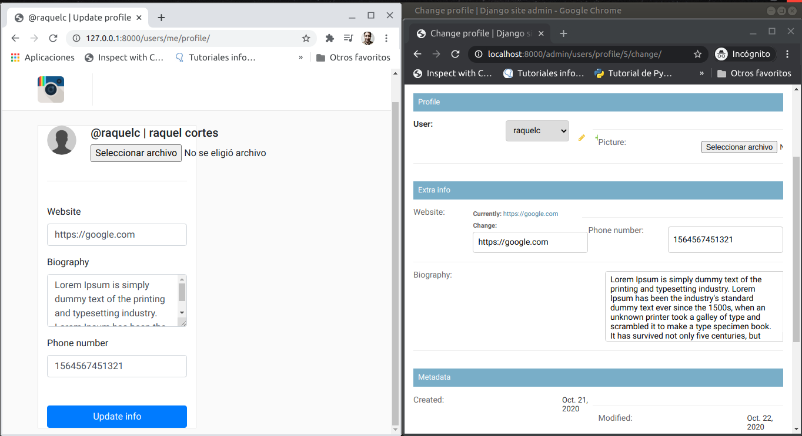

**Nota:** Es importante aclarar que los valores que realmente estan trayendo la informacion desde el admin son los atributos que estan en el template **update_profile.html** como `{{ user.profile.biography }}` o en value `value="{{ user.profile.phone_number }}`, etc.

Ahora lo que se va hacer es traer los propios **Form** que brinda Django para evitar estar utilizando y repetidiendo codigo, el modelo es parecido a la forma como se establecen los atributos o elementos para las bases de datos y todo se puede encontrar en la documentacion de como trabajar con [Django - Forms](https://docs.djangoproject.com/en/3.1/topics/forms/) y en como trabajar con los [Field - Forms](https://docs.djangoproject.com/en/3.1/ref/forms/fields/)

Para empezar a trabajar con los Forms se puede trabajar con las vistas en **PLatzigram/users/views.py** donde se importa `from users.forms import ProfileForm` y la clase `update_profile` cambia de tal manera que se agrega render al contexto para simplificar mas toda la logica que se indica en la documentacion a implementar

```
""" Users views. """

# Django
from django.contrib.auth import authenticate, login, logout
from django.contrib.auth.decorators import login_required
from django.shortcuts import render, redirect

#Exception
from django.db.utils import IntegrityError

#Models
from django.contrib.auth.models import User
from users.models import Profile

#Forms
from users.forms import ProfileForm


def login_view(request):
    """ Login view """
    if request.method == 'POST':
        username = request.POST['username']
        password = request.POST['password']
        user = authenticate(request, username=username, password=password)
        if user:
            login(request, user)
            return redirect('feed')
        else:
            return render(request, 'users/login.html', {'error': 'Invalid username and password'})
            
    return render(request, 'users/login.html')


def signup_view(request):
    """ Sign up view """
    if request.method == 'POST':
        username = request.POST['username']
        password = request.POST['password']
        password_confirmation = request.POST['password_confirmation']

        if password != password_confirmation:
            return render(request, 'users/signup.html', {'error': 'Password confirmation does not match'})

        try:
            user = User.objects.create_user(username=username, password=password)
        except IntegrityError:
            return render(request, 'users/signup.html', {'error': 'Username is already in user'})

        user.first_name = request.POST['first_name']
        user.last_name = request.POST['last_name']
        user.email = request.POST['email']
        user.save()

        profile = Profile(user=user)
        profile.save()

        return redirect('login')


    return render(request, 'users/signup.html')


@login_required
def update_profile(request):
    """ Update a user's profile view. """
    profile = request.user.profile

    # if this is a POST request we need to process the form data
    if request.method == 'POST':
    # create a form instance and populate it with data from the request:
        form = ProfileForm(request.POST)
        # check whether it's valid:
        if form.is_valid():
            # process the data in form.cleaned_data as required
            # ...
            # redirect to a new URL:
            print(form.cleaned_data)
    # if a GET (or any other method) we'll create a blank form
    else:
        form= ProfileForm()

    return render(
        request=request,
        template_name='users/update_profile.html',
        context={
            'profile': profile,
            'user': user,
            'form': form,
        }
    )


@login_required
def logout_view(request):
    """ Logout a user """
    logout(request)
    # Redirect to a success page.
    return redirect('login')
```

Despues de realizar esto, se crea un archivoi **forms.py** en **Platzigram/users/forms.py**

```
""" User Forms """

#Django
from django import forms


class ProfileForm(forms.Form):
    """ Profile form """

    website= forms.URLField(max_length=200, required=True)
    biography= forms.CharField(max_length=500, required=False)
    phone_number = forms.CharField(max_length=20, required=False)
    picture = forms.ImageField()
```

Este debe ser consistente con el modelo como se haya creado 

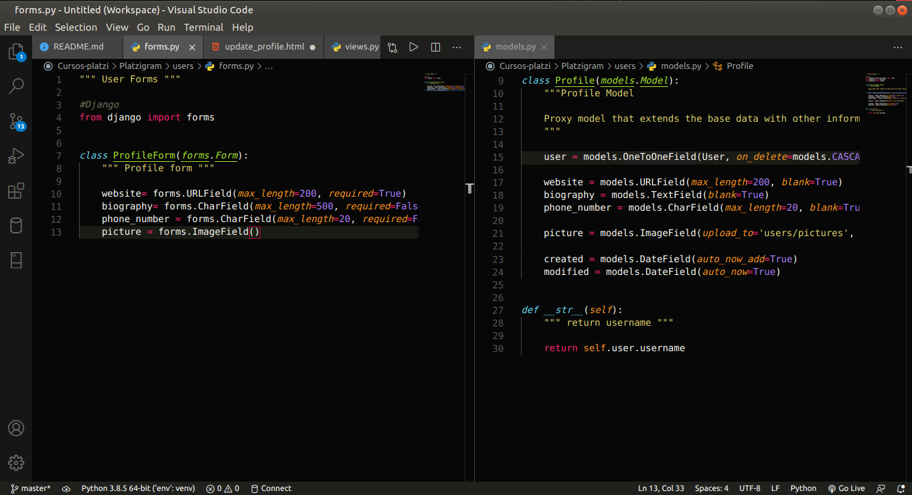

para hacer la prueba se deben establecer valores que contengan mas de lo establecido, por ejemplo 

en wl website añadir mas de 500 caracteres, en el numero mas de 20 caracteres y añadir la foto. Tambien no añadirla para ver si el formulario obliga a agregarla

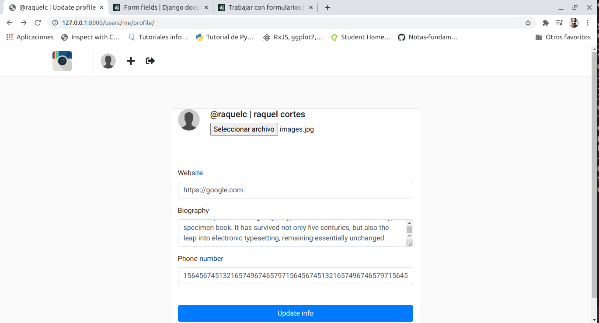

si sale el siguiente error 

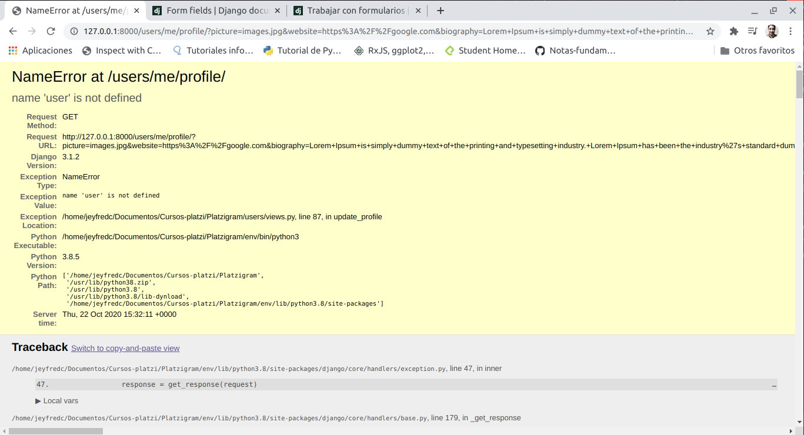

es porque falta añadir el metodo POST al form action del template update_profile.html y tambien el token csrf

**Nota:** enctype es el protocolo que permite tener en cuenta si se envía simplemente texto o si se envían cosas más complejas como archivos, ya que no es lo mismo la transmisión de una cosa que de otra.

```
            <form action="" method="POST" enctype="multipart/form-data">
                
```

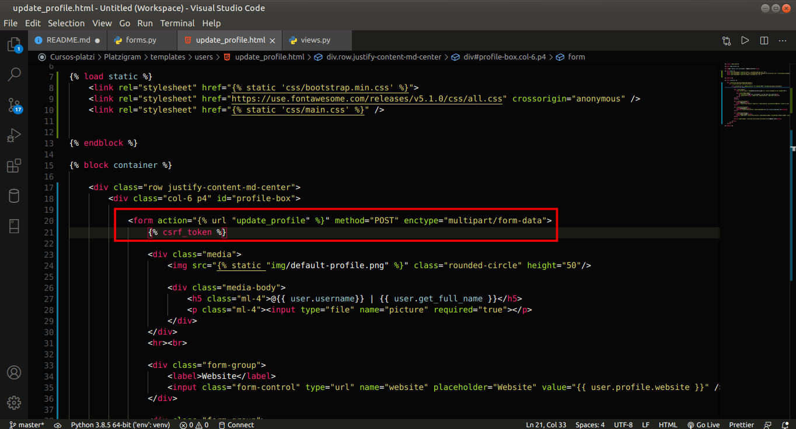

y nuevamente enviar el formulario con mas de los caracteres validos

al enviar no pasa nada porque justamente en la logica de la vista se indica que si el formulario es valido se envia, si no, se limpia de nuevo 
```
        if form.is_valid():
            # process the data in form.cleaned_data as required
            # ...
            # redirect to a new URL:
            print(form.cleaned_data)
```            

para que se informe un error se puede establecer un `forms.errors` que proporcionan los formularios y agregarlo al template

```
                
                <p class="alert alert-danger">{{ form.errors }}</p>
                
```        

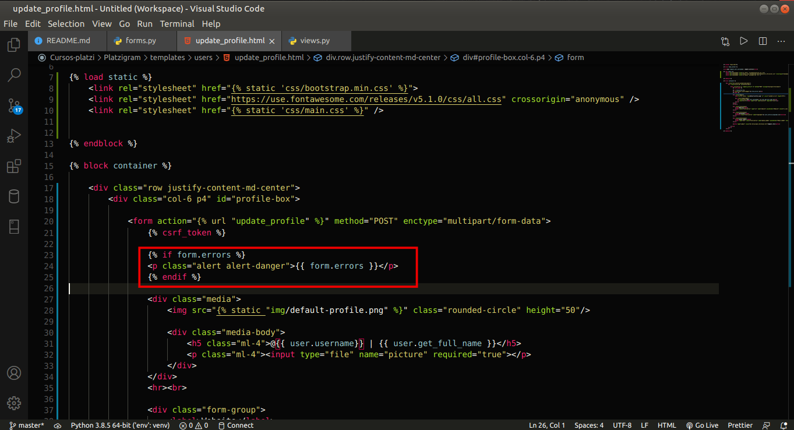

De esta forma recargando la pagina y pasando mas valores de los que son validos, ya existe una forma para ver que errores son los que esta saliendo al introducir datos

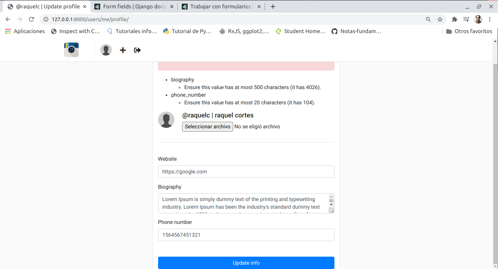

Nuevamente si se pasan los datos bien como estan establecidos, no va arrojar ningun error y como existe print en la logica de la vista se va a imprimir los datos que se pasen en la terminal

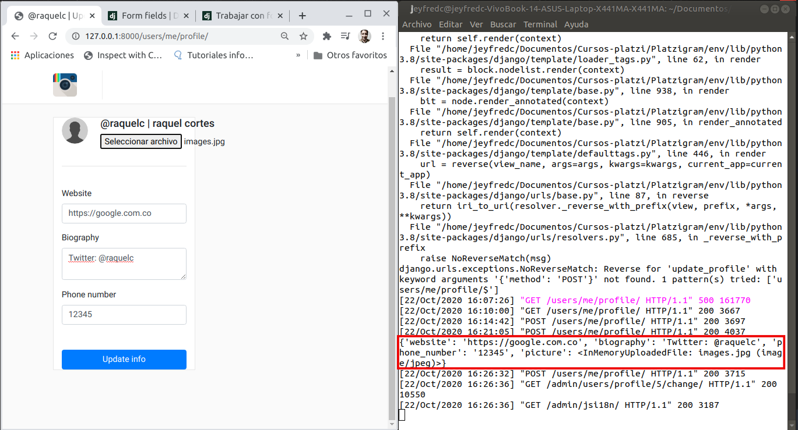

Para empezar a guardar los datos que se pasaron en el navegador y que se actualicen luego en el admin y en base de datos hay que pasar los parametros en la vista y en la funcion `update_profile`

```
@login_required
def update_profile(request):
    """ Update a user's profile view. """
    profile = request.user.profile

    # if this is a POST request we need to process the form data
    if request.method == 'POST':
    # create a form instance and populate it with data from the request:
        form = ProfileForm(request.POST, request.FILES)
        # check whether it's valid:
        if form.is_valid():
            # process the data in form.cleaned_data as required
            # ...
            # redirect to a new URL:
            data = form.cleaned_data

            profile.website = data['website']
            profile.phone_number = data['phone_number']
            profile.biography = data['biography']
            profile.picture = data['picture']
            profile.save()

            return redirect('update_profile')

    # if a GET (or any other method) we'll create a blank form
    else:
        form= ProfileForm()

    return render(
        request=request,
        template_name='users/update_profile.html',
        context={
            'profile': profile,
            'user': request.user,
            'form': form
        }
    )
```

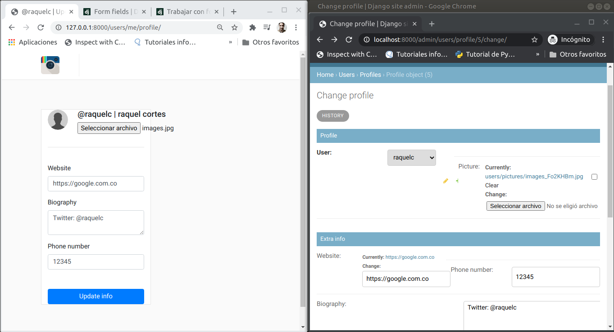

Para que la imagen se cargue al navegador falta realizar una modificacion en la logica del template

```
                    
                    
                    
                    
                    
```

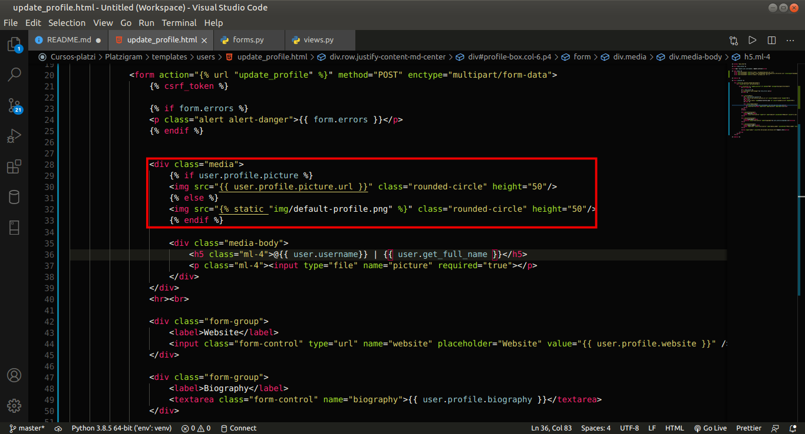


y de esta forma ya se pueden ver todos los cambios reflejados en el perfil

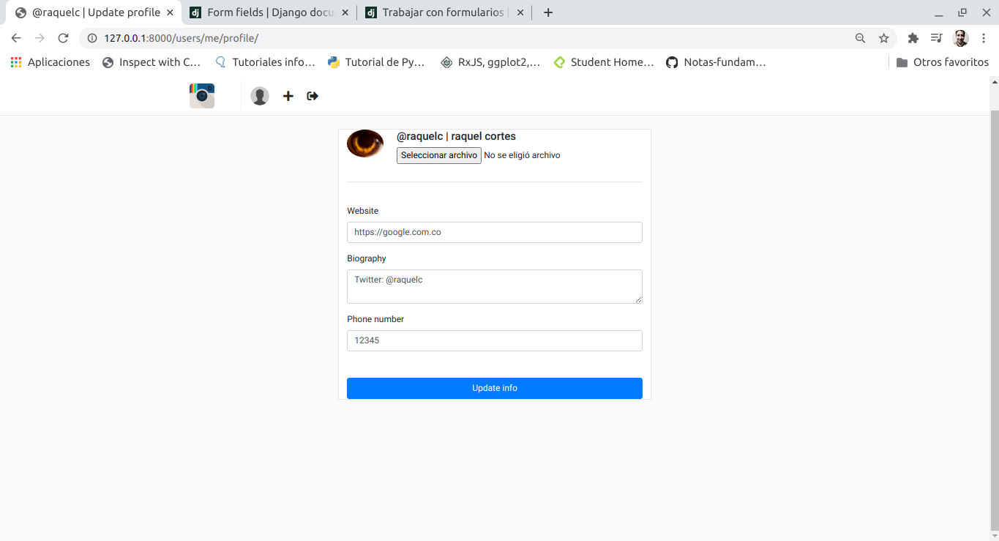

## Clase 24 Mostrando el form en el template

Existen diferentes formas en las que se pueden mostrar los valores del form, estas son: as_table, as_p y as_ul. También se pueden mostrar campos de manera individual, incluso customizar las clases que se van a usar para mostrar los errores, etc. Refinaremos la apariencia del form a través de algunas refactorizaciones en el template.

Para comprender mejor como mejorar la forma de mostrar un error hay que revisar la seccion de Django [working with form templates](https://docs.djangoproject.com/en/3.1/topics/forms/#working-with-form-templates)

Para hacer render de los errores hay que abrir el template **update_profile.html** y empezar aplicar la forma manual indicada en la documentacion donde dice que "cada campo está disponible como un atributo del formulario que usa , y en una plantilla de Django, se representará adecuadamente. Por ejemplo:{{ form.name_of_field }}". cuando dice cada campo disponible como atributo que usa se refiere a los campos establecidos en **forms.py**, para este proyecto son los campos **website, biography, phone_number, picture**

Para iniciar se modifica website 

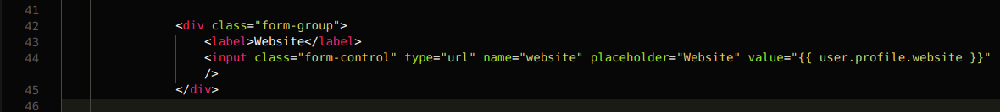

por lo siguiente 
```
                {# Website Field #}
                <div class="form-group">
                    <label>Website</label>
                    <input 
                    class="form-control is-invalid"
                    type="text"
                    name="website"
                    placeholder="Website"
                    value="{{ form.website.value }}{{ user.profile.website }}" />
                    <div class="invalid-feedback">
                        
                        {{ error }}
                        
                    </div>
                </div>
```

Se aplica **form.field.errors** como se indica en la documentacion y luego se evalua el atributo a traves de value con la misma propiedad **form.field.value** por ultimo se añade una clase de bootstrap y se itera sobre el error y luego se imprime, lo que se consigue con esto es que el navegador muestre de otra forma el error con la descripcion mucho mas presentable


Ahora falta aplicarlo a los otros capos que son biography, phone_number y picture, queda a continuacion todo el codigo de **update_profile.html**, teniendo en cuenta que se aplica la misma logica para el resto de fields.

```




<title>@{{ request.user.username}} | Update profile</title>


    <link rel="stylesheet" href="">
    <link rel="stylesheet" href="https://use.fontawesome.com/releases/v5.1.0/css/all.css" crossorigin="anonymous" />
    <link rel="stylesheet" href="" />






    <div class="row justify-content-md-center">
        <div class="col-6 p4" id="profile-box">

            <form action="" method="POST" enctype="multipart/form-data">
                

                <div class="media">
                    
                    
                    
                    
                    

                    <div class="media-body">
                        <h5 class="ml-4">@{{ user.username}} | {{ user.get_full_name }}</h5>
                        <p class="ml-4"><input type="file" name="picture"></p>
                    </div>
                </div>

                
                <div class="alert alert-danger">
                    <b>Picture: </b>{{ error }}
                </div>
                

                <hr><br>

                {# Website Field #}
                <div class="form-group">
                    <label>Website</label>
                    <input 
                    class="form-control is-invalid"
                    type="text"
                    name="website"
                    placeholder="Website"
                    value="{{ form.website.value }}{{ user.profile.website }}" />
                    <div class="invalid-feedback">
                        
                        {{ error }}
                        
                    </div>
                </div>

                {# Biography Field #}
                <div class="form-group">
                    <label>Biography</label>
                    <textarea class="form-control is-invalid"
                    name="biography">{{ form.biography.value }}{{ user.profile.biography }}</textarea>
                    <div class="invalid-feedback">
                        
                        {{ error }}
                        
                    </div>
                
                </div>

                <div class="form-group">
                    <label>Phone number</label>
                    <input type="text" class="form-control is-invalid" name="phone_number" 
                    placeholder="Phone number" 
                    value="{{ form.phone_number.value }}{{ user.profile.phone_number }}"/>
                    <div class="invalid-feedback">
                        
                        {{ error }}
                        
                    </div>
                </div>


                <button type="submit" class="btn btn-primary btn-block mt-5">Update info</button>

            </form>
        </div>
    </div>


```

De tal manera que al introducir o faltar algun campo en el navegador, se va indicar que errores son los que se estan teniendo 

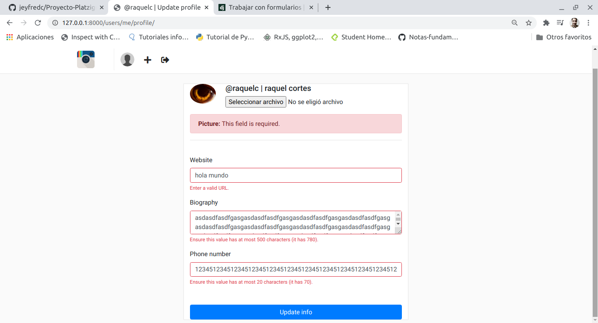

## Clase 25 Model forms

ModelForm es una manera más sencilla de crear formularios en Django y en el caso de nuestro proyecto, se adapta mucho mejor al modelo que ya tenemos.
Lo usaremos para crear el formulario de posts.

Aprovecharemos para refinar la funcionalidad en el navbar y conectar el feed con los posts.

La documentacion se encuentra en Djando [Model Form](https://docs.djangoproject.com/en/3.1/topics/forms/modelforms/), la forma en la que funciona es que la clase va a leer el modelo de Post

Como se trata de crear un formulario para posts lo primero que hay que hacer es crear la url en **urls.py** y agregar el path.

**Nota:** tambien dejar la vista posts sin path para ingresar a posts apenas se abra localhost o la ruta del navegador http://127.0.0.1:8000/

```
    path('', posts_views.list_posts, name='feed'),

    path('posts/new/', posts_views.create_post, name='create_post'),
```

despues crear la funcion `create_post` en **Platzigram/posts/views.py** y añadir toda la logica para los forms 

```
"""Post views.  """

# Django
from django.contrib.auth.decorators import login_required
from django.shortcuts import render, redirect

# Utilities
from datetime import datetime

#Forms
from posts.forms import PostForm


posts=[
    {
        'title': 'Mont Blanck',
        'user': {
            'name': 'Jeyfred Calderon',
            'picture': 'https://lh3.googleusercontent.com/ogw/ADGmqu9Rq5ukqaEtLja_pDNAyZJq7qMy3YTdwSEEdhXF=s32-c-mo',
        },
        'timestamp' : datetime.now().strftime('%b %dth, %Y - %H:%M hrs'),
        'photo': 'https://picsum.photos/800/600?image=1036',
    },
    {
        'title': 'Via Láctea',
        'user': {
            'name': 'Christian Van der Henst',
            'picture': 'https://picsum.photos/60/60?image=1005',
        },
        'timestamp' : datetime.now().strftime('%b %dth, %Y - %H:%M hrs'),
        'photo': 'https://picsum.photos/800/800?image=903',
    },
    {
        'title': 'Nuevo auditorio',
        'user': {
            'name': 'Uriel (Thespianartist)',
            'picture': 'https://picsum.photos/60/60?image=883',
        },
        'timestamp' : datetime.now().strftime('%b %dth, %Y - %H:%M hrs'),
        'photo': 'https://picsum.photos/500/700?image=1076',
    },
]

@login_required
def list_posts(request):
    """ List existing posts. """
    return render(request, 'posts/feed.html', {'posts': posts})


@login_required
def create_post(request):
    """ create new post view """
    if request.method == 'POST':
        form = PostForm(request.POST, request.FILES) 
        if form.is_valid():
            form.save()
            return redirect('feed')
    
    else:
        form = PostForm()

    return render(
        request= request,
        template_name = 'posts/new.html',
        context={
            'form' : form,
            'user' : request.user,
            'profile' : request.user.profile
        }
    )
```

Ahora crear el formulario que se llama **forms.py** en **PLatzigram/posts/forms.py** de la manera en que lo proporciona [Model Form](https://docs.djangoproject.com/en/3.1/topics/forms/modelforms/)

```
""" Post forms """

#Django
from django import forms

#Models
from posts.models import Post


class PostForm(forms.ModelForm):
    """ Post Model form """

    class Meta:
        """ Form settings """
        model = Post
        fields = ('user', 'profile', 'title', 'photo')
```

y despues de esto solo falta crear la vista que se va a llamar **new.html** en **Platzigram/templates/posts/new.html**

```



<title>Create new post</title>




    <div class="container">
        <div class="row justify-content-md-center">
            <div class="col-6 pt-3 pb-3" id="profile-box">
                <h4 class="mb-4">Post a new photo!</h4>
                <form method="POST" enctype="multipart/form-data">
                

                <input type="hidden" name="user" value="{{ user.pk }}"/>
                <input type="hidden" name="profile" value="{{ profile.pk }}"/>

                {# website field#}
                <div class="form-group">
                    <input 
                    class="form-control is-invalid"
                    type="text"
                    name="title"
                    placeholder="Title">
                    <div class="invalid-feedback">
                        {{ error }}
                    </div>
                </div>

                {# Photo field #}
                <div class="form-group">
                    <label>Choose your photo:</label>
                    <input 
                    class="form-control is-invalid"
                    type="file"
                    name="photo"
                    placeholder="Photo">
                    <div class="invalid-feedback">
                        {{ error }}
                    </div>
                </div>

                <button type="submit" class="btn btn-primary btn-block mt-5">Publish</button>
                </form>
            </div>
        </div>
    </div>


```

y ahora lo que hay que hacer es redireccionar a la pagina http://127.0.0.1:8000/posts/new/ para comprobar que este cargando la vista correctamente

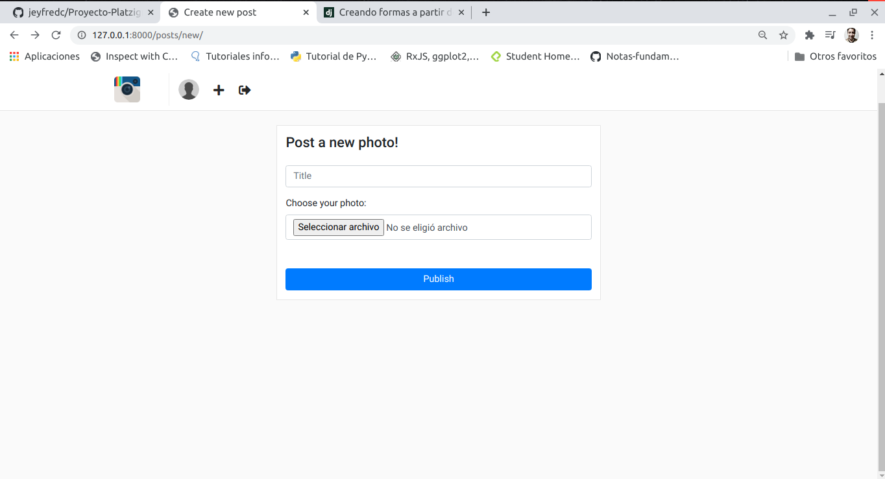

Ahora si se requiere realizar un post se puede hacer y se puede verificar que este cargando en posts del admin 

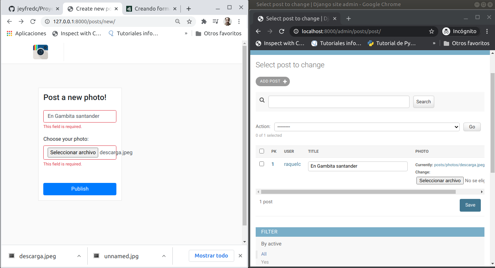

y despues de hacer el post se redirecciona hacia el feed pero no esta publicando todavia el post que se guardo en la base de datos.

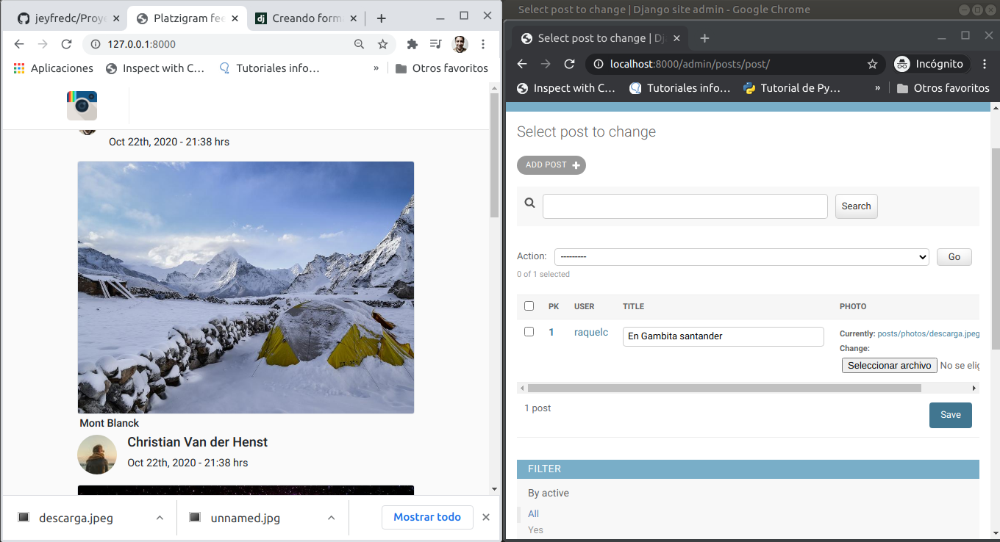
Adicionalmente hay que corregir un poco mas la vista de la navegacion porque ya se tiene configurado el **logout** pero tambien hacia falta configurar **new post** y **profile**

para empezar a corregir hay que abrir **nav.html** en **Platzigram/templates/nav.html**

primero se añade la logica en la imagen de perfil para que se empiece a cargar la imagen de usuario en el navbar

```
                <li class="nav-item">
                    <a href="">
                        
                        
                        
                        
                        
                    </a>
                </li>
```

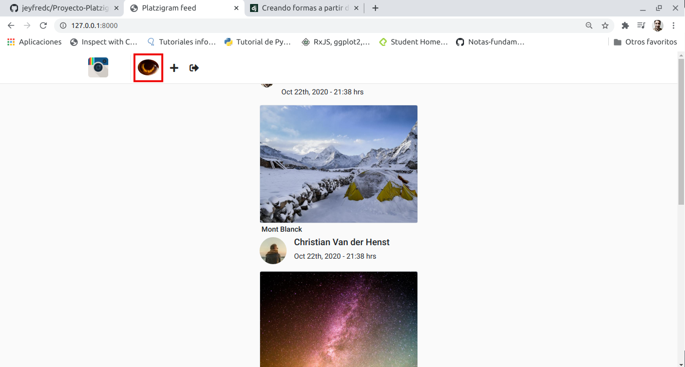

Luego darle conexion para crear un post 

```
                <li class="nav-item nav-icon">
                    <a href="">
                        <i class="fas fa-plus"></i>
                    </a>
                </li>
```                

el archivo queda asi

```

<nav class="navbar navbar-expand-lg fixed-top" id="main-navbar">
    <div class="container">

        <a class="navbar-brand pr-5" style="border-right: 1px solid #efefef;" href="">
            
        </a>

        <div class="collapse navbar-collapse">
            <ul class="navbar-nav mr-auto">

                <li class="nav-item">
                    <a href="">
                        
                        
                        
                        
                        
                    </a>
                </li>

                <li class="nav-item nav-icon">
                    <a href="">
                        <i class="fas fa-plus"></i>
                    </a>
                </li>

                <li class="nav-item nav-icon">
                    <a href="">
                        <i class="fas fa-sign-out-alt"></i>
                    </a>
                </li>

            </ul>
        </div>
    </div>
</nav>
```

para que al dar click, se redirija a **create_post** en el navegador desde la ruta principal

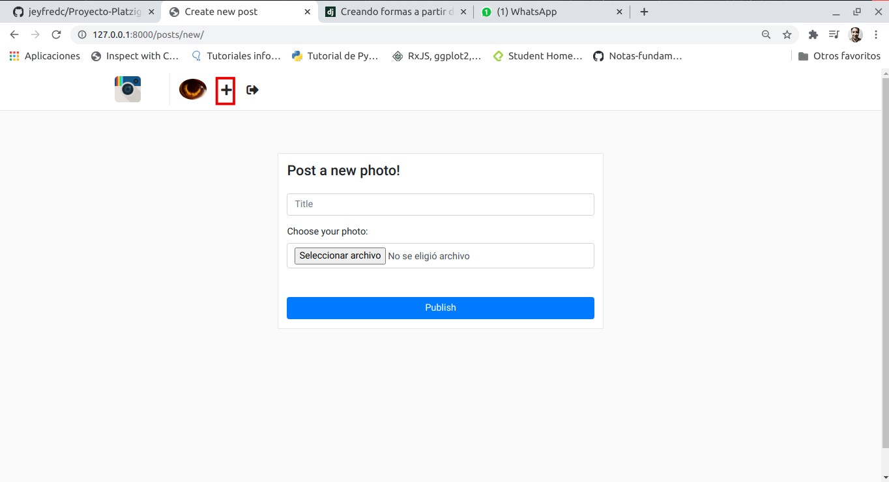

Por ultimo se hace la conexion para que al crear un post se actualice en feed

Abrir el archivo **Platzigram/posts/views.py** y modificar de la siguiente forma, lo que se hace es importar el modelo donde estan creadas las bases de datos y en la funcion `list_posts` se trae la lista de objetos y se ordena del ultimo al primero con `posts= Post.objects.all().order_by('-created')`

```
"""Post views.  """

# Django
from django.contrib.auth.decorators import login_required
from django.shortcuts import render, redirect

#Models

from posts.models import Post

#Forms
from posts.forms import PostForm


@login_required
def list_posts(request):
    """ List existing posts. """
    posts= Post.objects.all().order_by('-created')

    return render(request, 'posts/feed.html', {'posts': posts})


@login_required
def create_post(request):
    """ create new post view """
    if request.method == 'POST':
        form = PostForm(request.POST, request.FILES) 
        if form.is_valid():
            form.save()
            return redirect('feed')
    
    else:
        form = PostForm()

    return render(
        request= request,
        template_name = 'posts/new.html',
        context={
            'form' : form,
            'user' : request.user,
            'profile' : request.user.profile
        }
    )
```

El template **feed.html** que se encuentra en **Platzigram/templates/posts/feed.html**, tiene algunas modificaciones para que se puedan cargar los posts desde la base de datos

```



    <title>Platzigram</title>



    <div class="container">
        <div class="row">

            
            <div class="col-sm-12 col-md-8 offset-md-2 mt-5 p-0 post-container">
                <div class="media pt-3 pl-3 pb-1">
                    
                    <div class="media-body">
                        <p style="margin-top: 5px;">{{ post.user.get_full_name  }}</p>
                    </div>
                </div>

                

                <p class="mt-1 ml-2" >
                    <a href="" style="color: #000; font-size: 20px;">
                        <i class="far fa-heart"></i>
                    </a> 30 likes
                </p>
                <p class="ml-2 mt-0 mb-2">
                    <b>{{ post.title }}</b> - <small>{{ post.created }}</small>
                </p>
            </div>
            
        </div>
    </div>

```

Finalmente el post que se realizo y cargo en base de datos ya esta cargando en la pagina principal.


Si se crea un nuevo post tambien va a aparecer el ultimo que se cargue por ejemplo 

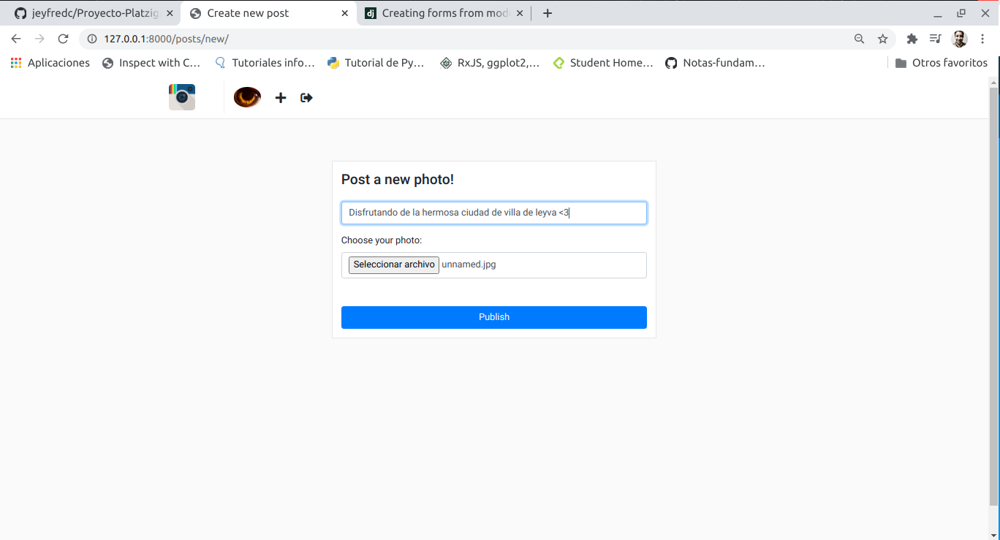

y de esta forma ya queda cargado

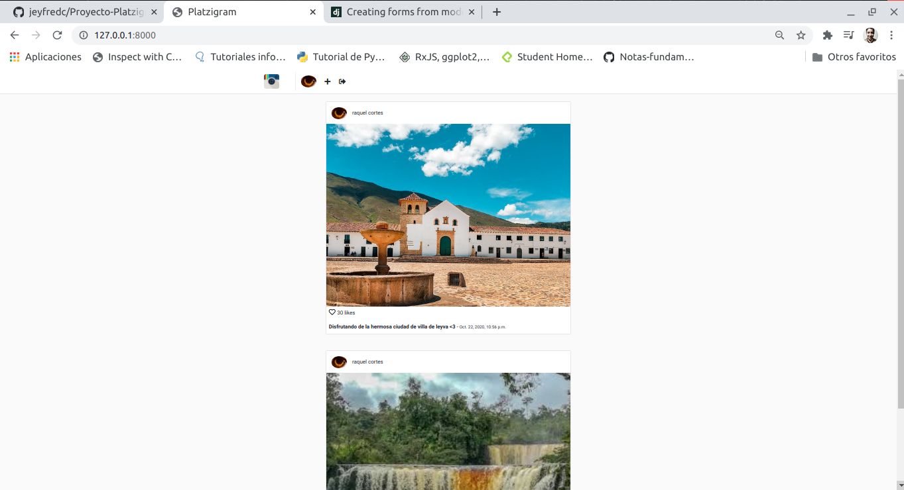

## Clase 26 Validación de formularios

Falta crear el link en **Login** para redirigir hacia **Sign up** y crear cualquier usuario.

Para eso abrir el template **login.html** en **Platzigram/templates/users/login.html** y agregar al final despues del boton Sign in!  y el form que cierra todo lo siguiente

```
<p class="mt-4">Don't have an account yet? <a href="">Sign up here.</a></p>
```

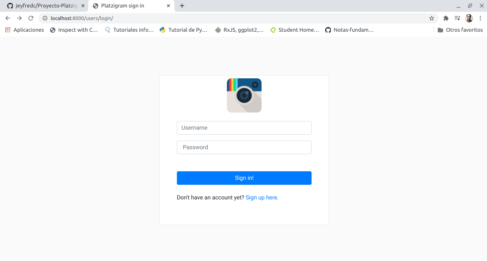

Para aprender a validar los campos de un formulario vamos a actualizar el registro de usuarios.
Hasta este momento el script de validación del formulario Signup está escrito directamente en la vista que esta ubicada en **Platzigram/users/views.py**

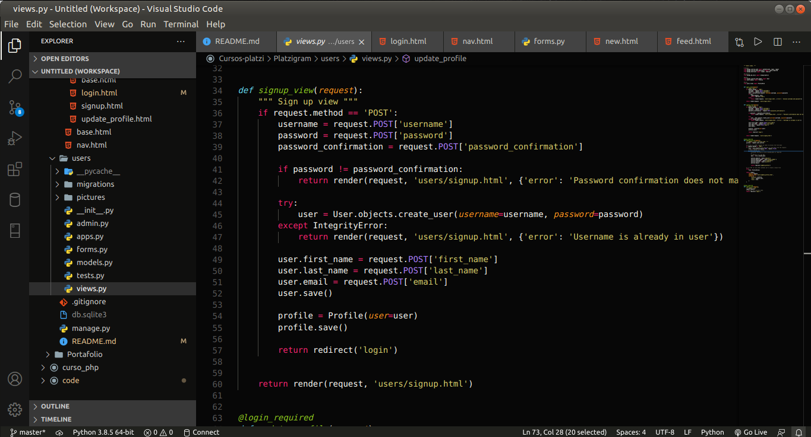

, y a pesar de que no genera ningún error, puede convertirse en un problema, así que lo recomendable es separarlo. Crearemos un nuevo form con la clase forms.Form, también vamos a introducir un nuevo concepto relacionado con formularios: los widgets.

para esto se va a crear otra clase `SignupForm` que va a estar ubicada en **Platzigram/users/forms.py** y se empieza a agregar cada uno de los fields que componen el formulario para crear una cuenta, recordando que estos estan en la documentacion de Django [Form fields](https://docs.djangoproject.com/en/3.1/ref/forms/fields/) y luedo de esto en el password se añade un widget consultar la documentacion de Django [Widgets](https://docs.djangoproject.com/en/3.1/ref/forms/widgets/).

```
class SignupForm(forms.Form):
    """ Sign up form """

    username = forms.CharField(min_length=4, max_length=50)

    password = forms.CharField(max_length=70, widget=forms.PasswordInput())

    password_confirmation = forms.CharField(max_length=70, widget=forms.PasswordInput())

    first_name = forms.CharField(min_length=2, max_length=50)

    last_name = forms.CharField(min_length=2, max_length=50)

    email = forms.CharField(min_length=6, max_length=70, widget=forms.EmailInput())    
```

Los widgets en Django, son una representación de elementos de HTML que pueden incluir ciertas validaciones. Por default todos los campos son requeridos. Los datos depurados se pueden consultar con self.cleaned_data['_nombre_del_field_'], y esto se puede encontrar en las Validaciones de los Forms [Form and field validation](https://docs.djangoproject.com/en/3.1/ref/forms/validation/). Lo que dice es que dentro de la instancia de un formulario python va a llamar varios metodos. Lo primero que hace es convertir un valor ingresado a un valor de Python, luego va a llamar al metodo `validate()`, `run_validators()`, `clean()`, existen formas para validar varios campos con la clase **validate** y para validar un solo campo con el metodo `clean_nombre_del_field_'`.

El campo que se requiere validar es username por tanto se implementa el metodo a continuacion `def clean_username(self):`, lo primero que se debe hacer es acceder al valor `username = self.cleaned_data['username']`,  para validar que el username sea unico se hace un query a la base de datos, indica que traiga a todos los usuarios de la abase de datos a traves de filter y al final se añade exists para que traiga un booleano True o False `username_taken = User.objects.filter(username=username).exists()` y luego se añade la validacion con un mensaje de error que Django se encarga de mostrar al usuario, siempre que se vaya a hacer la validacion de un campo se tiene que regresar el campo a traves de `return username` en este caso 

```
if username_taken:
    raise forms.ValidationError('Username is already in use.')
return username
```

Es importante traer al modelo de usuario a traves de `from django.contrib.auth.models import User`

Para validar las contraseñas y los casos que la confirmacion dependen una de la otra es decir que la contraseña y la confirmacion de la contraseña deben ser iguales se implementa el metodo clean `def clean(self):` para traer los datos y sobre escribirlos se trae el metodo **super()** con `data = super().clean`, despues se traen las variables password y password confirmation a traves de data

```
password = data['password']
password_confirmation = data['password_confirmation']
```
y se agrega la validacion con el error

```
if password != password_confirmation:
    raise forms.ValidationError('Passwords do no match.')

return data
```

y ahora se debe indicar que si ya ha obtenido los datos como se van a guardar. Se implementa el metodo save `def save(self):` se traen todos los datos a traves de la variable data y lo que esta guardado en cleaned_data `data = self.cleaned_data`, la confirmacion del password ya no se requiere por que se ha validado por lo tanto se puede borrar con el metodo pop `data.pop('password_confirmation')` y luego viene la creacion del usuario y el perfil ya que estos dos se guardan al tiempo. `user = User.objects.create_user(**data)`, al traer (**data) quiere decir que esta trayendo todos los atributos del diccionario

```
user = User.objects.create_user(**data)
profile = Profile(user=user)
profile.save()
```

Para que funcione es necesario traer el modelo del perfil a traves de `from users.models import Profile`

```
""" User Forms """

#Django
from django import forms

from django.contrib.auth.models import User
from users.models import Profile


class SignupForm(forms.Form):
    """ Sign up form """

    username = forms.CharField(min_length=4, max_length=50)

    password = forms.CharField(max_length=70, widget=forms.PasswordInput())

    password_confirmation = forms.CharField(max_length=70, widget=forms.PasswordInput())

    first_name = forms.CharField(min_length=2, max_length=50)

    last_name = forms.CharField(min_length=2, max_length=50)

    email = forms.CharField(min_length=6, max_length=70, widget=forms.EmailInput())


    def clean_username(self):
        """ Username must be unique. """
        username = self.cleaned_data['username']
        username_taken = User.objects.filter(username=username).exists()
        if username_taken:
            raise forms.ValidationError('Username is already in use.')
        return username


    def clean(self):
        """ Verify password confirmation match """
        data = super().clean()

        password = data['password']
        password_confirmation = data['password_confirmation']

        if password != password_confirmation:
            raise forms.ValidationError('Passwords do no match.')

        return data


    def save(self):
        """ Create user and profile """
        data = self.cleaned_data
        data.pop('password_confirmation')
        user = User.objects.create_user(**data)
        profile = Profile(user=user)
        profile.save()


class ProfileForm(forms.Form):
    """ Profile form """

    website= forms.URLField(max_length=200, required=True)
    biography= forms.CharField(max_length=500, required=False)
    phone_number = forms.CharField(max_length=20, required=False)
    picture = forms.ImageField()
```

despues de crear el formulario y las validaciones ahora si se pasa a la vista en **Platzigram/users/views.py** y se modifica toda la logica de `signup`

```
def signup_view(request):
    """ Sign up view """
    if request.method == 'POST':
        form = SignupForm(request.POST)
        if form.is_valid():
            form.save()
            return redirect('login')
    else:
        form = SignupForm()

    return render(
        request=request,
        template_name = 'users/signup.html',
        contex
```

tambien se debe importar el form de SignUpForm `from users.forms import ProfileForm, SignupForm` y se elimina el error que antes se habia importador y capturado con `try except` 
`from django.db.utils import IntegrityError`

Para hacer uso del form tambien se cambia el template `signup` segun la estructura de Bootstrap que tiene con la logica por la forma que ofrece los Forms de Django de cargar los datos [working with form templates](https://docs.djangoproject.com/en/3.1/topics/forms/#working-with-form-templates) cambiar logica de **Platzigram/templates/users/signup.html** por la siguiente 

```



<title>Platzigram sign up</title>




    <form action="" method="POST">
        

        {{ form.as_p }}

        <button class="btn btn-primary btn-block mt-5" type="submit">Register!</button>

    </form>
    

```

La vista en el navegador en la ruta http://localhost:8000/users/signup/ va a cambiar por la siguiente, en el momento no tiene estilos pero esta cumpliendo con la funcion de formulario y validar los datos, si se crear otro usuario de manera incorrecta se va a mostrar de esta forma

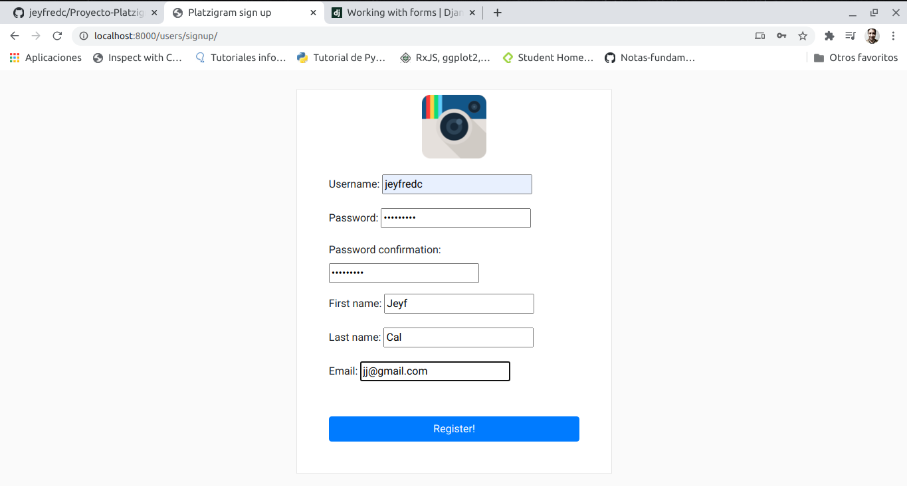

y luego informa el error, en este caso es que el usuario ya existe

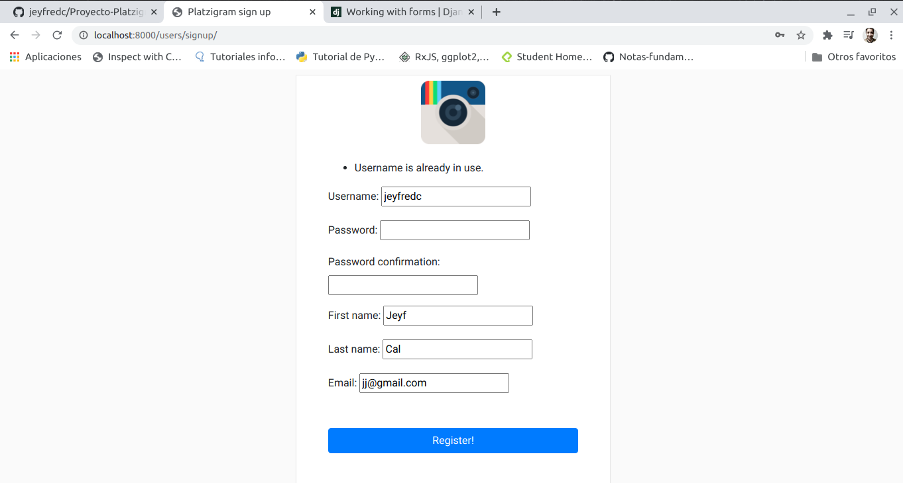

Si se crea un nuevo usuario este va a cargar automaticamente en la base de datos y va a estar listo para configurar el perfil, la imagen y demas atributos requeridos para ir a la zona principal

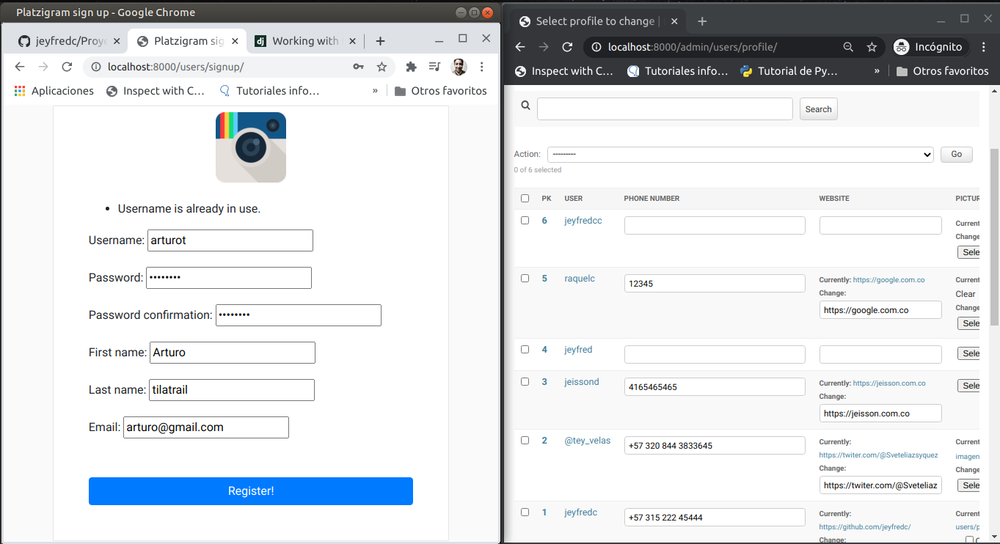

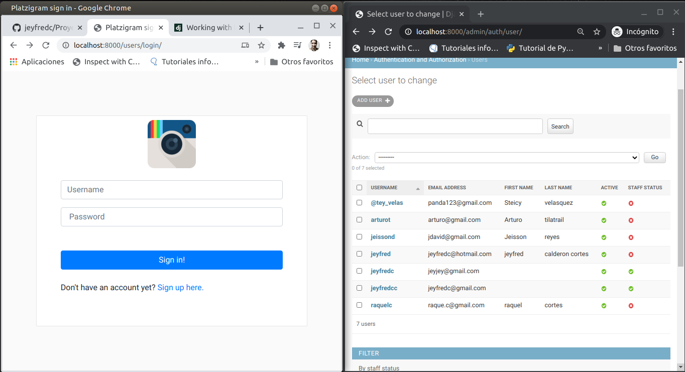


## Clase 27 Class-based views

Veamos de qué forma optimizamos el proceso de creación de nuestras apps de forma que no repitamos código. Para veamos cuál es el concepto de [class based views](https://docs.djangoproject.com/en/3.1/topics/class-based-views/).

Las vistas también pueden ser clases, que tienen el objetivo de evitar la repetición de tareas como mostrar los templates, son vistas genéricas que resuelven problemas comunes.

Abrir **urls.py**, a continuacion todo lo que se encuentra en el archivo va a cambiar y se van a mover bloques de codigo a otros archivos 

lo primero que se va a hacer es eliminar las vistas que se crearon al principio del curso es decir estas 

```
    path('hello-world/', local_views.hello_world, name='hello_world'),

    path('sorted/', local_views.sort_integers, name='sort'),

    path('hi/<str:name>/<int:age>/', local_views.say_hi, name='hi'),
```

Ademas borrar el archivo **views.py** el cual sirvio como introduccion para iniciar con el curso 

Ahora nuevamente abrir **urls.py** y alli se encuentran las urls que tienen que ver con posts y con users, lo que se va a hacer es mandar esas urls a sus respectivas aplicaciones para esto se debe importar `include`, esta funcion recibe dos parametros, el primero recibe una tupla que recibe o indica de que aplicacion viene y el segundo es un `namespace` que es un conjunto de nombres que definen las urls. 

La tupla tiene dos elementos que es donde esta ubicado el archivo de urls y el nombre de la aplicacion y el namespace tambien lleva el nombre de la aplicacion 

`path('', include(('posts.urls', 'posts'), namespace='posts')),`

ahora se sacan los 2 path de posts que se habian creado es decir 

```

    path('', posts_views.list_posts, name='feed'),

    path('posts/new/', posts_views.create_post, name='create_post'),
```

se cortan y a continuacion crear un archivo que se llame **urls.py** en la ruta **Platzigram/posts/urls.py** y alli pegar los 2 path, los argumentos van a cambiar un poco pero es mas legible y sencillo de entender

```
""" Posts urls """

#Django
from django.urls import path

#Views
from posts import views

urlpatterns = [

    path(
        route='',
        view= views.list_posts,
        name='feed'
    ),

    path(
        route='posts/new/',
        view= views.create_post,
        name='create_post'
        ),

]
```

Ahora hay que realizar lo mismo con los path de users, nuevamente en **Platzigram/platzigram/urls.py**

el archivo queda de esta forma 

```
""" Platzigram URLs module. """

#Django
from django.contrib import admin
from django.conf import settings
from django.conf.urls.static import static
from django.urls import path, include


urlpatterns = [

    path('admin/', admin.site.urls),

    path('', include(('posts.urls', 'posts'), namespace='posts')),

    path('users/', include(('users.urls', 'users'), namespace='users')),

] + static(settings.MEDIA_URL, document_root=settings.MEDIA_ROOT)
```

Cortar los path de users, crear un archivo que se llame **urls.py** y pegarlos en **Platzigram/users/urls.py**

y establecer los mismos pasos que se hicieron con posts, en este archivo se va a crear el perfil del usuario para eso tambien se establece la ruta a traves de la libreria que proporciona la documentacion para implementar clases basadas en vistas  a traves de `from django.views.generic import TemplateView` y el path para el detalle de usuario 

```
    path(
        route = '<str:username>/',
        view = TemplateView.as_view(template_name='users/detail.html'),
        name = 'detail'
    ),
```

El archivo queda asi 

```
""" Users urls """

#Django
from django.urls import path
from django.views.generic import TemplateView

#Views
from users import views

urlpatterns = [


    #Mangement
    path(
        route = 'login/', 
        view = views.login_view,
        name = 'login'
    ),

    path(
        route = 'logout/',
        view = views.logout_view, 
        name='logout'
    ),

    path(
        route = 'signup/', 
        view= views.signup_view, 
        name='signup'
    ),

    path(
        route = 'me/profile/', 
        view = views.update_profile, 
        name='update_profile'
    ),

    #posts
    path(
        route = '<str:username>/',
        view = TemplateView.as_view(template_name='users/detail.html'),
        name = 'detail'
    ),
]
```

Como se cambiaron algunas configuraciones que ya estaban establecidas todas las rutas van a empezar a fallar, es decir el navegador va a empezar a arrojar errores en cada una de las rutas 

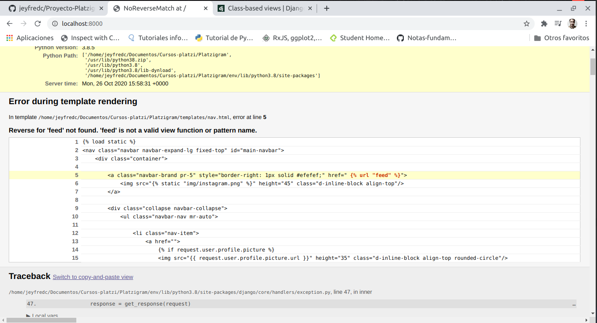

el namespace para feed que se establecio es posts, por tanto se debe cambiar 

`href=" `

por `href=" ` en el archivo **nav.html**, y si se sigue cargando la pagina despues de hacer cambios van aparecer mas errores

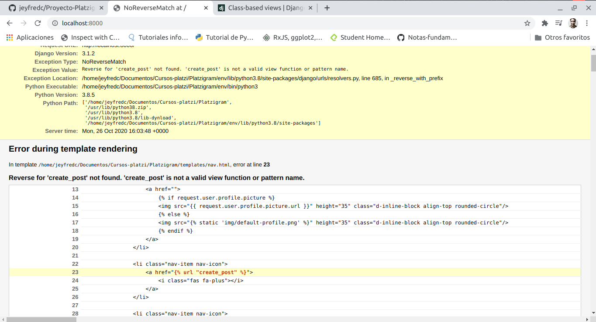


ahora se cambia

`href=""`

por  `href=""` en el archivo **nav.html**

esto se debe hacer con cada error que cargue dependiendo si la ruta o el namespace esta en users o posts

Ahora crear el template **detail.html** en **Platzigram/templates/users/detail.html** el cual queda con la siguiente estructura de codigo

```



<title>@{{ request.user.username }} | Platzigram</title>




    <div class="container mb-5" style="margin-top: 8em;">
        <div class="row">
            <div class="col-sm-4 d-flex justify-content-center">
                
            </div>
            <div class="col-sm-8">
                <h2 style="font-weight: 100;">
                    {{ request.user.username }}
                    
                        <a
                            href=""
                            class="ml-5 btn btn-sm btn-outline-info"
                        >
                            Edit profile
                        </a>
                    
                        <a
                            href=""
                            class="ml-5 btn btn-sm btn-primary"
                        >
                            Follow
                        </a>
                    
                </h2>
                <div class="row mt-2" style="font-size: 1.2em">
                    <div class="col-sm-4">
                        <b>{{ request.user.profile.posts_count }}785</b> posts
                    </div>
                    <div class="col-sm-4">
                        <b>{{ request.user.profile.followers }}1,401</b> followers
                    </div>
                    <div class="col-sm-4">
                        <b>{{ request.user.profile.following }}491</b> following
                    </div>
                </div>
                <div class="row mt-4">
                    <div class="col-sm-12">
                        <p>{{ request.user.profile.biography }}</p>
                    </div>
                </div>
            </div>
        </div>
    </div>

    <hr>



```

por ultimo se puede probar que el template este cargando , estableciendo cualquier ruta en users como http://localhost:8000/users/hola/

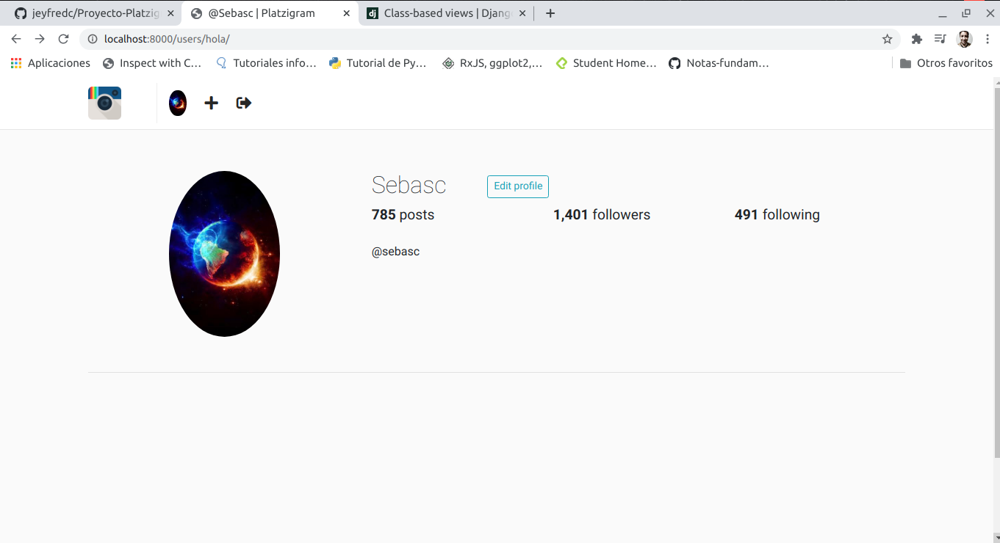

## Clase 28 Protegiendo la vista de perfil, Detail View y List View

En esta clase vamos a usar Detail View para continuar con el perfil de usuario y usaremos List View para definir la lista de views.

actualmente al cargar la vista http://localhost:8000/users/hola/ no esta cargando un usuario que se haya creado en la base de datos es decir `/hola/` en la url no es un usuario de la base de datos, es cualquier argumento que se esta pasando y esto no deberia pasar por tal motivo hay que hacer uso de **Detail View** y volver mas complejo el path que se encuentra en **Platzigram/users/urls.py**

este path se debe cambiar 

```
    path(
        route = '<str:username>/',
        view = TemplateView.as_view(template_name='users/detail.html'),
        name = 'detail'
    ),
```    

por el siguiente

```
    path(
        route = '<str:username>/',
        view = views.UserDetailView.as_view(),
        name = 'detail'
    ),
```

y tambien quitar `from django.views.generic import TemplateView`

pasar a las vistas para crear la nueva clase `UserDetailView()` en **Platzigram/users/views.py** e importar `from django.views.generic import DetailView`

```
class UserDetailView(DetailView):
    """ User detail view """

    template_name = 'users/detail.html'

```

aqui va a indicar un error que dice que hace falta **QuerySet** y esto significa que a partir de que conjunto de datos va a traer los datos, para esto se utiliza

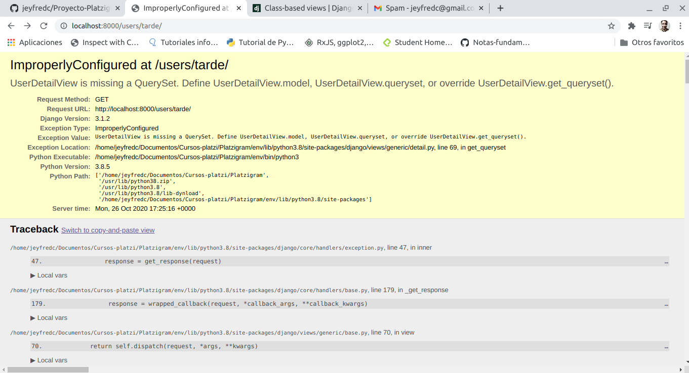

`queryset = User.objects.all()`

para usar un query es necesario importar el modelo de la base de datos con 

`from django.contrib.auth.models import User`

despues de realizar esto va a salir otro error 

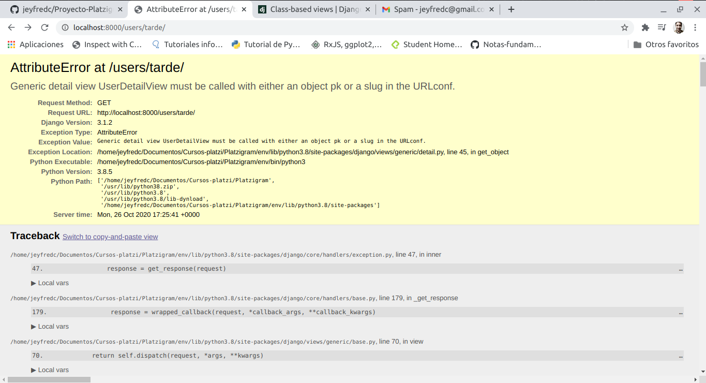

e indica que debe ser llamado con un Primary key o un slug(), el slug indica que es el username, tiene que ver con un campo de texto unico y ademas se utiliza `slug_url_kwarg` pero este esta relacionado con la ruta que se establece en el path, donde se indica que el username es un string `route = '<str:username>/',`

`slug_field = 'username'`

`slug_url_kwarg= 'username'`

**Nota:** si la ruta se llamara de otra forma `route = '<str:slug>/'` el slug_url_kwarg tambien se debe llamar slug `slug_url_kwarg= 'slug'`

Ahora al recargar la pagina va a salir un error 404 que va indicar simplemente que ya esta cargando bien al usuario de esa sesion 

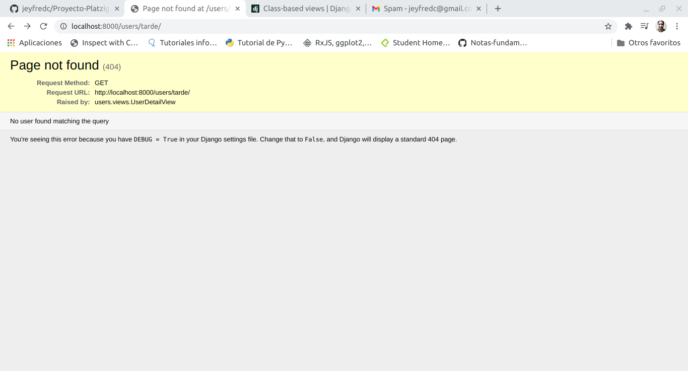

en este caso el usuario es Sebasc y va a cargar como si estuviera el perfil, pero los datos no se estan trayendo de manera correcta

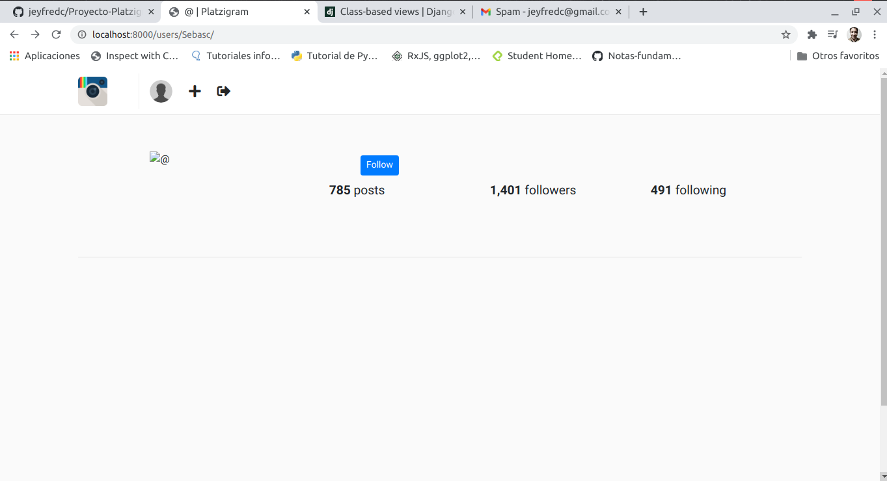

el template **detail.html** se debe modificar 

```



<title>@{{ user.username }} | Platzigram</title>




    <div class="container mb-5" style="margin-top: 8em;">
        <div class="row">
            <div class="col-sm-4 d-flex justify-content-center">
                
            </div>
            <div class="col-sm-8">
                <h2 style="font-weight: 100;">
                    {{ user.username }}
                    
                        <a
                            href=""
                            class="ml-5 btn btn-sm btn-outline-info"
                        >
                            Edit profile
                        </a>
                    
                        <a
                            href=""
                            class="ml-5 btn btn-sm btn-primary"
                        >
                            Follow
                        </a>
                    
                </h2>
                <div class="row mt-2" style="font-size: 1.2em">
                    <div class="col-sm-4">
                        <b>{{ user.profile.posts_count }}785</b> posts
                    </div>
                    <div class="col-sm-4">
                        <b>{{ user.profile.followers }}1,401</b> followers
                    </div>
                    <div class="col-sm-4">
                        <b>{{ user.profile.following }}491</b> following
                    </div>
                </div>
                <div class="row mt-4">
                    <div class="col-sm-12">
                        <p>{{ user.profile.biography }}</p>
                    </div>
                </div>
            </div>
        </div>
    </div>

    <hr>


```

si ahora se establece la ruta para el usuario Sebasc

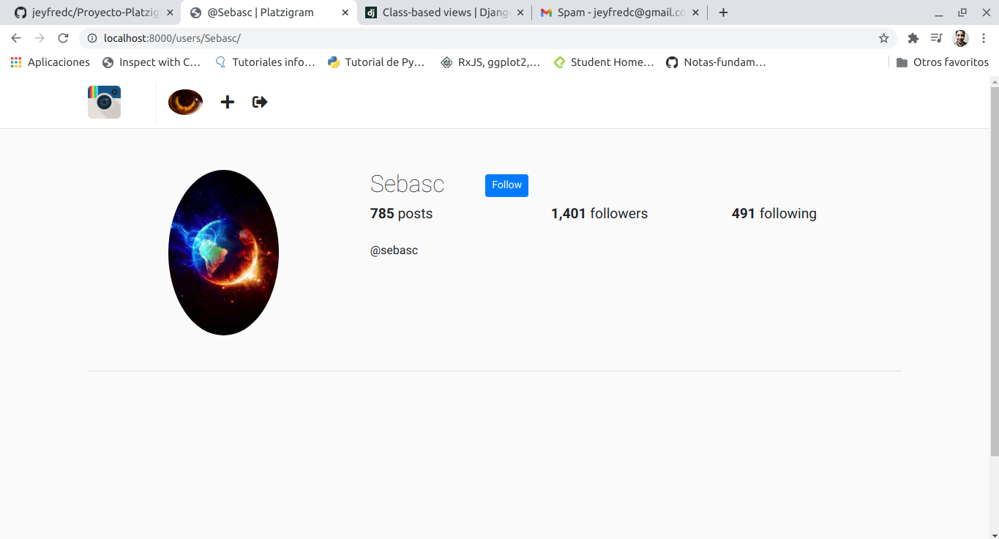

aparece follow para seguir y si se ubica dentro del perfil del mismo usuario con el que se logueo la sesion va a salir edith profile

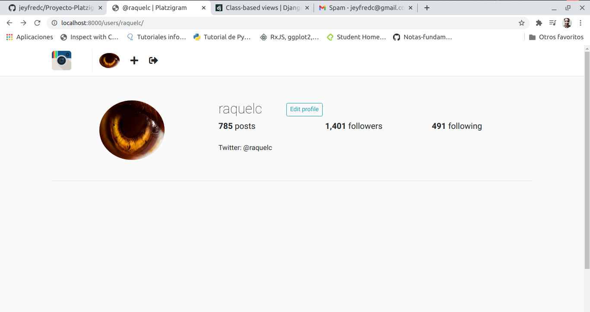

ademas en cada archivo se deben empezar a corregir las rutas y las redirecciones por ejemplo al hacer click en edit profile sale otro error 

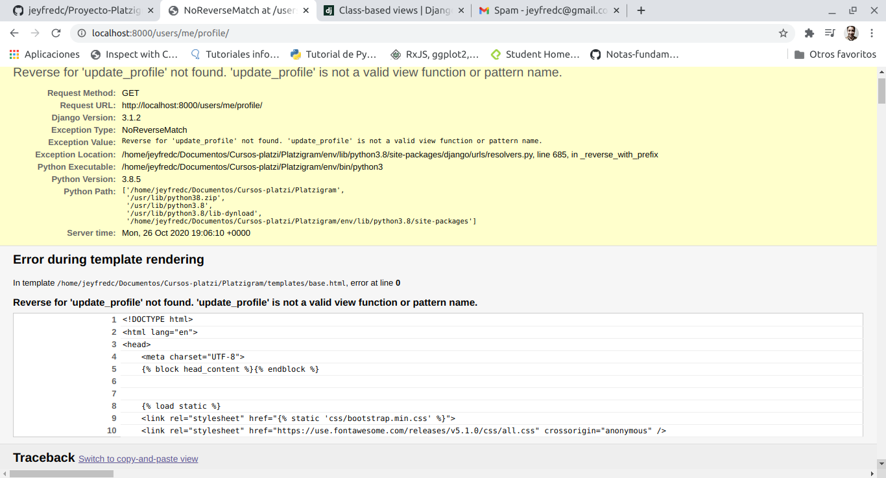

que indica que la ruta en el template update_profile ya no es esa ruta `"` ahora se llama `"`

al corregir ya se carga la ruta para empezar a editar 

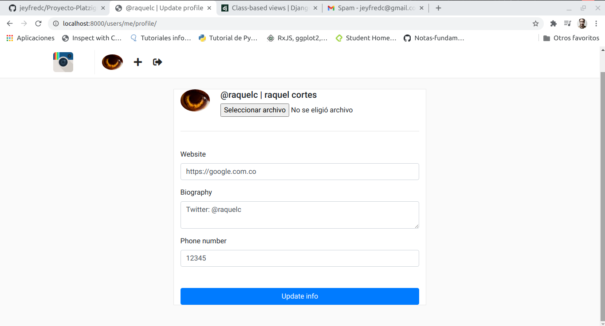


Al intentar cargar datos, nuevamente sale un error que esta en el redirect de la linea 80 de la ruta **Platzigram/users/views.py**

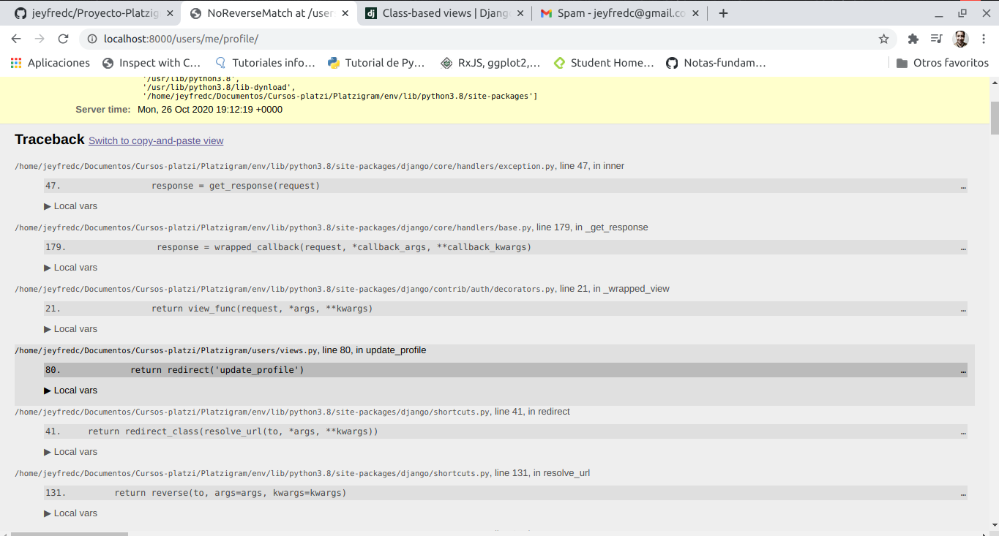

la cual cambia de ser `return redirect('update_profile')` por `return redirect('users:update_profile')` y tambien es buen momento para empezar a reconfigurar todas las vistas

`return redirect('feed')` por `return redirect('posts:feed')`

`return redirect('login')` por `return redirect('users:login')`

y tambien corregir las urls que estan en los templates **signup.html** y **login.html**

de esta forma si se corrige y se hacen cambios sobre el perfil, van a empezar a aparecer 

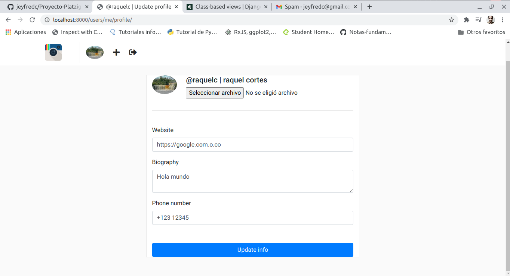

Ahora en vez de redirigir hacia `update_profile` ahora va a redirigir hacia el perfil el cual se establecio como `detail`.

en la funcion update_profile se debe cambiar todo el redirect

`return redirect('users:update_profile')`.

como se va a cambiar se debe importar `from django.urls import reverse` y establecer la ruta en la funcion 

```
@login_required
def update_profile(request):
    """ Update a user's profile view. """
    profile = request.user.profile

    # if this is a POST request we need to process the form data
    if request.method == 'POST':
    # create a form instance and populate it with data from the request:
        form = ProfileForm(request.POST, request.FILES)
        # check whether it's valid:
        if form.is_valid():
            # process the data in form.cleaned_data as required
            # ...
            # redirect to a new URL:
            data = form.cleaned_data

            profile.website = data['website']
            profile.phone_number = data['phone_number']
            profile.biography = data['biography']
            profile.picture = data['picture']
            profile.save()

            url = reverse('users:detail', kwargs={'username': request.user.username})
            return redirect(url)
```

y ahora si se requiere actualizar alguna informacion en el perfil, al dar clik en update info debe redirigir hacia el perfil del usuario

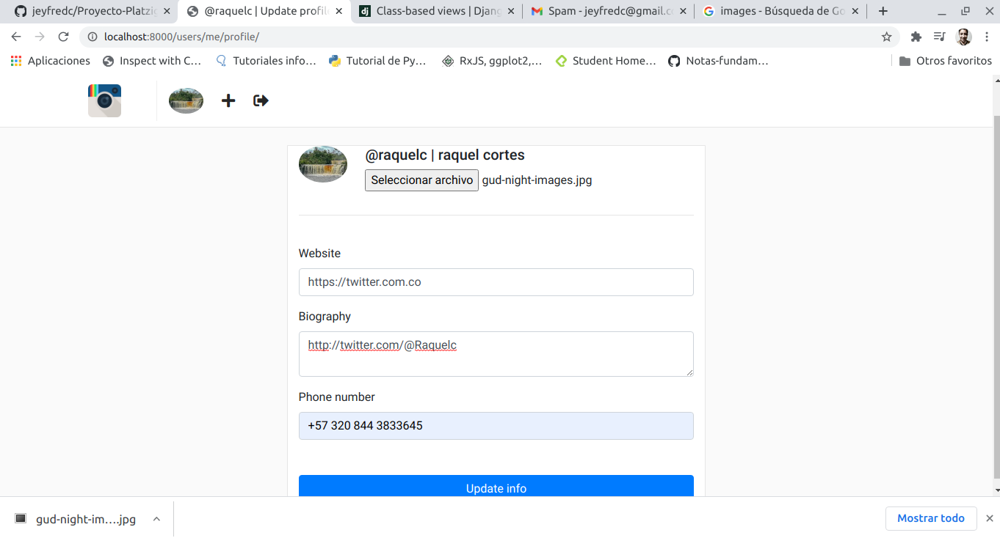

y se actualizan los datos, imagenes y demas caracteristicas

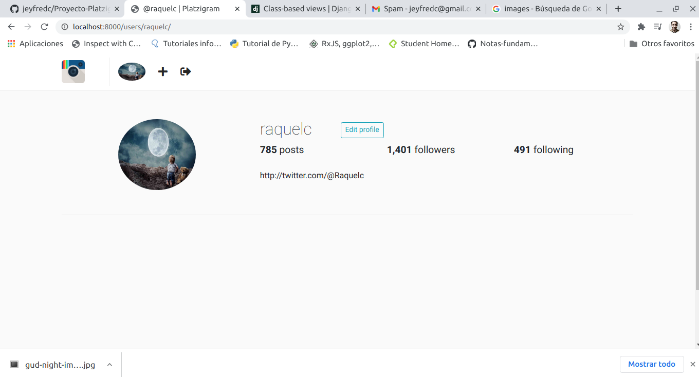

**Nota:** Cualquier duda revisar los archivos del repositorio

Falta actualizar los posts o publicaciones que han realizado los usuarios para esto se hace uso de [DetailView](https://docs.djangoproject.com/en/3.1/topics/class-based-views/generic-display/#adding-extra-context)


y se crea la funcion `get_context_data` en la clase `UserDetailView` y se importa Post `from posts.models import Post` para traer las imagenes posteadas de cada usuario, tambien para que sea requerido el login en una vista se trae al mixin LoginRequiredMixin con `from django.contrib.auth.mixins import LoginRequiredMixin` y se implementa en la clase UserDetailView `class UserDetailView(LoginRequiredMixin, DetailView):`


```
""" Users views. """

# Django
from django.contrib.auth import authenticate, login, logout
from django.contrib.auth.decorators import login_required
from django.contrib.auth.mixins import LoginRequiredMixin
from django.shortcuts import render, redirect
from django.urls import reverse
from django.views.generic import DetailView

#Models
from django.contrib.auth.models import User
from posts.models import Post

#Forms
from users.forms import ProfileForm, SignupForm


class UserDetailView(LoginRequiredMixin, DetailView):
    """ User detail view """

    template_name = 'users/detail.html'
    slug_field = 'username'
    slug_url_kwarg = 'username'
    queryset = User.objects.all()
    context_object_name = 'user'

    def get_context_data(self, **kwargs):
        """ User detail view. """
        # Call the base implementation first to get a context
        context = super().get_context_data(**kwargs)
        user = self.get_object()
        # Add in a QuerySet of all the books
        context['posts'] = Post.objects.filter(user=user).order_by('-created')
        return context


def login_view(request):
    """ Login view """
    if request.method == 'POST':
        username = request.POST['username']
        password = request.POST['password']
        user = authenticate(request, username=username, password=password)
        if user:
            login(request, user)
            return redirect('posts:feed')
        else:
            return render(request, 'users/login.html', {'error': 'Invalid username and password'})
            
    return render(request, 'users/login.html')


def signup_view(request):
    """ Sign up view """
    if request.method == 'POST':
        form = SignupForm(request.POST)
        if form.is_valid():
            form.save()
            return redirect('users:login')
    else:
        form = SignupForm()

    return render(
        request=request,
        template_name = 'users/signup.html',
        context={'form' : form}
    )


@login_required
def update_profile(request):
    """ Update a user's profile view. """
    profile = request.user.profile

    # if this is a POST request we need to process the form data
    if request.method == 'POST':
    # create a form instance and populate it with data from the request:
        form = ProfileForm(request.POST, request.FILES)
        # check whether it's valid:
        if form.is_valid():
            # process the data in form.cleaned_data as required
            # ...
            # redirect to a new URL:
            data = form.cleaned_data

            profile.website = data['website']
            profile.phone_number = data['phone_number']
            profile.biography = data['biography']
            profile.picture = data['picture']
            profile.save()

            url = reverse('users:detail', kwargs={'username': request.user.username})
            return redirect(url)

    # if a GET (or any other method) we'll create a blank form
    else:
        form= ProfileForm()

    return render(
        request=request,
        template_name='users/update_profile.html',
        context={
            'profile': profile,
            'user': request.user,
            'form': form
        }
    )


@login_required
def logout_view(request):
    """ Logout a user """
    logout(request)
    # Redirect to a success page.
    return redirect('users:login')
```

y para establecer que al dar click sobre la foto del usuario automaticamente se va a trasladar hacia el perfil se modifica el template **nav.html**

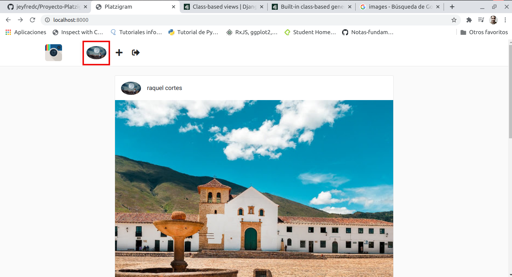

```

<nav class="navbar navbar-expand-lg fixed-top" id="main-navbar">
    <div class="container">

        <a class="navbar-brand pr-5" style="border-right: 1px solid #efefef;" href=" ">
            
        </a>

        <div class="collapse navbar-collapse">
            <ul class="navbar-nav mr-auto">

                <li class="nav-item">
                    <a href="">
                        
                        
                        
                        
                        
                    </a>
                </li>

                <li class="nav-item nav-icon">
                    <a href="">
                        <i class="fas fa-plus"></i>
                    </a>
                </li>

                <li class="nav-item nav-icon">
                    <a href="">
                        <i class="fas fa-sign-out-alt"></i>
                    </a>
                </li>

            </ul>
        </div>
    </div>
</nav>
```


y ahora para hacer click sobre cualquier usuario y entrar al perfil se modifica **feed.html**

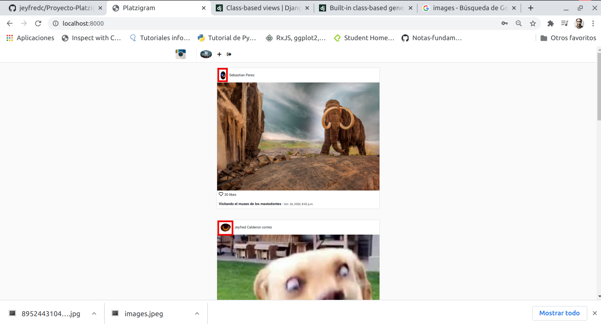

```



    <title>Platzigram</title>



    <div class="container">
        <div class="row">

            
            <div class="col-sm-12 col-md-8 offset-md-2 mt-5 p-0 post-container">
                <div class="media pt-3 pl-3 pb-1">
                    <a href="">
                    
                    </a>
                    <div class="media-body">
                        <p style="margin-top: 5px;">{{ post.user.get_full_name  }}</p>
                    </div>
                </div>

                

                <p class="mt-1 ml-2" >
                    <a href="" style="color: #000; font-size: 20px;">
                        <i class="far fa-heart"></i>
                    </a> 30 likes
                </p>
                <p class="ml-2 mt-0 mb-2">
                    <b>{{ post.title }}</b> - <small>{{ post.created }}</small>
                </p>
            </div>
            
        </div>
    </div>

```

y por ultimo para recorrer cada post en cada usuario agregar a `detail.html` lo siguiente

```
    <div class="container" id="user-posts">
        <div class="row mt-3">
            
            <div class="col-sm-4 pt-5 pb-5 pr-5 pl-5 d-flex justify-content-center align-items-center">
                <a href="" class="border">
                    
                </a>
            </div>
            
        </div>
    </div>
```

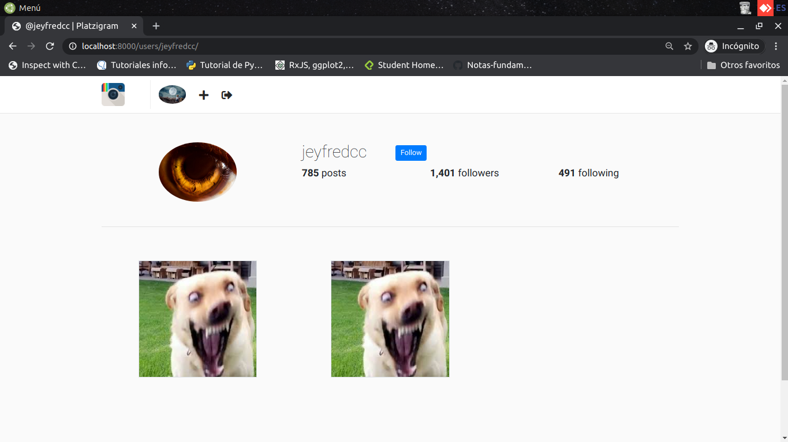

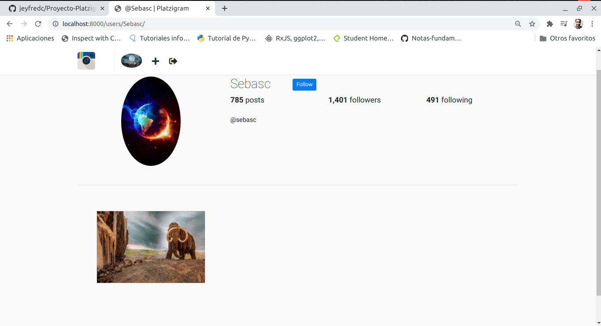

Ahora se va a agregar ListView a **Platzigram/posts/views.py** para listar los posts de la manera en que lo estable Django, el cual se puede consultar con la documentacion y se cambia la funcion que anteriormente se llamaba `list_posts` por la clase `PostFeedView()`, se importa `from django.contrib.auth.mixins import LoginRequiredMixin` para requerir que al ver las listas de posts este logueado el usuario y se importa `from django.views.generic import ListView` para crear la clase y establecer los parametros de vista y orden 

```
"""Post views.  """

# Django
from django.contrib.auth.decorators import login_required
from django.shortcuts import render, redirect
from django.contrib.auth.mixins import LoginRequiredMixin
from django.views.generic import ListView

#Models

from posts.models import Post

#Forms
from posts.forms import PostForm


class PostsFeedView(LoginRequiredMixin, ListView):
    """ Return all published posts """

    template_name= 'posts/feed.html'
    model= Post
    ordering = ('-created',)
    paginate_by = 2
    context_object_name = 'posts'


@login_required
def create_post(request):
    """ create new post view """
    if request.method == 'POST':
        form = PostForm(request.POST, request.FILES) 
        if form.is_valid():
            form.save()
            return redirect('posts:feed')
    
    else:
        form = PostForm()

    return render(
        request= request,
        template_name = 'posts/new.html',
        context={
            'form' : form,
            'user' : request.user,
            'profile' : request.user.profile
        }
    )
```

Al haber cambiado la funcion `list_post` tambien cambia la funcion establecida en **Platzigram/platzigram/urls.py** cambia         

`view= views.list_posts,` por `view= views.PostsFeedView.as_view(),`

nuevamente comprobar que los posts esten cargando en el navegador

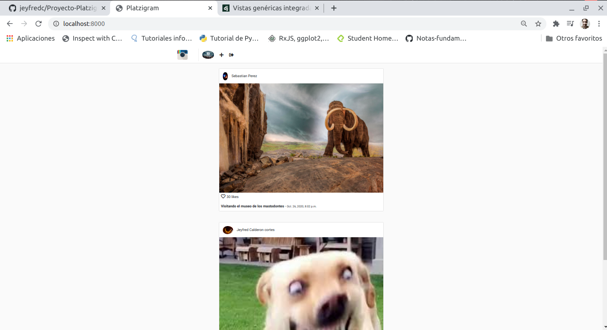

**Reto:** Hacer el detalle de los posts con DetailView

## Clase 29 CreateView, FormView y UpdateView

En esta clase incorporamos la paginación de posts utilizando page_obj, bootstrap y variables del contexto. Adicionalmente resolvemos el reto de la clase anterior usando DetailView. Remplazamos render y redirect por CreateView para los posts. Implementaremos FormView en sustitución del formulario de registro Signup que teníamos hasta ahora con el fin de optimizar el código y finalmente optimizamos la vista de actualización del perfil con UpdateView.

Para la paginacion se implementa otra seccion de codigo en el archivo **feed.html** que se encuentra en **Platzigram/templates/posts/feed.html** y despues del ultimo `</div>` se agrega un nav para la paginacion y que se pueda pasar de la pagina 1 a la 2 o mas y viceversa.

```
<nav>
    <ul class="pagination justify-content-end">
        
        <li class="page-item">
            <a class="page-link" href="?page={{ page_obj.previous_page_number }}">
                Previous
            </a>
        </li>
        
        <li class="page-item">
            <a class="page-link" href="#">
                {{ page_obj.number }} of {{ page_obj.paginator.num_pages }}
            </a>
        </li>
        
        <li class="page-item">
            <a class="page-link" href="?page={{ page_obj.next_page_number }}">
                Next
            </a>
        </li>
        
    </ul>
</nav>
```

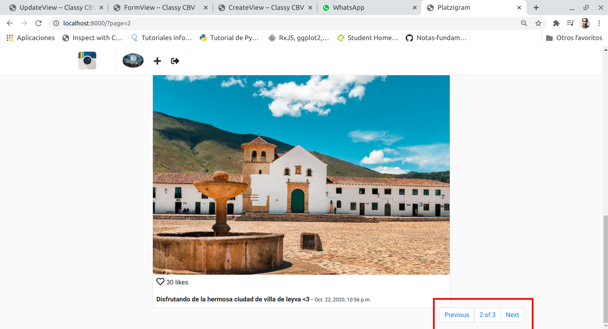

el codigo bootstrap para la paginacion se podria implementar mas adelante en otro lado por  tanto el codigo anterior se pasa a un template que se va a llamar **pagination.html** y para que **feed.html** lo use simplemente debajo del `</div>` se agrega una linea de codigo con lo siguiente

``

de esta foma va a seguir funcionando la paginacion

Para solucionar el reto de la clase anterior se debe solucionar que al dar click en una foto se debe poder acceder al detalle, pero de momento no funciona.

abrir **Platzigram/posts/urls.py** y crear un nuevo path.

```
    path(
        route='posts/<int:pk>/',
        view= views.PostDetailView.as_view(),
        name='detail'
        ),
```

Despues pasar a **Platzigram/posts/views.py** para crear la clase `PostDetailView` la cual debe heredar de `LoinRequiredMixin` y `DetailView`

```
class PostDetailView(LoginRequiredMixin, DetailView):
    """ Return post detail """
    template_name= 'posts/detail.html'
    queryset = Post.objects.all()
    context_object_name= 'post'
```

Se crea un template **detail.html**  que va a estar ubicado en **Platzigram/templates/posts/detail.html** el cual lleva el siguiente bloque de codigo que hereda a su vez de **post_card.html** y el cual tambien debe ser creado 

```



    <title>Platzigram</title>

<!DOCTYPE html>


    <div class="container">
        <div class="row">
            
        </div>
    </div>


```

y ahora se crea **post_card.html** dentro del mismo folder y lleva el siguiente bloque de codigo 

```
<div class="col-sm-12 col-md-8 offset-md-2 mt-5 p-0 post-container">
    <div class="media pt-3 pl-3 pb-1">
        <a href="">
            
        </a>
        <div class="media-body">
            <p style="margin-top: 5px;">{{ post.user.get_full_name  }}</p>
        </div>
    </div>

    

    <p class="mt-1 ml-2" >
        <a href="" style="color: #000; font-size: 20px;">
            <i class="far fa-heart"></i>
        </a> 30 likes
    </p>
    <p class="ml-2 mt-0 mb-2">
        <b>{{ post.title }}</b> - <small>{{ post.created }}</small>
    </p>
</div>
```

Como el codigo de **post_card.html** se puede reutilzar tambien se modifica **feed.html** por lo siguiente

```



    <title>Platzigram</title>



    <div class="container">
        <div class="row">

            
                
            
        </div>
    </div>

    


```

Debajo de `PostDetailView` **Platzigram/posts/views.py** pasar a crear la clase `CreatePostView` para reemplazar la funcion `create_post`, esta va a contener `LoginRequiredMixin` y `CreateView`, para hacer uso de CreateView se debe agregar a `from django.views.generic import CreateView, DetailView, ListView`, se va a establecer una variable success_url que va a redirigir hacia `posts:feed` con la funcion reverse_lazy que se utiliza para hacer una comprobacion y se tiene que importar con `from django.urls import reverse_lazy`


hacer uso de la [documentacion](https://docs.djangoproject.com/en/3.1/ref/class-based-views/generic-editing/#createview) para implementarlo. La clase queda de la siguiente forma

```
class PostCreateView(LoginRequiredMixin, CreateView):
    template_name = 'posts/new.html'
    form_class = PostForm
    success_url = reverse_lazy('posts:feed')


    def get_context_data(self, **kwargs):
        """ Add user and profile to context. """

        context = super(). get_context_data(**kwargs)
        context['user'] = self.request.user
        context['profile'] = self.request.user.profile
        return context
```

**Platzigram/posts/views.py** queda asi 

```
"""Post views.  """

# Django
from django.urls import reverse_lazy
from django.contrib.auth.mixins import LoginRequiredMixin
from django.views.generic import CreateView, DetailView, ListView 

#Forms
from posts.forms import PostForm

#Models
from posts.models import Post


class PostFeedView(LoginRequiredMixin, ListView):
    """ Return all published posts """

    template_name= 'posts/feed.html'
    model= Post
    ordering = ('-created',)
    paginate_by = 30
    context_object_name = 'posts'


class PostDetailView(LoginRequiredMixin, DetailView):
    """Return post detail."""

    template_name = 'posts/detail.html' 
    queryset = Post.objects.all()
    context_object_name = 'posts'


class PostCreateView(LoginRequiredMixin, CreateView):
    template_name = 'posts/new.html'
    form_class = PostForm
    success_url = reverse_lazy('posts:feed')


    def get_context_data(self, **kwargs):
        """ Add user and profile to context. """

        context = super(). get_context_data(**kwargs)
        context['user'] = self.request.user
        context['profile'] = self.request.user.profile
        return context


```

Ahora hay que arreglar **Platzigram/posts/urls.py** el cual queda asi 

```
""" Posts urls """

#Django
from django.urls import path

#Views
from posts import views

urlpatterns = [

    path(
        route='',
        view= views.PostFeedView.as_view(),
        name='feed'
    ),

    path(
        route='posts/new/',
        view= views.PostCreateView.as_view(),
        name='create_post'
    ),

        path(
        route='posts/<int:pk>/',
        view=views.PostDetailView.as_view(),
        name='detail'
    )

]
```

De esta forma ya se debe cargar la vista para crear usuarios

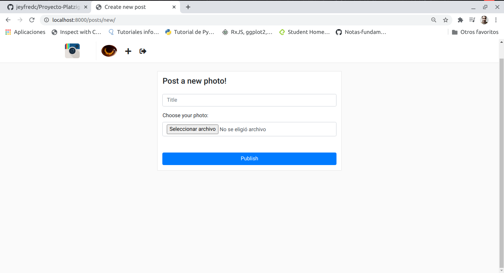

Se puede mejorar tambien la funcion signup de la vista que esta en **Platzigram/users/views.py** y hacer uso de la clase [FormView](https://docs.djangoproject.com/en/3.1/ref/class-based-views/generic-editing/#formview), para esto hay que importar `FormView` agregandola a `from django.views.generic import DetailView, FormView` y se crea la clase `class SignupView(FormView):` que va a reemplazar a la funcion  `signup_view` y tambien se debe implementar la funcion `form_valid(self, form):` para que al hacer sign up el usuario se pueda crear con el perfil, esto se debe implementar porque antes se hace una validacion

```
class SignupView(FormView):
    """ Users Sign up view """
    
    template_name = 'users/signup.html'
    form_class = SignupForm
    success_url = reverse_lazy('users:login')
```

**Platzigram/users/views.py** queda asi 

```
""" Users views. """

# Django
from django.contrib.auth import authenticate, login, logout
from django.contrib.auth.decorators import login_required
from django.contrib.auth.mixins import LoginRequiredMixin
from django.shortcuts import render, redirect
from django.urls import reverse, reverse_lazy
from django.views.generic import DetailView, FormView

#Models
from django.contrib.auth.models import User
from posts.models import Post

#Forms
from users.forms import ProfileForm, SignupForm


class UserDetailView(LoginRequiredMixin, DetailView):
    """ User detail view """

    template_name = 'users/detail.html'
    slug_field = 'username'
    slug_url_kwarg = 'username'
    queryset = User.objects.all()
    context_object_name = 'user'

    def get_context_data(self, **kwargs):
        """ User detail view. """
        # Call the base implementation first to get a context
        context = super().get_context_data(**kwargs)
        user = self.get_object()
        # Add in a QuerySet of all the books
        context['posts'] = Post.objects.filter(user=user).order_by('-created')
        return context


def login_view(request):
    """ Login view """
    if request.method == 'POST':
        username = request.POST['username']
        password = request.POST['password']
        user = authenticate(request, username=username, password=password)
        if user:
            login(request, user)
            return redirect('posts:feed')
        else:
            return render(request, 'users/login.html', {'error': 'Invalid username and password'})
            
    return render(request, 'users/login.html')


class SignupView(FormView):
    """ Users Sign up view """
    
    template_name = 'users/signup.html'
    form_class = SignupForm
    success_url = reverse_lazy('users:login')


    def form_valid(self, form):
        """ Save form data """
        form.save()
        return super().form_valid(form)


@login_required
def update_profile(request):
    """ Update a user's profile view. """
    profile = request.user.profile

    # if this is a POST request we need to process the form data
    if request.method == 'POST':
    # create a form instance and populate it with data from the request:
        form = ProfileForm(request.POST, request.FILES)
        # check whether it's valid:
        if form.is_valid():
            # process the data in form.cleaned_data as required
            # ...
            # redirect to a new URL:
            data = form.cleaned_data

            profile.website = data['website']
            profile.phone_number = data['phone_number']
            profile.biography = data['biography']
            profile.picture = data['picture']
            profile.save()

            url = reverse('users:detail', kwargs={'username': request.user.username})
            return redirect(url)

    # if a GET (or any other method) we'll create a blank form
    else:
        form= ProfileForm()

    return render(
        request=request,
        template_name='users/update_profile.html',
        context={
            'profile': profile,
            'user': request.user,
            'form': form
        }
    )


@login_required
def logout_view(request):
    """ Logout a user """
    logout(request)
    # Redirect to a success page.
    return redirect('users:login')

```

Ahora hay que arreglar **Platzigram/users/urls.py** el cual queda asi 

```
""" Users urls """

#Django
from django.urls import path
#Views
from users import views

urlpatterns = [

    #Mangement
    path(
        route = 'login/', 
        view = views.login_view,
        name = 'login'
    ),

    path(
        route = 'logout/',
        view = views.logout_view, 
        name = 'logout'
    ),

    path(
        route = 'signup/', 
        view= views.SignupView.as_view(), 
        name = 'signup'
    ),

    path(
        route = 'me/profile/', 
        view = views.update_profile, 
        name = 'update_profile'
    ),

    #posts
    path(
        route = '<str:username>/',
        view = views.UserDetailView.as_view(),
        name = 'detail'
    ),
]
```

A continuacion va a salir un error que indica que se debe actualizar la redireccion en **midleware.py**

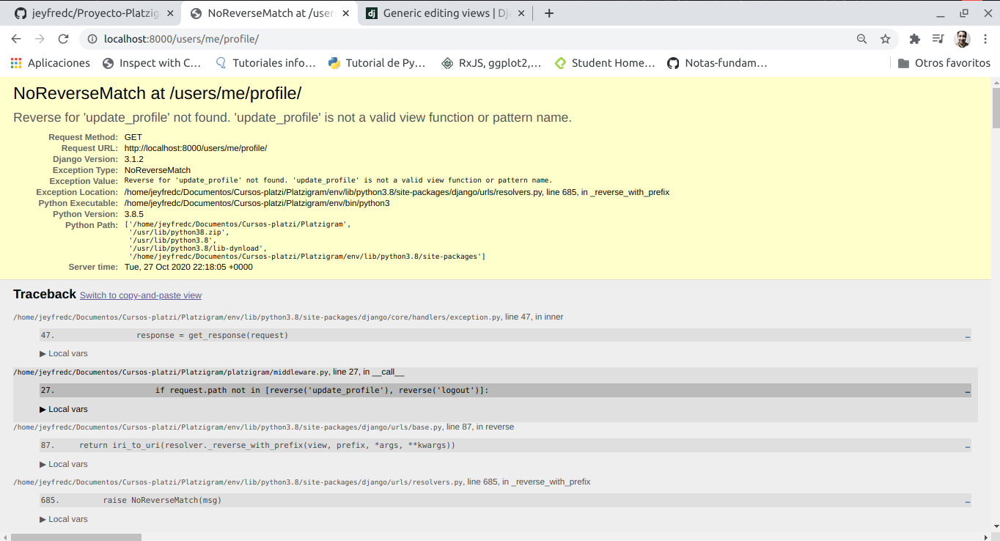

y se debe cambiar 

```
if request.path not in [reverse('update_profile'), reverse('logout')]:
                        return redirect('update_profile')
```

por 

```
if request.path not in [reverse('users:update_profile'), reverse('users:logout')]:
                        return redirect('users:update_profile')
```

Despues de esto ya deja ingresar a la creacion del perfil de usuario para actualizar, foto,website, biografia


Por ultimo se implementa la clase `class UpdateprofileView`la cual hereda de `LoginRequiredMixin` y `UpdateView`, esta va a reemplazar la funcion `update_profile` . Para hacer uso de U`pdateView` se debe agregar a `from django.views.generic import DetailView, FormView, UpdateView` y seguir todos los pasos que indica la documentacion, que de por si son muy parecidos a las otras clases ya implementadas en **Platzigram/users/views.py**.

Se debe importar el Profile de users `from users.models import Profile`

Se debe eliminar `ProfileForm` y solo dejar SignupForm `from users.forms import SignupForm` porque el otro formulario esta cumpliendo con la funcion que hacia `ProfileForm`, es decir que tambien se debe borrar la clase de **Platzigram/users/forms.py**

Se sobreescribe el metodo `get_object` que es el encargado de hacer el query y regrese el perfil del usuario

```
    def get_object(self):
        """ Return user's profile """
        return self.request.user.Profile
```
y luego se necesita implementar el metodo `get_succes_url`, para pasar los argumentos que requiere traer el perfil del usuario

```
    def get_success_url(self):
        """ Return to user's profile """
        username = self.object.user.username
        return reverse('users:detail', kwargs={'username' : username})
```

La clase queda asi 

```
class UpdateProfileView(LoginRequiredMixin, UpdateView):
    """ Update View """

    template_name = 'users/update_profile.html'
    model = Profile
    fields = ['website', 'phone_number', 'biography', 'picture']

    
    def get_object(self):
        """ Return user's profile """
        return self.request.user.Profile
    
    def get_success_url(self):
        """ Return to user's profile """
        username = self.object.user.username
        return reverse('users:detail', kwargs={'username' : username})
```

y el archivo **Platzigram/users/views.py** queda mucho mas corto y legible 

```
""" Users views. """

# Django
from django.contrib.auth import authenticate, login, logout
from django.contrib.auth.decorators import login_required
from django.contrib.auth.mixins import LoginRequiredMixin
from django.shortcuts import render, redirect
from django.urls import reverse, reverse_lazy
from django.views.generic import DetailView, FormView, UpdateView

#Models
from django.contrib.auth.models import User
from posts.models import Post
from users.models import Profile

#Forms
from users.forms import SignupForm


class UserDetailView(LoginRequiredMixin, DetailView):
    """ User detail view """

    template_name = 'users/detail.html'
    slug_field = 'username'
    slug_url_kwarg = 'username'
    queryset = User.objects.all()
    context_object_name = 'user'

    def get_context_data(self, **kwargs):
        """ User detail view. """
        # Call the base implementation first to get a context
        context = super().get_context_data(**kwargs)
        user = self.get_object()
        # Add in a QuerySet of all the books
        context['posts'] = Post.objects.filter(user=user).order_by('-created')
        return context


def login_view(request):
    """ Login view """
    if request.method == 'POST':
        username = request.POST['username']
        password = request.POST['password']
        user = authenticate(request, username=username, password=password)
        if user:
            login(request, user)
            return redirect('posts:feed')
        else:
            return render(request, 'users/login.html', {'error': 'Invalid username and password'})
            
    return render(request, 'users/login.html')


class SignupView(FormView):
    """ Users Sign up view """
    
    template_name = 'users/signup.html'
    form_class = SignupForm
    success_url = reverse_lazy('users:login')


    def form_valid(self, form):
        """ Save form data """
        form.save()
        return super().form_valid(form)


class UpdateProfileView(LoginRequiredMixin, UpdateView):
    """ Update View """

    template_name = 'users/update_profile.html'
    model = Profile
    fields = ['website', 'phone_number', 'biography', 'picture']

    
    def get_object(self):
        """ Return user's profile """
        return self.request.user.Profile
    
    def get_success_url(self):
        """ Return to user's profile """
        username = self.object.user.username
        return reverse('users:detail', kwargs={'username' : username})


@login_required
def logout_view(request):
    """ Logout a user """
    logout(request)
    # Redirect to a success page.
    return redirect('users:login')
```

por ultimo hay que configurar **Platzigram/users/urls.py** el cual queda asi 

```
""" Users urls """

#Django
from django.urls import path
#Views
from users import views

urlpatterns = [

    #Mangement
    path(
        route = 'login/', 
        view = views.login_view,
        name = 'login'
    ),

    path(
        route = 'logout/',
        view = views.logout_view, 
        name = 'logout'
    ),

    path(
        route = 'signup/', 
        view= views.SignupView.as_view(), 
        name = 'signup'
    ),

    path(
        route = 'me/profile/', 
        view = views.UpdateProfileView, 
        name = 'update_profile'
    ),

    #posts
    path(
        route = '<str:username>/',
        view = views.UserDetailView.as_view(),
        name = 'detail'
    ),
]
```

## Clase 30 Generic auth views

Django cuenta con varias vistas genéricas basadas en clases para resolver muchas de las funcionalidades relacionadas con la autenticación, como es el caso de:

- login

- logout

- password_change

- password_change_done

- password_reset

- password_reset_done

- password_reset_confirm

- password_reset_complete

Estas vistas genéricas nos permiten ahorrarnos varias líneas de código, además de que incluyen características adicionales de mucha utilidad.

Asi que se va a implementar la clase `LoginView` para reemplazar la funcion `login_view`en **Platzigram/users/views.py** siguiendo con la [documentacion](https://docs.djangoproject.com/en/3.1/topics/auth/default/#module-django.contrib.auth.views) para evitar muchas lineas de codigo que llevaban la logica ya que Django propociona esa facilidad.

Se importa `from django.contrib.auth import views as auth_views`, se implementa la clase heredando de `auth_views.LoginView`

```
class LoginView(auth_views.LoginView):
    """ Login view """
    template_name = 'users/login.html'
```

Se hace una correccion de logica en el template **login.html** ubicado en **Platzigram/templates/users/login.html**

```



<title>Platzigram sign in</title>




    
        <p class="alert alert-danger"> 
            Your username and password didn't match. Please try again.    
        </p>
    

    <form method="POST" action="">
        

        <div class="form-group">
            <input class="form-control" type="text" placeholder="Username" name="username">
        </div>

        <div class="form-group">
            <input class="form-control" type="password" placeholder=" Password" name="password"">
        </div>

        <button class="btn btn-primary btn-block mt-5" type="submit">Sign in!</button>

    </form>

    <p class="mt-4">Don't have an account yet? <a href="">Sign up here.</a></p>


```

Luego pasar a urls.py en **Platzigram/users/urls.html**, corregir 

```
    path(
        route = 'login/', 
        view = views.login_view,
        name = 'login'
    ),

```

por 

```
    path(
        route = 'login/', 
        view = views.LoginView.as_view(),
        name = 'login'
    ),

```

y despues de esto hacer la prueba haciendo logout y login

posiblemente cuando se este haciendo login salga el siguiente error

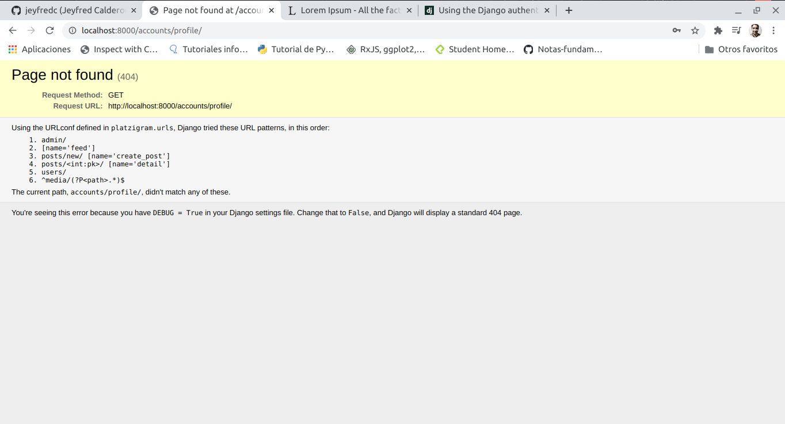

para solucionarlo en el archivo **settings.py** se debe configurar la url como lo indica la documentacion y al final se coloca lo siguiente 

`LOGIN_REDIRECT_URL = '/'`

por defecto la url en el navegador queda asi con el error http://localhost:8000/accounts/profile/
borrarla y reemplazarla por http://localhost:8000/ de esta forma ya debe estar en el feed y nuevamente hacer la pŕueba haciendo logout y login verificando que todo cargue normalmente

Por ultimo se implementa la clase `LogoutView` reemplazando la funcion `logout_view` para esto se quita de **Platzigram/users/views.py** las siguientes librerias porque no van a ser requeridas

`from django.shortcuts import render, redirect`

`from django.contrib.auth import authenticate, login, logout`

`from django.contrib.auth.decorators import login_required`

la clase queda de la siguiente forma 

```
class LogoutView(LoginRequiredMixin, auth_views.LogoutView):
    """ Logout view """

    template_name = 'users/logged_out.html'
```

**Platzigram/users/views.py** queda asi 

```
""" Users views. """

# Django
from django.contrib.auth.mixins import LoginRequiredMixin
from django.urls import reverse, reverse_lazy
from django.views.generic import DetailView, FormView, UpdateView
from django.contrib.auth import views as auth_views
#Models
from django.contrib.auth.models import User
from posts.models import Post
from users.models import Profile

#Forms
from users.forms import SignupForm


class UserDetailView(LoginRequiredMixin, DetailView):
    """ User detail view """

    template_name = 'users/detail.html'
    slug_field = 'username'
    slug_url_kwarg = 'username'
    queryset = User.objects.all()
    context_object_name = 'user'

    def get_context_data(self, **kwargs):
        """ User detail view. """
        # Call the base implementation first to get a context
        context = super().get_context_data(**kwargs)
        user = self.get_object()
        # Add in a QuerySet of all the books
        context['posts'] = Post.objects.filter(user=user).order_by('-created')
        return context


class LoginView(auth_views.LoginView):
    """ Login view """
    template_name = 'users/login.html'


class SignupView(FormView):
    """ Users Sign up view """
    
    template_name = 'users/signup.html'
    form_class = SignupForm
    success_url = reverse_lazy('users:login')


    def form_valid(self, form):
        """ Save form data """
        form.save()
        return super().form_valid(form)


class UpdateProfileView(LoginRequiredMixin, UpdateView):
    """ Update View """

    template_name = 'users/update_profile.html'
    model = Profile
    fields = ['website', 'phone_number', 'biography', 'picture']

    
    def get_object(self):
        """ Return user's profile """
        return self.request.user.Profile
    
    def get_success_url(self):
        """ Return to user's profile """
        username = self.object.user.username
        return reverse('users:detail', kwargs={'username' : username})


class LogoutView(LoginRequiredMixin, auth_views.LogoutView):
    """ Logout view """

    template_name = 'users/logged_out.html'

```

Se configura **Platzigram/users/urls.py** que quedan asi 

```
""" Users urls """

#Django
from django.urls import path
#Views
from users import views

urlpatterns = [

    #Mangement
    path(
        route = 'login/', 
        view = views.LoginView.as_view(),
        name = 'login'
    ),

    path(
        route = 'logout/',
        view = views.LogoutView.as_view(), 
        name = 'logout'
    ),

    path(
        route = 'signup/', 
        view= views.SignupView.as_view(), 
        name = 'signup'
    ),

    path(
        route = 'me/profile/', 
        view = views.UpdateProfileView, 
        name = 'update_profile'
    ),

    #posts
    path(
        route = '<str:username>/',
        view = views.UserDetailView.as_view(),
        name = 'detail'
    ),
]
```

por ultimo en **setting.py** se agrega la URL al final con la variable que se configuro para el login

`LOGOUT_REDIRECT_URL = LOGIN_URL`

Ahora hacer la prueba en el navegador haciendo login y logout

De esta forma queda lista la aplicacion **PLatzigram!!**

## Clase 31 Arquirectura / Conceptos / Componentes

Liberar un proyecto de Django a producción es una tarea bastante sencilla pero que puede confundir a muchos la primera vez que se intente (a mi me sucedió). El objetivo de esta lectura es tener una breve a introducción a la arquitectura de un proyecto de Django corriendo en un servidor de producción (un servidor de verdad) y que consecuentemente los siguientes tutoriales de configuración tengan más sentido al momento de que los leas.

Al principio del curso hablamos de un archivo llamado wsgi.py ubicado dentro del folder de las configuraciones del proyecto, conviviendo junto con el archivo urls.py y settings.py. WSGI significa Web Server Gateway Interface y es un protocolo sencillo de llamadas para que un web server (como NGINX o Apache) se comuniquen con una aplicación web o framework escritos en Python.

WSGI nos permite delegar el trabajo de aplicar reglas complejas de enrutamiento a un web server como NGINX y al mismo tiempo lograr que exista una comunicación del usuario final de nuestro proyecto de Python. Dicho esto, esta sería la ilustración de un servidor que expone múltiples servicios como e-mail a través de pop3, un app server usando SSL, otro app server redirigiendo las peticiones HTTP a HTTPS y una base de datos de PostgreSQL:

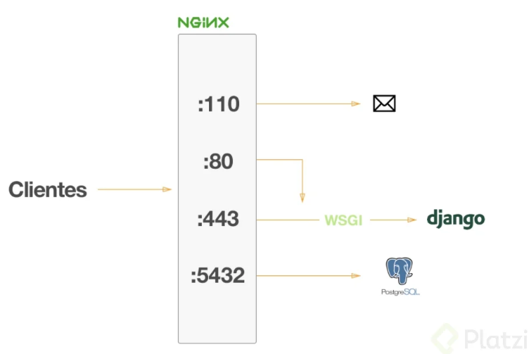

Para el caso particular del proyecto del curso, nosotros usaremos un servidor Linux corriendo Ubuntu 16.04 en el cual configuraremos una base de datos de PostgreSQL, un web server NGINX y correremos nuestro proyecto de Django usando Gunicorn. Los archivos estáticos y subidos por los usuarios serán también servidos usando NGINX ya que no es trabajo de Django realizar estas tareas. La base de datos no tiene que estar disponible para el público por lo que no hay necesidad de que NGINX la exponga.

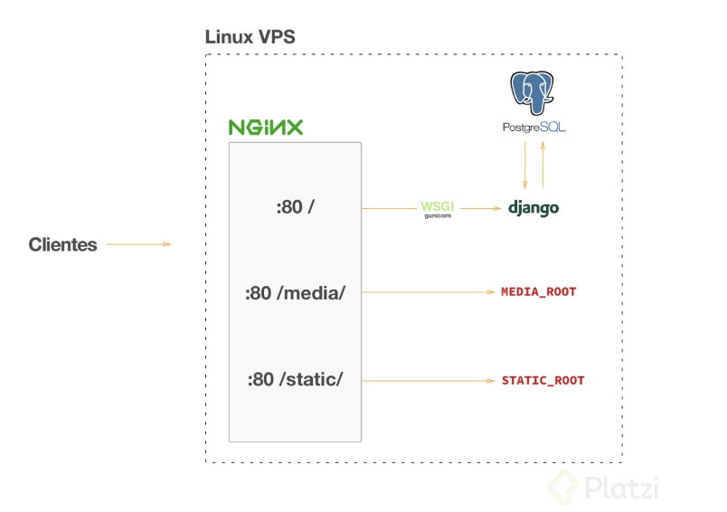

## Clase 32 ¿Cómo conectar Django a una base de datos?

Django obtiene la estructura, acceso y control de los datos de una aplicación a través de su ORM (Object Relational Mapper), esto significa que no importa qué motor de base de datos esté usando, el mismo código seguirá funcionando, configurar esto en un proyecto de Django es cuestión de segundos.

Todo se define dentro del archivo **settings.py** de nuestro proyecto dentro de la variable DATABASES:

DATABASE

Será el nodo padre que nos servirá para indicar que definiremos una base de datos.
Dentro, tendremos el nodo default este tendrá toda la configuración clave de la base de datos.

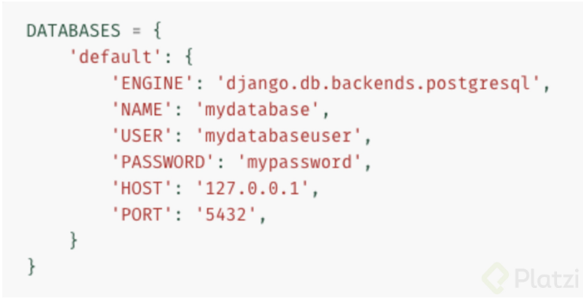

Además, Django puede trabajar con múltiples bases de datos usando una estrategia llamada routers por lo que el diccionario DATABASES puede contener múltiples llaves con diferentes bases de datos. Pero eso sí, necesita siempre existir una llave “default”.

Es un diccionario de python el cual requiere definir una base de datos por default, más de eso al final, usando la llave default que a su vez será otro diccionario con los datos de configuración:

La configuración recibirá el engine el cual puede ser:

PostgreSQL: 'django.db.backends.postgresql’
MySQL: 'django.db.backends.mysql’
SQLite: 'django.db.backends.sqlite3’
Oracle: 'Django.db.backends.oracle’
El nombre de la base de datos “NAME”.
El usuario “USER”.
La contraseña “PASSWORD”.
La ubicación o host del servidor de la base de datos “HOST”.
Y el puerto de conexión “PORT”.

Adicionalmente, se pueden configurar más detalles por base de datos, por ejemplo, configurar que todos los queries de una vista sean empaquetados en una sola transacción a la base de datos usando ATOMIC_REQUESTS=True

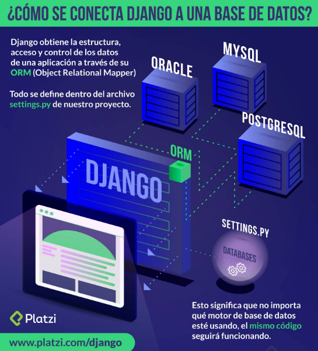

## Clase 33 Configurar el servidor

Es una buena práctica al conectarnos por primera vez a nuestro servidor actualizar los paquetes del Sistema Operativo con los siguientes comandos:

`sudo apt-get update && sudo apt-get upgrade`

**Configuración inicial del servidor**
___

1. Creamos un nuevo usuario sin directorio home que tenga la capacidad de correr algunos comandos de súper usuario:

`sudo useradd -g sudo -M <username>`

2. Le asignamos una contraseña segura al nuevo usuario:

`sudo passwd <username>`

3. Iniciamos sesión con el nuevo usuario:

`su <username>`

4. Por último vamos a instalar las dependencias de **python, postgress, git y nginix** con el siguiente comando:

`sudo apt-get install python3-pip python3-dev postgresql postgresql-contrib libpq-dev git nginx`

**Configurar PostgreSQL**
___

Primero iniciamos sesión con el usuario **postgres** usando el comando `sudo su postgres` y después escribimos `psql` para entrar al **shell interactivo de PostgreSQL** donde configuramos lo siguiente:

1. Creamos una base de datos: `CREATE DATABASE platzi;`

2. Creamos un usuario para la base de datos: `CREATE USER freddier WITH PASSWORD ‘cvander<3’;`

3. Le damos permisos al usuario sobre la base de datos: `GRANT ALL PRIVILEGES ON DATABASE platzi TO freddier;`

Hecho esto, salimos del shell escribiendo \q seguido de exit para salir de la sesión de postgres.

**Configurar el proyecto**

1. Clonar el proyecto de Github:
`git clone [https://github.com/pablotrinidad/platzigram.git]``(https://github.com/pablotrinidad/platzigram.git) platzi`

2. Instalar virtualenv:

`sudo pip3 install virtualenv`

3. Crear entorno virtual:

`virtualenv -p $(which python3) .venv`

4. Activar entorno virtual:

`source .venv/bin/activate`

5. Instalar dependencias para Pillow:

`sudo apt-get install libjpeg-dev`

6. Ir al folder del proyecto:

`cd platzi`

7. Instalar dependencias de python del proyecto:

`pip install -r requirements/prod.txt`

8. Agregar algunas variables de entorno al archivo **~/.bashrc** para probar localmente que todo esté funcionando:

`vim ~/.bashrc`

9. Las variables deben lucir algo similar a lo siguiente:

```
export PLATZI_SECRET_KEY="random_key:aasdafasf"
export PLATZI_DB_NAME="platzi"
export PLATZI_DB_USER="freddier"
export PLATZI_DB_PASSWORD="cvander<3"
export PLATZI_DB_PORT="5432"
export PLATZI_DB_HOST="localhost"
export DJANGO_SETTINGS_MODULE="platzi.settings.prod"
Leemos las variables:
source ~/.bashrc
```

10. Editamos la variable **ALLOWED_HOSTS **del archivo de settings de producción:

`vim platzi/settings/prod.py`

11. La variable tendrá algo como lo siguiente, donde gatos.io será tu dominio o IP:

`ALLOWED_HOSTS = [’gatos.io’]`

**Hacer un Sanity Check**
___

Hasta este punto el proyecto debe ser capaz de escribir a la base de datos además de servirse usando el servidor de desarrollo y **gunicorn**. Probémoslo:

1. Reflejar el modelo de Django en PostgreSQL: `./manage.py migrate`

2. Crear un súper usuario: `./manage.py createsuperuser`

3. Correr servidor de desarrollo: `./manage.py runserver 0.0.0.0:8000`

4. Correr gunicorn: `gunicorn platzi.wsgi -b 0.0.0.0:8000`

Si todo funcionó correctamente, los pasos 3 y 4 debieron mostrar tu sitio en la URL o IP en el puerto 8000.

**Configurar Nginx**


1. Iniciar sesión como súper usuario: `sudo su -`

2. Ir al directorio de Nginx: `cd /etc/nginx/`

3. Borrar los antiguos archivos de configuración: `rm sites-*/default`

4.  Crear un nuevo archivo `vim sites-available/app` con el siguiente [contenido](https://gist.github.com/pablotrinidad/7a608fe9afef3e56055a):

```
upstream django_app {
    server 127.0.0.1:8000;
}

server {

    listen 80;
    server_name demo.gatos.io;

    access_log /var/log/nginx/app.log;
    error_log /var/log/nginx/app.error.log;

    location /static {
        autoindex on;
        alias /home/platzi/platzi/staticfiles/;
    }

    location /media {
        autoindex on;
        alias /home/platzi/platzi/media/;
    }

    location / {
        proxy_set_header X-Forwarded-For $proxy_add_x_forwarded_for;
        proxy_set_header Host $http_host;
        proxy_redirect off;

        proxy_pass http://django_app;
    }

}
```


5. Enlazar los archivos: `ln -s /etc/nginx/sites-available/app /etc/nginx/sites-enabled/`

6. Reiniciar Nginx: `service nginx restart`

**Configurar Gunicorn**

1. Regresamos a la sesión de Platzi: `exit`

2. Creamos directorios para los scripts y los logs: `mkdir deploy logs`

3. Creamos un script dentro de deploy `vim deploy/gunicorn_start` con un contenido similar al [siguiente](https://gist.github.com/pablotrinidad/5de6fef758a35950d08c):

```
#!/bin/bash

NAME="platzi"
VIRTUALENV="/home/platzi/venv/"
DJANGODIR="/home/platzi/platzi/"
USER=platzi
GROUP=sudo
NUM_WORKERS=3
DJANGO_WSGI_MODULE=platzi.wsgi

echo "Starting $NAME as `whoami`"

cd $VIRTUALENV
source bin/activate
cd $DJANGODIR

export PLATZI_SECRET_KEY="&wrw__y!3_hlh@&1v)a!%=ext=-7zuqewv+#^qu^63g)a(3f3@"

export PLATZI_DB_NAME="platzi"
export PLATZI_DB_USER="cvander"
export PLATZI_DB_PASSWORD="adminadmin123"
export PLATZI_DB_PORT="5432"
export PLATZI_DB_HOST="localhost"

export DJANGO_SETTINGS_MODULE="platzi.settings.prod"

export PYTHONPATH=$DJANGODIR:$PYTHONPATH

exec gunicorn ${DJANGO_WSGI_MODULE} \
        --workers $NUM_WORKERS \
        --user=$USER --group=$GROUP \
        --log-level=debug \
        --bind=127.0.0.1:8000
```

4. Hacer el script ejecutable: chmod +x deploy/gunicorn_start

5. Probar el script: deploy/gunicorn_start

Mientras el script esté corriendo, el proyecto estará viviendo en la IP en el puerto 80.

**Crear un servicio**
___

1. Iniciar sesión como súper usuario: sudo su -

2. Ir al directorio de los servicios: cd /etc/init

3. Crear el servicio vim platzi.conf con el siguiente contenido:

```
# platzi

# description "Platzi Linux Service"
# authon "Pablo Trinidad"

start on startup

script
    exec /home/platzi/deploy/gunicorn_start
end script
```

4. Iniciar servicio: `service platzi start`

Por último regresamos al directorio que contiene el proyecto y ejecutamos: .`/manage.py collectstatic`

## Clase 34 Preparación del VPS (en AWS)

**El servidor**
___

Para la demostración de la clase se usa una máquina t2.nanoque Amazon Web Services provee con Ubuntu Server. Toda la configuración del proyecto vive en el mismo servidor. Es decir, tanto la base de datos como los archivos estáticos y el código fuente son manejados por una sola máquina. Es importante mencionar que en casos donde nuestro proyecto es más grande y requiere de una mejor arquitectura, es recomendable separar cada uno de estos de manera que la base de datos tenga su propio servidor, que exista un balanceo de carga hacia las instancias que manejan el código y que la media y los estáticos sean servidos desde una CDN. El caso de instalación que veremos en este post es un método que se puede usar en cualquier servidor Linux con Ubuntu Server; por lo que no es una configuración que únicamente se pueda llevar a cabo usando AWS. Cualquier proveedor que te dé acceso a una máquina Linux es útil.

**Crear el servidor**
___

Una vez dentro de la [consola](https://console.aws.amazon.com/console/home) de administración de Amazon Web Services sigue estos pasos:


1. Accede a la sección de Amazon EC2

2. Da clic en el botón **Launch Instance**

3. Selecciona **Ubuntu 16.04** como el Sistema Operativo deseado

4. Elige el tipo de instancia que más se adecúe a tus necesidades (t2.micro es parte de la capa gratuita)

5. En el paso 3, deja todas las configuraciones tal y como están

6. Selecciona la cantidad de GB de almacenamiento que quieras tener en tu instancia

7. Asigna un nombre descriptivo a la instancia

8. Crea un nuevo grupo de seguridad con el puerto **22, 80** y **8000** abiertos desde cualquier IP por el protocolo **TCP**

9. Selecciona **Launch**

10. Crea nuevas llaves SSH y descargarlas al ordenador

**Conectarse al servidor**
___

Para conectarnos al servidor usaremos la llave que acabamos de descargar. Es muy importante nunca perder esta llave ya que si la perdemos no tendremos otra forma de acceder al servidor.

1. Poner la llave en modo lectura: [shell]chmod 0400 Platzi.pem[/shell]

2. Conectarse al servidor usando la IP pública que AWS nos asigna: [shell]sudo ssh -i Platzi.pem ubuntu@IP[/shell]